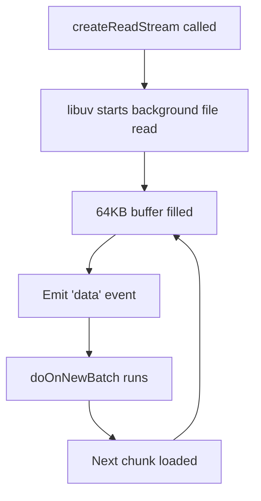
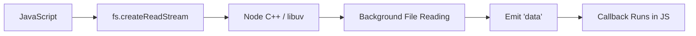

# Implementing File Streaming with `fs.createReadStream`

---

## 1. Initial Setup: Variables and Functions

### 1.1 Accumulator Variable

```javascript
let cleanedTweets = "";
```

**Purpose:**

- Stores the processed (cleaned) tweet data.
    
- Acts as an accumulator across multiple data batches.

---

### 1.2 Processing Functions

Two functions are declared:

```javascript
function cleanTweets(data) {
  // cleaning logic
}

function doOnNewBatch(chunk) {
  // handle each 64KB batch
}
```

#### Roles

|Function|Purpose|
|---|---|
|`cleanTweets`|Performs the cleaning/transformation logic|
|`doOnNewBatch`|Handles each incoming chunk from the stream|

Important distinction:

- `doOnNewBatch` is designed to be **auto-run by an event**.
    
- We do not manually call it.

---

## 2. Creating a Read Stream

### 2.1 Code

```javascript
const accessTweetsArchive = fs.createReadStream("tweets.json");
```

---

## 3. What Happens Internally?

This single line does two major things:

---

### 3.1 In Node (C++ / Libuv Layer)

- `fs.createReadStream` tells Node to:
    
    - Use `libuv`
        
    - Create a background thread
        
    - Begin reading `tweets.json` incrementally
        
    - Buffer data in chunks (default 64 KB)

Node handles:

- File access
    
- Chunking
    
- Background I/O

---

### 3.2 In JavaScript

Immediately returns:

> A stream object containing methods that allow us to interact with the background file-reading process.

That object is assigned to:

```javascript
accessTweetsArchive
```

This object:

- Represents this specific file-reading operation.
    
- Contains event methods (e.g., `.on()`).
    
- Is connected to the underlying stream.

---

## 4. Streams Emit Events

### 4.1 Default Batch Size

- Default chunk size: **64 KB**
    
- Controlled by: **High Water Mark**

|Concept|Meaning|
|---|---|
|High Water Mark|Maximum internal buffer size before emitting `"data"`|
|Default Value|64 KB|

It can be changed:

```javascript
fs.createReadStream("tweets.json", { highWaterMark: 1024 });
```

---

## 5. Listening for Stream Events

### 5.1 The Key Event: `"data"`

When a 64 KB chunk is ready:

- Node emits the `"data"` event.
    
- Any callback attached to `"data"` runs automatically.

---

### 5.2 Attaching the Event Listener

```javascript
accessTweetsArchive.on("data", doOnNewBatch);
```

---

## 6. Step-by-Step Execution Flow

1. `fs.createReadStream` is called.
    
2. Node starts reading `tweets.json` in the background.
    
3. 64 KB of data fills the buffer.
    
4. Node **emits** the `"data"` event.
    
5. `doOnNewBatch` is automatically executed.
    
6. The next 64 KB chunk is read.
    
7. The process repeats.

---

### Flow Diagram



---

## 7. Important Technical Detail: Function Reference

When writing:

```javascript
accessTweetsArchive.on("data", doOnNewBatch);
```

We are:

- Passing a **reference** to the function.
    
- Not copying its code.
    
- Not executing it immediately.

Node stores the reference and executes it later when the event fires.

---

## 8. Core Pattern of Node.js

This pattern repeats throughout Node:

1. Trigger background work.
    
2. Get back an object.
    
3. Attach event listeners.
    
4. Node auto-runs callbacks when events are emitted.

This is fundamental to Node’s architecture.

---

## 9. Conceptual Architecture



Node bridges:

- Background I/O
    
- JavaScript execution

Through event emission.

---

## 10. Why This Is Powerful

|Feature|Benefit|
|---|---|
|Chunked Processing|No full file load required|
|Background I/O|Non-blocking behavior|
|Event Emission|Automatic execution|
|Function References|Clean, modular architecture|

This enables:

- Handling large files efficiently.
    
- Keeping the event loop responsive.
    
- Writing scalable server-side applications.

---

# Key Points Summary

- `fs.createReadStream()` starts background file reading.
    
- It returns a stream object immediately in JavaScript.
    
- Data is read in 64 KB chunks by default.
    
- Each chunk triggers a `"data"` event.
    
- `.on("data", callback)` registers an auto-run function.
    
- The callback is passed by reference.
    
- Node’s core pattern: background work + event emission + callback execution.
    
- This model enables efficient, non-blocking file processing.

---

