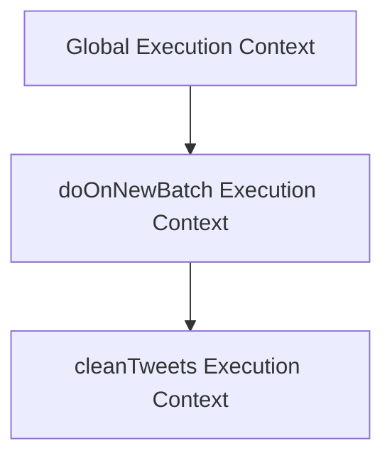
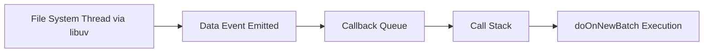
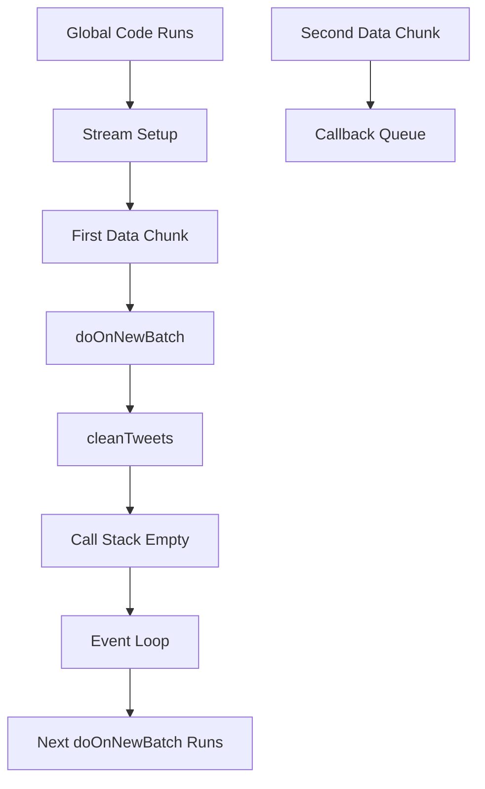

# Node.js Streams, Event Loop, and Callback Queue

## 1. Timeline and Stream Initialization

### 1.1 When Does the Stream Start Reading?

**Key Rule:**  
A `fs.createReadStream()` does **not** start pulling data immediately.

It begins reading **only after** a listener is attached to an event (e.g., `"data"`).

**Why?**  
If no handler exists, there is no reason to retrieve data from disk.

### Execution Timeline

|Time (ms)|Event|
|---|---|
|~0 ms|Stream is created|
|~0 ms|`.on('data', doOnNewBatch)` registered|
|~1 ms|First 64KB batch arrives|
|~2 ms|Second 64KB batch arrives|

---

## 2. Data Flow: First Batch Execution

### 2.1 First Batch Arrives

- Default chunk size: **64 KB**
    
- The `"data"` event is emitted.
    
- `doOnNewBatch` auto-runs.

### What Happens Internally?

1. Execution context created for `doOnNewBatch`
    
2. `data` parameter receives chunk (stringified JSON)
    
3. `cleanTweets(data)` is called
    
4. Cleaned data appended to global `cleanedTweets`

---

## 3. Execution Context and Call Stack

### 3.1 Call Stack at First Batch



- `cleanTweets` runs inside `doOnNewBatch`
    
- Once finished → popped off stack
    
- Then `doOnNewBatch` finishes → popped
    
- Control returns to Global

---

## 4. Concurrency Issue: Second Batch Arrives Mid-Execution

### 4.1 The Problem

While `cleanTweets()` is still processing the first batch:

- Second 64KB chunk arrives
    
- `"data"` event fires again
    
- `doOnNewBatch` wants to run again

**Question:**  
Can it interrupt the currently running function?

**Answer:**  
No.

JavaScript is **single-threaded**.

---

## 5. The Callback Queue

### 5.1 Definition

**Callback Queue**  
A queue where Node stores callback functions that are ready to run but must wait until the call stack is empty.

When the second batch arrives:

- `"data"` event fires
    
- `doOnNewBatch` is placed in the **callback queue**
    
- It waits until the stack is empty

### Updated Flow



---

## 6. Event Loop Rule (Simplified)

### Core Rule

> A callback function can only move from the Callback Queue to the Call Stack when the Call Stack is empty.

So:

1. First `cleanTweets` runs
    
2. It finishes
    
3. `doOnNewBatch` finishes
    
4. Stack becomes empty
    
5. Event loop pushes next `doOnNewBatch` from callback queue

---

## 7. Order and Determinism

Concern raised:  
Could batches process out of order?

Because:

- Cleaning takes time
    
- New batches arrive during processing

### Why Order Is Preserved

Even if new data arrives early:

- It waits in the callback queue
    
- It cannot execute until previous processing completes
    
- The queue is FIFO (First In, First Out)

Therefore:

**Processing order matches arrival order.**

---

## 8. Important Concepts

### 8.1 Stream

A mechanism for processing data in chunks instead of loading entire files into memory.

### 8.2 Data Event

Triggered when a chunk of data is available from the stream.

Default chunk size: **64 KB**  
Configurable using `highWaterMark`.

---

### 8.3 Execution Context

An environment created whenever a function runs containing:

- Local variables
    
- Parameters
    
- Scope chain
    
- `this`

---

### 8.4 Call Stack

A stack structure that tracks currently executing functions.

- LIFO (Last In, First Out)
    
- Only one function runs at a time

---

### 8.5 Callback Function

A function passed into another function to be executed later.

Example:

```js
accessTweetsArchive.on("data", doOnNewBatch)
```

`doOnNewBatch` is the callback.

---

### 8.6 Callback Queue

Stores callback functions that are ready to run but waiting for the stack to clear.

---

### 8.7 Libuv

A C++ library used internally by Node.js to:

- Handle filesystem operations
    
- Manage thread pool
    
- Emit events when background tasks complete

---

## 9. Step-by-Step Example Walkthrough

### Step 1 — Setup

- Stream created
    
- `"data"` listener attached

### Step 2 — First Chunk

- 64KB arrives
    
- `doOnNewBatch` runs
    
- `cleanTweets` processes data
    
- Result appended to `cleanedTweets`

### Step 3 — Second Chunk Arrives Early

- Cannot interrupt current execution
    
- Callback placed in callback queue

### Step 4 — First Execution Finishes

- `cleanTweets` popped
    
- `doOnNewBatch` popped
    
- Stack empty

### Step 5 — Event Loop Moves Next Callback

- Second `doOnNewBatch` pushed to stack
    
- Execution begins

---

## 10. Overall System Model



---

# Key Takeaways

- Streams process files in 64KB chunks by default.
    
- A `"data"` event is emitted per chunk.
    
- JavaScript is single-threaded; functions cannot interrupt one another.
    
- When data arrives during execution, callbacks go to the callback queue.
    
- The event loop only pushes callbacks to the stack when it is empty.
    
- Order is preserved because the callback queue is FIFO.
    
- libuv handles background file reading and signals completion via events.

This model underpins nearly all Node.js asynchronous behavior.