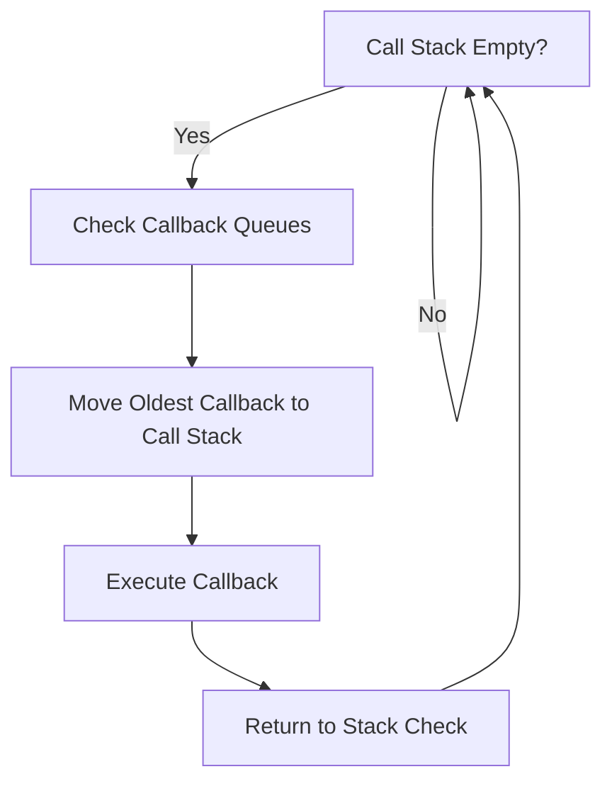
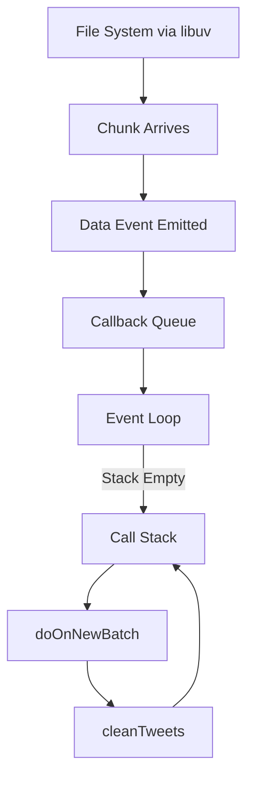

# Node.js Event Loop and Callback Queue Execution

## 1. When Does Node Check the Queues?

### 1.1 Core Condition

Node continuously checks:

1. Is there **any global code left to run?**
    
2. Is there **any function currently on the call stack?**

If the answer to both is **no**, Node proceeds to check the queues.

---

## 2. The Event Loop

### 2.1 Definition

**Event Loop**  
A built-in mechanism in Node.js (implemented with the help of **libuv**) that:

- Monitors the call stack
    
- Checks callback queues
    
- Moves ready callbacks to the call stack when it is empty

It exists in both:

- Node.js (implemented using libuv)
    
- Browser JavaScript (implemented by the browser runtime)

---

### 2.2 Event Loop Behavior

**Key Rule:**  
Callbacks are only moved to the call stack when the stack is empty.

---

## 3. Applying the Model to Stream Processing

### 3.1 Recap: What Happened Previously

1. First 64KB batch arrived
    
2. `"data"` event emitted
    
3. `doOnNewBatch` executed
    
4. `cleanTweets` executed inside it
    
5. While cleaning was still running:
    
    - Second batch arrived
        
    - `"data"` event fired again
        
    - Second `doOnNewBatch` placed in **callback queue**

---

## 4. Callback Queue Processing

### 4.1 At ~2 Ms

- Second batch ready
    
- Callback cannot run yet
    
- It waits in callback queue

### 4.2 At ~2.5 Ms

- First `cleanTweets` finishes
    
- First `doOnNewBatch` finishes
    
- Call stack becomes empty

Now the **event loop activates**.

---

### 4.3 What Happens Next?

1. Event loop checks queues
    
2. Finds `doOnNewBatch` in callback queue
    
3. Moves it to the call stack
    
4. Creates a **new execution context**
    
5. Runs it with the second 64KB batch

---

## 5. Execution Context Creation

Important clarification:

- JavaScript engine creates execution contexts.
    
- Node (with libuv) decides _when_ a callback is allowed to run.
    
- Each invocation gets a **brand new execution context**.

---

## 6. Stream + Event System Model

### 6.1 Chunk Processing Pattern

Node processes data in **chunks**, not as a full file.

For file streams:

- Default chunk size: **64 KB**
    
- `"data"` event emitted per chunk

For HTTP:

- Small responses → single chunk
    
- Large responses (images, videos) → multiple chunks

This model applies broadly to background I/O operations.

---

## 7. Incremental Processing Advantage

### 7.1 Without Streams

|Phase|Time|
|---|---|
|Import entire file|15s|
|Clean entire file|10s|
|Total|25s|

All processing waits until full file loads.

---

### 7.2 With Streamed Chunks

|Phase|Behavior|
|---|---|
|Import chunk|Start cleaning immediately|
|Next chunk arrives|Queue if needed|
|Repeat|Overlapping work|

Total time ≈ **15 seconds**, not 25.

**Reason:** Cleaning and importing overlap.

---

## 8. Complete System Overview

---

## 9. Key Concepts

### 9.1 Event Loop

Continuously checks:

- Is stack empty?
    
- Are callbacks waiting?

Moves callbacks accordingly.

---

### 9.2 Callback Queue

FIFO structure storing:

- Event callbacks
    
- Deferred function executions

---

### 9.3 Execution Context

Created every time a function runs.  
Contains:

- Local variables
    
- Parameters
    
- Scope references

---

### 9.4 Chunked Processing

Large data is split into manageable pieces:

- Improves responsiveness
    
- Reduces memory pressure
    
- Enables parallel I/O + computation

---

## 10. Important Observations

- Auto-run functions cannot interrupt running code.
    
- They must wait in queues.
    
- Node’s performance comes from:
    
    - Background I/O via libuv
        
    - Event-driven callbacks
        
    - Chunked data processing
        
    - Non-blocking architecture

---

# Summary of Key Points

- The event loop runs when the call stack is empty.
    
- It checks callback queues and moves waiting callbacks to the stack.
    
- Streams emit `"data"` events for each chunk (default 64KB).
    
- If a callback is triggered while code is running, it waits in the callback queue.
    
- Node processes data incrementally, allowing computation and I/O to overlap.
    
- This model significantly reduces total processing time compared to sequential full-file processing.
    
- libuv enables background I/O, while the event loop coordinates execution timing.