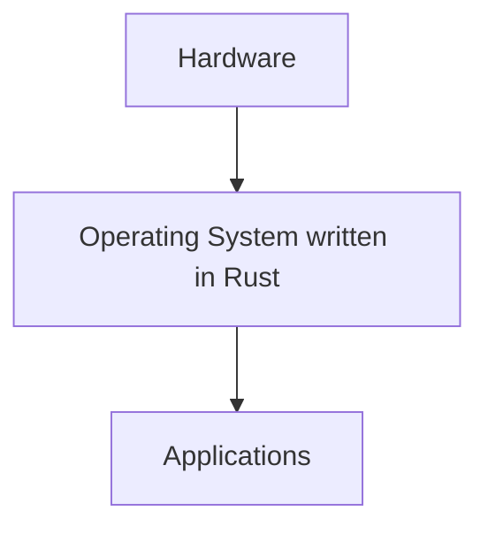
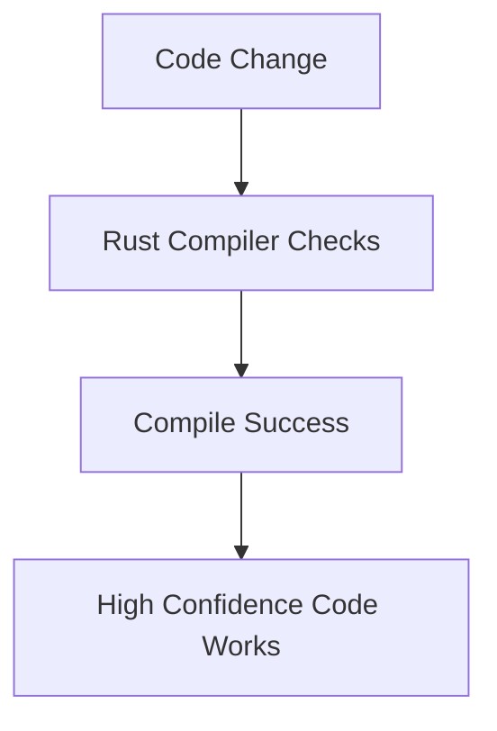

# Introduction to Rust

## 1. Overview of Rust

### Definition of Rust

**Rust** is a systems programming language designed to enable developers to build **reliable and efficient software**.

Key characteristics:

|Property|Description|
|---|---|
|Reliability|Rust prevents many classes of bugs through strict compile-time checks.|
|Efficiency|Programs compile to machine code and run with performance close to C/C++.|
|Memory Safety|Rust manages memory safely without requiring a garbage collector.|
|Compilation Targets|Rust can compile to native binaries or WebAssembly.|

### Compilation Targets

Rust programs can compile to:

|Target|Description|
|---|---|
|Native Machine Code|Creates executable binaries (e.g., `.exe` on Windows or binaries on macOS/Linux).|
|WebAssembly (WASM)|Allows Rust programs to run inside web browsers.|

### Rust Philosophy

Rust focuses primarily on:

- **Reliability** – preventing common runtime errors.
    
- **Efficiency** – maximizing hardware performance.

---

## 2. Organizations Using Rust

Rust is used across many industries and organizations.

|Organization|Usage|
|---|---|
|Mozilla|Used in Firefox for high-performance rendering components.|
|Microsoft|Rewriting some low-level Windows components in Rust.|
|Dropbox|Improves performance in synchronization systems.|
|Tock OS|Embedded operating system written in Rust.|
|Redox OS|Full desktop operating system implemented entirely in Rust.|

These examples demonstrate that Rust is used for:

- Browsers
    
- Operating systems
    
- Cloud infrastructure
    
- Embedded systems
    
- High-performance applications

---

## 3. What Can Be Built with Rust

Rust is versatile and supports many application domains.

### 3.1 Web Servers

Rust can be used to build **high-performance backend services**.

Typical architecture:


Benefits:

- High throughput
    
- Low memory usage
    
- Strong reliability guarantees

---

### 3.2 Command Line Interfaces (CLI)

Rust is well suited for building command-line tools used in:

- Build systems
    
- Developer tooling
    
- Automation scripts

Advantages:

- Fast execution
    
- Easy distribution as a single binary

---

### 3.3 Native Desktop Applications

Rust can power **native desktop applications** as an alternative to frameworks like Electron.

Benefits:

|Feature|Rust|
|---|---|
|Performance|High|
|Memory usage|Low|
|Startup time|Fast|

---

### 3.4 Web Frontend via WebAssembly

Rust can compile to **WebAssembly (WASM)** to run directly in browsers.

Example capability:

- Interactive UI frameworks written in Rust
    
- Browser-based applications

Example:  
**Makepad** – a browser-based IDE running at 60 FPS on mobile devices using Rust.

---

### 3.5 Performance-Critical Libraries

Rust is often used for:

- Image processing
    
- Cryptography
    
- Game engines
    
- System libraries

Rust code can act as a high-performance module within larger systems.

---

### 3.6 Operating Systems

Rust can be used for extremely low-level development, including operating systems.

Example architecture:



Example projects:

- Tock OS
    
- Redox OS

---

# 4. Why Choose Rust

Rust's primary advantages revolve around **performance and reliability**.

## Core Reasons

1. Speed
    
2. Performance
    
3. Maximum hardware utilization

Rust allows developers to achieve **near-optimal hardware performance**.

---

# 5. Historical Context of High-Performance Languages

## C (1972)

|Feature|Description|
|---|---|
|Purpose|Efficient low-level programming|
|Performance|Extremely high|
|Design|Minimal abstraction over hardware|

C is often described as **portable assembly language**.

---

## C++ (1985)

|Feature|Description|
|---|---|
|Extension of C|Adds object-oriented programming|
|Performance|Comparable to C|
|Goal|Combine abstraction with efficiency|

C++ introduced programming constructs while maintaining minimal overhead.

---

## Rust (2010)

Rust was designed as a **modern alternative** to C and C++.

Key goals:

- Efficiency
    
- Reliability
    
- Ergonomic development

Comparison:

|Language|Performance|Safety|Ergonomics|
|---|---|---|---|
|C|Very high|Low|Low|
|C++|Very high|Medium|Medium|
|Rust|Very high|High|High|

Rust attempts to provide **C/C++ performance with stronger safety guarantees**.

---

# 6. Compiler Ergonomics

Rust improves the developer experience with helpful compiler errors.

## Example: Rust Compiler Error

Example typo in field name:

```Python
no field `emial` on type `User`
note: available fields are: `name`, `email`
```

Characteristics:

- Identifies the exact problem
    
- Suggests available fields
    
- Improves debugging speed

---

## Equivalent Error in C++

```Python
main.cpp error: no member named 'emial' in 'User'
```

Limitations:

- Minimal diagnostic information
    
- No suggestions

---

## Comparison with Elm

Elm provides extremely friendly compiler errors:

Example message:

- Explains the problem
    
- Suggests corrections
    
- Lists similar field names

However, Elm is a **high-level functional language**, while Rust focuses on **low-level performance**.

---

# 7. Advantages of Rust

## 7.1 Performance

Rust offers **C/C++ level performance**.

Reasons:

- Direct compilation to machine code
    
- Zero-cost abstractions
    
- No garbage collector

---

## 7.2 Developer Tooling

Rust provides modern development tools:

|Tool|Purpose|
|---|---|
|Language Server|Intelligent code completion and analysis|
|Cargo|Built-in package manager|
|Formatter|Automatic code formatting|
|Compiler Diagnostics|Helpful error messages|

---

## 7.3 Memory Safety

Rust uses **ownership and borrowing rules** to ensure memory safety.

Benefits:

- Prevents memory leaks
    
- Prevents data races
    
- Prevents invalid memory access

---

## 7.4 Concurrency Safety

Rust provides compile-time checks for concurrent code.

Advantages:

- Detects data races during compilation
    
- Safe multi-threaded programming

---

## 7.5 Large Codebase Reliability

Rust’s strict compiler guarantees allow developers to refactor large systems confidently.

Example workflow:



---

# 8. Reasons Not to Use Rust

Despite its strengths, Rust also has disadvantages.

---

## 8.1 Large and Complex Language

Rust has many advanced concepts:

- Ownership
    
- Borrowing
    
- Lifetimes
    
- Traits
    
- Concurrency models

Learning curve:

|Level|Difficulty|
|---|---|
|Beginner|Moderate|
|Intermediate|Challenging|
|Advanced mastery|Significant|

---

## 8.2 Smaller Ecosystem

Compared to older languages:

|Language|Years in Use|
|---|---|
|C|Since 1972|
|C++|Since 1985|
|Rust|Since ~2010|

Because Rust is newer, there are fewer libraries.

---

## 8.3 FFI (Foreign Function Interface)

Rust can interact with C/C++ code through **FFI**.

Definition:

**Foreign Function Interface (FFI)** allows code written in one language to call functions written in another language.

Example architecture:


Limitations:

- Reduces safety guarantees
    
- Less ergonomic development

---

## 8.4 Slow Compilation

Rust compilation can be slow due to:

- Strict compiler checks
    
- Complex type system
    
- Advanced analysis such as the borrow checker

Full builds are particularly slow.

---

## 8.5 Borrow Checker Complexity

Rust introduces a unique system called the **borrow checker**.

### Borrow Checker Definition

A compile-time system that ensures:

- Memory safety
    
- No data races
    
- Proper ownership of values

Beginners often experience difficulty because:

- It introduces unfamiliar error types.
    
- It requires a new mental model for memory management.

---

## 8.6 Performance Vs Safety Tradeoff

Rust prioritizes performance.

However, some languages prioritize **maximum safety** instead.

Example:

|Language Type|Example|Tradeoff|
|---|---|---|
|Systems language|Rust|High performance|
|Pure functional|Elm|Maximum safety|

Rust balances safety and speed but does not maximize safety as purely functional languages do.

---

# 9. Rust Popularity

Rust has consistently ranked highly in developer satisfaction surveys.

## Stack Overflow Developer Survey

Rust was voted **most loved programming language** for multiple years:

|Year|Ranking|
|---|---|
|2016|Most Loved|
|2017|Most Loved|
|2018|Most Loved|
|2019|Most Loved|
|2020|Most Loved|

Interpretation:

- Developers who use Rust tend to enjoy working with it.
    
- It consistently scores high in satisfaction.

---

# 10. Key Concepts Introduced

|Concept|Definition|
|---|---|
|Rust|Systems programming language focused on performance and reliability|
|Machine Code|Binary instructions executed directly by hardware|
|WebAssembly|Portable binary format that runs in browsers|
|FFI|Mechanism for calling code written in other languages|
|Borrow Checker|Rust system that ensures safe memory usage|

---

# 11. Summary of Key Points

- Rust is a systems programming language designed for **efficient and reliable software**.
    
- It compiles to **native machine code** or **WebAssembly**.
    
- Major organizations such as Mozilla, Microsoft, and Dropbox use Rust.
    
- Rust can build:
    
    - Web servers
        
    - CLI tools
        
    - Desktop applications
        
    - WebAssembly applications
        
    - Operating systems.
        
- Its major advantage is **C/C++ level performance with better safety and ergonomics**.
    
- Rust provides strong tooling, compile-time checks, and concurrency safety.
    
- Downsides include:
    
    - Steep learning curve
        
    - Smaller ecosystem
        
    - Slow compilation
        
    - Borrow checker complexity.
        
- Despite tradeoffs, Rust is widely appreciated and repeatedly ranked the **most loved programming language** in developer surveys.