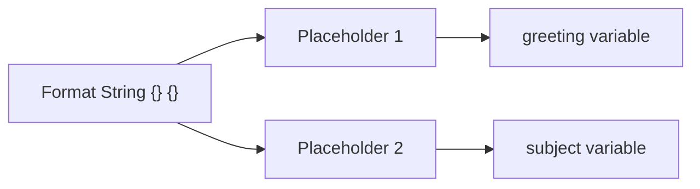
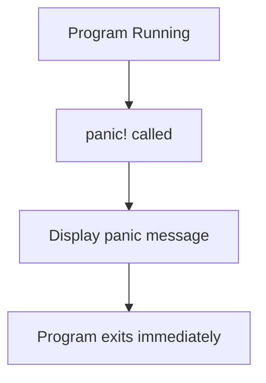

# Basic Data Types and Core Constructs in Rust

## 1. Rust Program Structure

### Functions in Rust

Rust programs are structured around **functions**, and execution starts from the `main` function.

#### Definition

A **function** in Rust is declared using the `fn` keyword.

Example:

```rust
fn main() {
    println!("Hello, world!");
}
```

Explanation step by step:

1. `fn` declares a function.
    
2. `main` is the program entry point.
    
3. `()` indicates the function takes no arguments.
    
4. `{}` contains the function body.

### File Structure

Rust source files use the `.rs` extension.

Example:

```Python
app.rs
```

### Compilation Process

Rust uses the `rustc` compiler.

Compilation command:

```Python
rustc app.rs
```

Output:

|Operating System|Output File|
|---|---|
|Windows|`app.exe`|
|macOS / Linux|`app`|

Execution flow:


---

# 2. Basic Data Types

This section introduces several fundamental Rust data types.

|Data Type|Description|
|---|---|
|String|Sequence of characters used for text|
|Integer|Whole numbers|
|Float|Decimal numbers|
|Boolean|Logical true/false values|

These primitive types form the basis of most Rust programs.

---

# 3. Strings in Rust

## Definition

A **string** represents textual data.

Example:

```Python
"Hello, world!"
```

Strings are commonly used with functions like `println!` to display text.

---

# 4. The `println!` Macro

## Basic Example

```rust
println!("Hello, world!");
```

This prints text to the console.

## The Exclamation Mark (`!`)

The `!` indicates that `println!` is a **macro**, not a normal function.

### Definition: Macro

A **macro** is a construct that expands into code during compilation, allowing more flexible operations than regular functions.

Macros in Rust are commonly used for:

- Printing
    
- Formatting
    
- Code generation

---

# 5. String Interpolation in Rust

Rust supports string interpolation through formatting macros.

## Example

```rust
let greeting = "hello";
let subject = "world";

println!("{} {}", greeting, subject);
```

## Step-by-Step Explanation

1. `greeting` contains `"hello"`.
    
2. `subject` contains `"world"`.
    
3. `{}` placeholders represent interpolation positions.
    
4. The values are substituted in order.

Output:

```Python
hello world
```

## Interpolation Mechanism

Rust formatting works by passing variables as arguments rather than embedding them directly in the string.



---

# 6. The `format!` Macro

## Definition

`format!` performs string interpolation **without printing**.

Instead, it **returns a new string**.

## Example

```rust
let message = format!("{} {}", greeting, subject);
```

Explanation:

1. The placeholders `{}` are replaced.
    
2. A new string is created.
    
3. The resulting string is stored in `message`.

## Comparison with `println!`

|Feature|`println!`|`format!`|
|---|---|---|
|Prints to console|Yes|No|
|Returns a string|No|Yes|
|Supports interpolation|Yes|Yes|

---

# 7. The `panic!` Macro

## Definition

`panic!` immediately stops program execution due to a critical error.

Example:

```rust
panic!("Program crashed: {}", crash_reason);
```

Explanation:

1. The panic message is formatted using interpolation.
    
2. The program terminates immediately.

---

## Program Termination Flow



---

# 8. Panic Vs Exceptions

Rust does **not use traditional exception systems** like many languages.

|Feature|Exceptions (Java/Python)|Rust `panic!`|
|---|---|---|
|Recoverable errors|Yes|Rarely|
|Program continuation|Possible|Typically stops program|
|Primary purpose|Error handling|Fatal program termination|

Although recovery mechanisms exist, panics are typically treated as **unrecoverable failures**.

---

# 9. Unreachable Code After Panic

Code placed after a `panic!` call will **never execute**.

Example:

```rust
panic!("Something went wrong");
println!("This will never run");
```

Rust compiler behavior:

- Detects unreachable code
    
- Generates a warning

## Execution Flow


---

# 10. Key Concepts Introduced

|Concept|Definition|
|---|---|
|Function|A reusable block of code defined using `fn`|
|Macro|Compile-time code expansion mechanism|
|String Interpolation|Inserting variable values into a formatted string|
|`println!`|Macro for printing formatted text to the console|
|`format!`|Macro for creating formatted strings|
|`panic!`|Macro that immediately terminates program execution|

---

# 11. Summary of Key Points

- Rust programs start execution in the `main` function.
    
- Source files use the `.rs` extension and are compiled using `rustc`.
    
- Basic data types include **strings, integers, floats, and booleans**.
    
- `println!` is a macro used to print formatted text.
    
- Rust supports **string interpolation** using `{}` placeholders.
    
- `format!` returns a formatted string without printing it.
    
- `panic!` stops program execution immediately.
    
- Any code written after a panic is unreachable and flagged by the compiler.