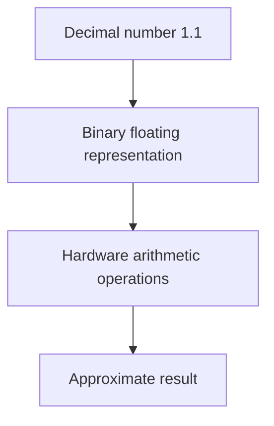
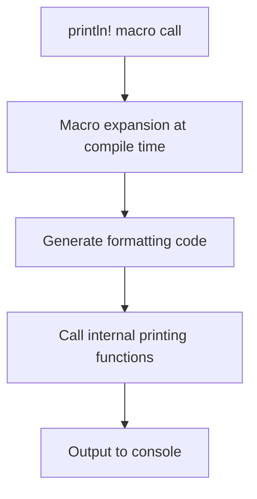
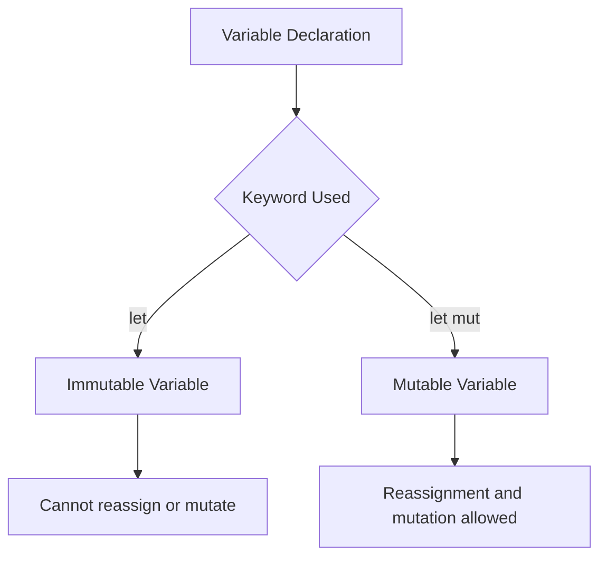

# Numeric Types, Macros, and Mutability in Rust

## 1. Floating Point Numbers (Floats)

### Definition

A **floating point number (float)** represents numbers with fractional components (decimals).  
Rust implements floating point numbers using **IEEE binary floating point representation**, which is optimized for performance on modern hardware.

Common float types in Rust include:

|Type|Description|
|---|---|
|`f32`|32-bit floating point number|
|`f64`|64-bit floating point number (default)|

---

## 2. Float Operations and Precision

### Example

```rust
let x = 1.1;
let y = 2.2;

println!("x times y is {}", x * y);
```

### Step-by-Step Explanation

1. `x` is assigned the floating point value `1.1`.
    
2. `y` is assigned the floating point value `2.2`.
    
3. The expression `x * y` performs multiplication.
    
4. `println!` inserts the computed result into the formatted string.

Expected mathematical result:

```Python
1.1 × 2.2 = 2.42
```

Actual output may be something like:

```Python
x times y is 2.4200000000000004
```

### Why This Happens

This behavior occurs because **binary floating point cannot precisely represent many decimal values**.

Most CPUs implement **IEEE floating point arithmetic**, which prioritizes speed.

|Feature|Binary Floating Point|
|---|---|
|Hardware implementation|Very fast|
|Precision for decimals|Sometimes imprecise|
|Typical usage|Scientific computing, graphics, high-performance applications|

---

### Floating Point Representation Concept



Binary floats prioritize **performance and hardware efficiency**, which is why they are widely used despite precision limitations.

---

# 3. Macros Vs Functions

Rust differentiates between **functions** and **macros**.

## Functions

Example:

```rust
fn main() {
}
```

Definition:

A **function** is a reusable block of code that executes when called.

Characteristics:

- Executed at runtime
    
- Accept arguments
    
- Return values

---

## Macros

Example:

```rust
println!("Hello, world!");
```

Definition:

A **macro** is a construct that performs **code transformation during compilation**.

Instead of running like a function, macros **expand into generated code before compilation finishes**.

Key indicator:

```Python
!
```

after the name.

---

## How `println!` Works Internally

The `println!` macro:

1. Takes the format string and arguments.
    
2. Converts values into strings.
    
3. Concatenates them.
    
4. Calls underlying printing functions.



Macros provide flexibility that functions cannot easily achieve.

---

# 4. Mutability in Rust

Rust emphasizes **immutability by default**.

## Definition

**Mutability** refers to whether a variable's value can be changed after it is created.

---

# 5. Immutable Variables (`let`)

## Example

```rust
let x = 1.1;
x = 2.2;
```

This code produces a compile-time error.

Error:

```Python
cannot assign twice to immutable variable
```

## Explanation

When a variable is declared with `let`, it is:

- **Immutable**
    
- **Non-reassignable**

This means:

- The variable cannot be assigned a new value.
    
- Its contents cannot be modified.

---

## Comparison with JavaScript

|Feature|Rust `let`|JavaScript `const`|
|---|---|---|
|Reassignment allowed|No|No|
|Internal mutation allowed|No|Yes (for objects)|
|Default behavior|Immutable|Constant binding only|

Rust's `let` behaves closer to:

```Python
const + deep immutability
```

This prevents unintended data modification.

---

# 6. Mutable Variables (`let mut`)

Rust allows mutation explicitly using the `mut` keyword.

## Example

```rust
let mut x = 1.1;
x = 2.2;
```

Explanation:

1. `mut` marks the variable as mutable.
    
2. Reassignment becomes allowed.
    
3. Internal mutation becomes allowed as well.

---

## Mutability Behavior

|Declaration|Reassignment|Internal Mutation|
|---|---|---|
|`let`|Not allowed|Not allowed|
|`let mut`|Allowed|Allowed|

---

## Rust Mutability Model



---

# 7. Immutability as a Design Principle

Rust encourages immutability for several reasons:

|Benefit|Explanation|
|---|---|
|Safety|Prevents accidental modification|
|Concurrency|Reduces race conditions|
|Predictability|Easier to reason about program state|

As a result:

- `let` is used **more frequently** than `let mut`.
    
- Mutation is used **only when necessary**.

---

# 8. Practical Usage Patterns

Typical Rust code tends to follow this pattern:

|Situation|Preferred Declaration|
|---|---|
|Value will not change|`let`|
|Value needs modification|`let mut`|

This enforces deliberate state changes.

---

# 9. Summary of Key Points

- Rust supports floating point numbers using IEEE binary floating point representation.
    
- Binary floating point prioritizes speed but may introduce precision artifacts.
    
- `println!` is a **macro**, not a function, and performs compile-time code generation.
    
- Macros expand into Rust code during compilation.
    
- Variables declared with `let` are **immutable by default**.
    
- Immutable variables cannot be reassigned or mutated.
    
- The `mut` keyword allows explicit mutation using `let mut`.
    
- Rust favors immutability to improve safety, maintainability, and concurrency behavior.