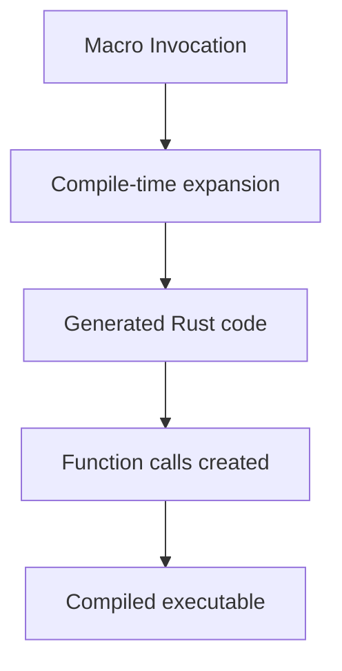
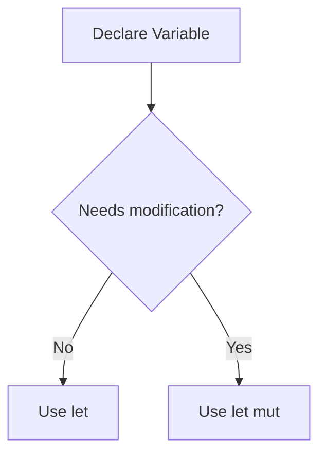

# Macros, Functions, and Immutability in Rust

## 1. Macros Vs Functions

Rust provides two major mechanisms for reusable logic:

- **Functions**
    
- **Macros**

Although they may appear similar in usage, they operate at different stages of program execution.

|Feature|Functions|Macros|
|---|---|---|
|Execution stage|Runtime|Compile time|
|Arguments|Fixed number|Variable number allowed|
|Code behavior|Executes logic|Generates or transforms code|
|Passable as values|Yes (first-class functions)|No|
|Syntax|`function()`|`macro!()`|

---

# 2. Functions in Rust

## Definition

A **function** is a reusable block of code that runs during program execution and operates on provided arguments.

## Key Characteristics

- Executed at **runtime**
    
- Must define a **fixed number of parameters**
    
- Can return values
    
- Can be passed as values (first-class functions)

## Example Structure

```rust
fn add(a: i32, b: i32) -> i32 {
    a + b
}
```

Explanation:

1. `fn` declares a function.
    
2. `add` is the function name.
    
3. `(a: i32, b: i32)` defines the parameter list.
    
4. `-> i32` indicates the return type.
    
5. The function returns the sum of the parameters.

---

# 3. Macros in Rust

## Definition

A **macro** is a compile-time construct that generates or transforms Rust code before the program is compiled.

Macros allow patterns of code to expand into more complex Rust code.

## Macro Syntax Indicator

Macros are called using an **exclamation mark**:

```rust
println!("Hello");
```

The `!` indicates that the construct is a **macro invocation** rather than a normal function call.

---

# Example: `println!` Macro

```rust
println!("{} {}", greeting, subject);
```

## Step-by-Step Explanation

1. The macro receives a format string `"{} {}"`.
    
2. Additional arguments (`greeting`, `subject`) are passed.
    
3. During compilation:
    
    - Rust expands the macro.
        
    - Generates multiple function calls internally.
        
4. The expanded code prints the formatted result.

---

## Macro Expansion Process



Macros effectively **generate Rust code automatically during compilation**.

---

# 4. Why Macros Are More Flexible

Macros can perform tasks that functions cannot.

## Major Advantages

|Capability|Explanation|
|---|---|
|Variable arguments|Macros can accept any number of parameters|
|Syntax transformation|Macros can generate complex code structures|
|Compile-time expansion|Logic happens before runtime|

Example:

```rust
println!("{} {} {}", a, b, c);
println!("{} {}", a, b);
println!("{}", a);
```

A normal function cannot easily accept **any number of arguments**, but a macro can.

---

# 5. Limitation of Macros

Despite their power, macros have an important limitation.

## Macros Are Not First-Class

You **cannot pass macros as values**.

Example of what is allowed with functions:

```rust
let f = some_function;
```

But macros cannot be assigned to variables or passed as arguments.

Reason:

Macros are expanded **before compilation finishes**, meaning they do not exist as runtime entities.

---

## Conceptual Difference


Functions only appear after compilation, while macros operate **earlier in the pipeline**.

---

# 6. Performance Differences

## Runtime Performance

Macros and functions **have identical runtime performance**.

Reason:

After expansion, macros simply produce normal Rust code.

|Stage|Impact|
|---|---|
|Runtime|No difference|
|Compile time|Macros increase compilation work|

---

## Compile-Time Overhead

Macros require additional work during compilation.

Steps involved:

1. Parsing macro input
    
2. Expanding macro patterns
    
3. Generating equivalent Rust code

This can increase compile time.

However:

- In most projects macros are **not the primary cause of slow compilation**.

---

# 7. Immutability in Rust

Rust encourages **immutability by default**.

## Definition

**Immutability** means a variable's value cannot change after it is assigned.

Example:

```rust
let x = 10;
```

Here:

- `x` cannot be reassigned
    
- The compiler prevents modification

---

# 8. Why Immutability Is Useful

Immutability reduces programming errors and improves program clarity.

## Benefits

|Benefit|Explanation|
|---|---|
|Predictability|Values remain constant|
|Safety|Prevents accidental changes|
|Easier reasoning|Developers do not need to track mutations|

---

## Example Scenario

```rust
let x = 10;
```

If a long section of code follows, the developer knows with **100% certainty**:

- `x` will never change.

If instead:

```rust
let mut x = 10;
```

Then the developer must check:

- Every subsequent line
    
- To determine whether `x` was modified.

---

## Mutability Comparison

|Declaration|Behavior|
|---|---|
|`let`|Immutable variable|
|`let mut`|Mutable variable|

---

## Mutability Decision Flow



Rust encourages using `let` first and only adding `mut` when necessary.

---

# 9. Static Typing in Rust

Rust is a **statically typed language**.

## Definition

A **statically typed language** determines the types of variables at compile time rather than at runtime.

Examples of statically typed languages:

|Language|Type System|
|---|---|
|Rust|Static|
|C++|Static|
|Java|Static|

This means:

- Type errors are caught before the program runs.
    
- Variables cannot change type dynamically.

---

## Static Vs Dynamic Typing

|Feature|Static Typing|Dynamic Typing|
|---|---|---|
|Type checking|Compile time|Runtime|
|Error detection|Earlier|Later|
|Flexibility|Lower|Higher|
|Safety|Higher|Lower|

Rust strictly enforces compile-time type checking.

---

# 10. Summary of Key Points

- **Macros** generate Rust code during compilation, while **functions execute at runtime**.
    
- Macros allow flexible syntax and variable numbers of arguments.
    
- Macros cannot be passed as values because they do not exist at runtime.
    
- Macros may slightly increase compile time but do not affect runtime performance.
    
- Rust encourages **immutability by default** using `let`.
    
- Mutable variables require the explicit keyword `mut`.
    
- Immutability improves safety and code predictability.
    
- Rust is a **statically typed language**, meaning all types are checked at compile time.