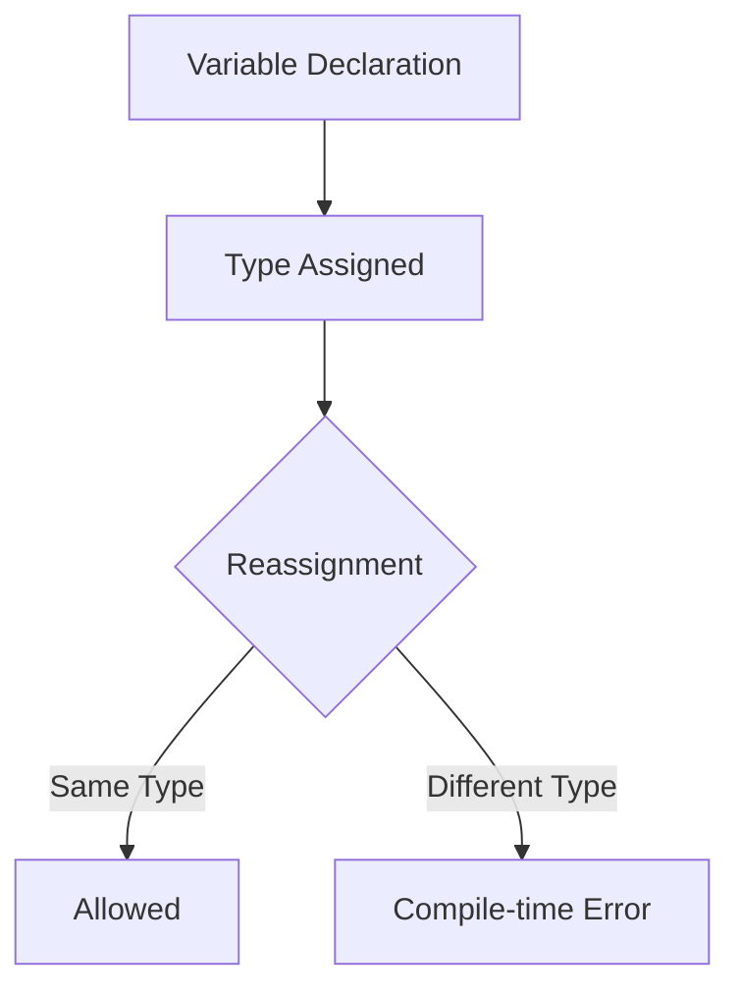
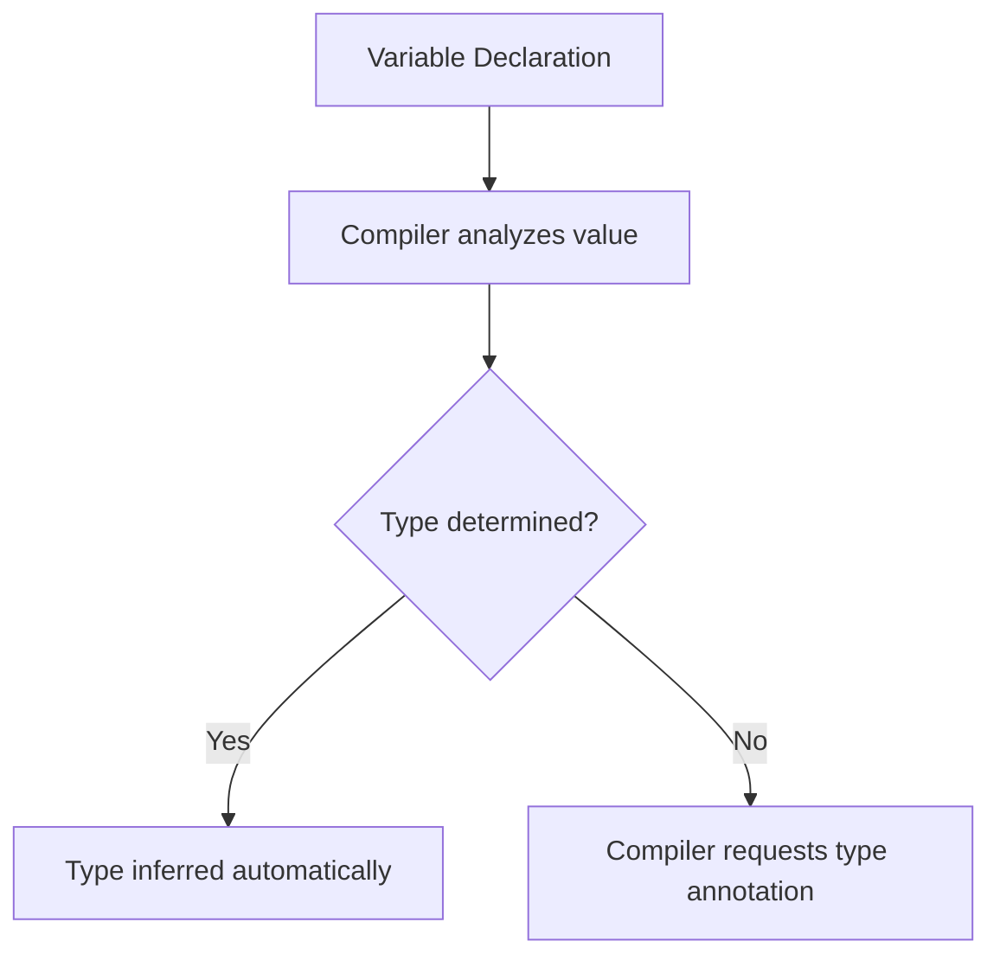
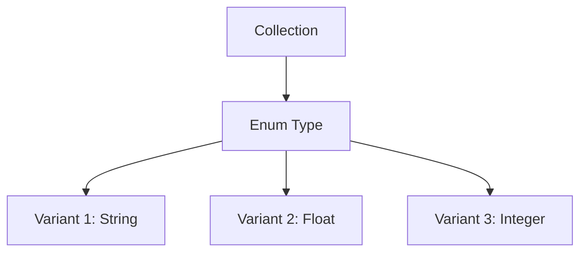

# Numeric Types, Type Annotations, and Functions in Rust

## 1. Numeric Types and Type Safety

### Definition

A **numeric type** defines the kind of number a variable can store. Rust enforces **strict type safety**, meaning once a variable has a type, it cannot change to another type.

Rust is a **statically typed language**, so all values have a fixed type determined at compile time.

---

## 2. Reassignment Vs Type Changes

Rust allows **reassignment of values** only if the new value has the **same type** as the original.

### Example: Valid Reassignment

```rust
let mut y = 2.2;
y = 3.1;
```

Step-by-step explanation:

1. `y` is declared as a mutable variable using `let mut`.
    
2. `y` is assigned the floating point value `2.2`.
    
3. The variable is reassigned to `3.1`.
    
4. Both values are floating point numbers, so the operation is valid.

---

### Example: Invalid Type Change

```rust
let mut y = 2.2;
y = "3.1";
```

Explanation:

1. `y` is initially assigned a **float**.
    
2. The new value `"3.1"` is a **string**.
    
3. Rust does not allow a variable’s type to change.

Result:

- Compilation error occurs.

---

### Rust Type Consistency Model



Rust enforces this rule to prevent runtime errors and ensure predictable program behavior.

---

# 3. Type Annotations

## Definition

A **type annotation** explicitly declares the type of a variable.

Syntax:

```rust
variable_name: Type
```

---

## Example

```rust
let x: f64 = 1.1;
```

Explanation:

1. `x` is declared using `let`.
    
2. `: f64` explicitly states the type.
    
3. `f64` means **64-bit floating point number**.

---

## Numeric Type Example

|Type|Meaning|
|---|---|
|`f32`|32-bit floating point number|
|`f64`|64-bit floating point number|

Rust uses `f64` as the default floating point type in most situations.

---

# 4. Type Inference

## Definition

**Type inference** is the compiler’s ability to automatically determine a variable’s type based on its assigned value.

Example:

```rust
let x = 1.1;
```

Here:

- Rust infers that `x` is a floating point number (`f64`).

---

## When Type Inference Works

|Situation|Behavior|
|---|---|
|Simple assignments|Compiler infers type|
|Complex expressions|Compiler may request annotation|
|Ambiguous types|Annotation required|

Important property:

- Rust will **never guess incorrectly**.
    
- If it cannot determine the type, the compiler produces an error and asks for explicit annotation.

---

## Type Inference Workflow



---

# 5. Defining Functions in Rust

Rust functions require **explicit type annotations** for parameters and return values.

## Definition

A **function** is a reusable block of code that performs a specific operation and may return a value.

---

# Example Function

```rust
fn multiply_both(x: f64, y: f64) -> f64 {
    return x * y;
}
```

## Step-by-Step Explanation

1. `fn` declares a function.
    
2. `multiply_both` is the function name.
    
3. `(x: f64, y: f64)` defines two parameters.
    
4. `-> f64` indicates the return type.
    
5. `return x * y;` computes and returns the result.

---

## Function Type Interpretation

This function can be read as:

```Python
multiply_both takes two f64 values and returns an f64
```

---

# 6. Calling Functions

Example usage:

```rust
let answer = multiply_both(2.0, 3.0);
println!("{}", answer);
```

Step-by-step:

1. `multiply_both` is called with two float arguments.
    
2. The function multiplies them.
    
3. The result is returned.
    
4. The result is stored in `answer`.
    
5. `println!` prints the value.

---

## Function Execution Flow


---

# 7. Functions Vs Macros in Calls

Rust distinguishes between **functions** and **macros** using syntax.

|Construct|Syntax|
|---|---|
|Function call|`multiply_both(2.0, 3.0)`|
|Macro call|`println!("Hello")`|

Key difference:

- **Functions** do not use `!`
    
- **Macros** always use `!`

In typical Rust code:

- Function calls are **more common**
    
- Macros appear for specialized operations like formatting.

---

# 8. Functions Without Return Values

If a function returns nothing, the return type can be omitted.

Example:

```rust
fn main() {
    println!("Hello");
}
```

Explanation:

- `main` takes no parameters.
    
- It returns nothing.

---

# 9. No Dynamic “Any” Type in Rust

Some languages allow variables that can store any type.

Examples:

|Language|Flexible Type|
|---|---|
|Python|Dynamic typing|
|Java|`Object`|
|TypeScript|`any`|

Rust does **not provide equivalent constructs**.

Key properties:

- No universal `any` type
    
- No `Object` base class
    
- No traditional inheritance

This enforces **strict compile-time type guarantees**.

---

# 10. Handling Multiple Types in Collections

Although individual variables cannot change type, Rust can store different types within a collection using **enums**.

## Concept



Enums allow a variable to represent **one of several predefined types safely**.

---

# 11. Summary of Key Points

- Rust variables have a **fixed type that cannot change at runtime**.
    
- Reassignment is allowed only if the new value has the same type.
    
- **Type annotations** explicitly declare variable types using `: Type`.
    
- Rust supports **type inference**, allowing the compiler to determine types automatically.
    
- When defining functions, **parameter types and return types must always be specified**.
    
- Function calls use normal syntax, while **macros use `!`**.
    
- Rust does not support dynamic types like `any` or `Object`.
    
- Multiple types in collections can be handled safely using **enums**.