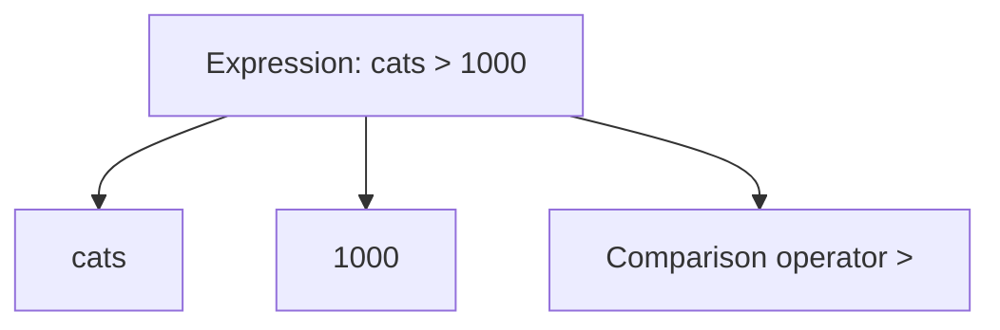
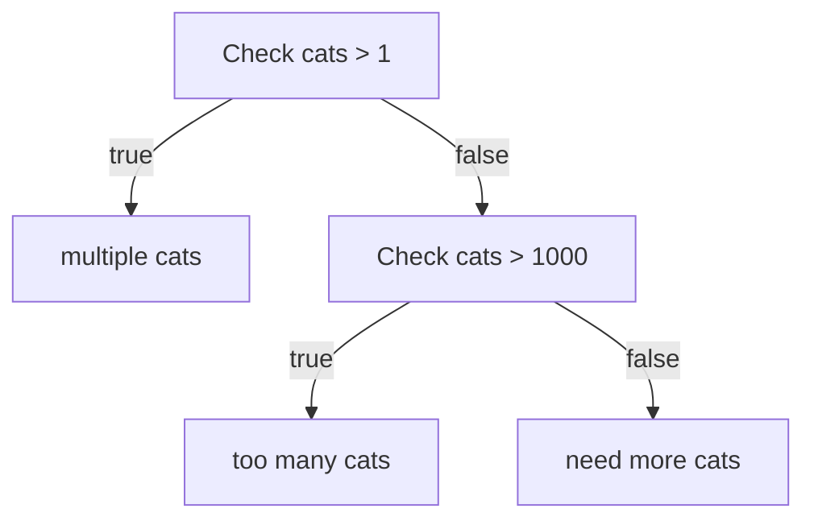

# Rust Booleans, Conditionals, and Expressions — Study Notes

---

# 1. Booleans in Rust

## Definition

A **Boolean** is a data type that represents a logical value. In Rust, a Boolean can only have **two possible values**:

- `true`
    
- `false`

Booleans are commonly used in **conditions, comparisons, and control flow**.

## Example

```rust
let should_go_fast = true;
let should_go_slow = false;
```

### Explanation

1. Two Boolean variables are declared.
    
2. `should_go_fast` stores `true`.
    
3. `should_go_slow` stores `false`.
    
4. These values can later be used in conditional statements like `if`.

---

## Boolean Internal Representation

Although conceptually a Boolean could be stored in **1 bit**, most hardware stores values in **bytes (8 bits)**.

In Rust, a Boolean behaves internally like a `u8`.

|Boolean|Numeric Representation|
|---|---|
|`true`|`1`|
|`false`|`0`|

### Conversion Example

Rust allows casting a Boolean to a number using `as`.

```rust
let value: u8 = true as u8;
```

### Explanation

1. `true` is cast to `u8`.
    
2. Rust converts it internally.
    
3. `value` becomes `1`.

---

# 2. Equality Comparison in Rust

## Structural Equality (`==`)

Rust uses the **double equals operator `==`** to compare values.

This performs **structural equality**, meaning Rust compares the **actual contents of the values**.

### Example

```rust
let cats = 3;

if cats == 3 {
    println!("Exactly three cats");
}
```

### Key Properties

|Feature|Rust Behavior|
|---|---|
|Equality operator|`==`|
|Triple equals|Not available|
|Comparison type|Structural equality|
|Collection comparison|Element-by-element|

### Important Notes

Some languages differentiate between:

- **Reference equality**
    
- **Structural equality**

Rust primarily uses **structural equality**, meaning collections are compared by their **contents**, not their memory addresses.

---

# 3. Conditionals in Rust

## Definition

A **conditional statement** controls program flow by executing code only when a condition evaluates to `true`.

Rust primarily uses the `if` construct.

---

## Basic If Statement

```rust
let cats = 3;

if cats > 1 {
    println!("multiple cats");
}
```

### Explanation

1. `cats > 1` produces a Boolean.
    
2. If the result is `true`, the code block executes.
    
3. If `false`, it is skipped.

---

## If–Else Statement

```rust
let cats = 1;

if cats > 1 {
    println!("multiple cats");
} else {
    println!("need more cats");
}
```

### Explanation

1. Rust checks the condition `cats > 1`.
    
2. If `true`, the first block runs.
    
3. Otherwise, the `else` block runs.

---

## Else If

Rust also supports chained conditions.

```rust
let cats = 5;

if cats > 1000 {
    println!("too many cats");
} else if cats > 1 {
    println!("multiple cats");
} else {
    println!("need more cats");
}
```

---

# 4. Rust Conditional Syntax Rules

Rust has stricter syntax rules than many languages.

|Syntax Feature|Requirement|
|---|---|
|Parentheses around condition|Optional|
|Curly braces `{}`|Required|
|Condition type|Must be Boolean|

## Example

Valid Rust syntax:

```rust
if cats > 1 {
    println!("multiple cats");
}
```

Invalid in Rust (missing braces):

```rust
// Not allowed
if cats > 1
    println!("multiple cats");
```

---

# No Truthiness in Rust

Some languages allow expressions like:

```Python
if (5)
if ("hello")
```

Rust **does not allow this**.

The condition must evaluate to **exactly a Boolean value**.

Example:

```rust
let cats = 3;

if cats {
    // ❌ Compile error
}
```

Correct version:

```rust
if cats > 0 {
    println!("We have cats");
}
```

---

# 5. Expressions Vs Statements

Understanding the difference between **expressions** and **statements** is critical in Rust.

## Expression

### Definition

An **expression** is something that **evaluates to a value**.

### Example

```rust
cats > 1000
```

This expression returns either:

- `true`
    
- `false`

### Expression Structure



Each component also evaluates to a value.

---

## Function Call Expressions

Function calls are also expressions.

```rust
println!("Hello");
```

However, `println!` returns no meaningful value, making it behave like a **statement** in practice.

---

## Statement

### Definition

A **statement** performs an action but **does not produce a useful value**.

Statements often end with a **semicolon (`;`)**.

### Example

```rust
println!("Hello world");
```

---

## Expression Vs Statement Table

|Feature|Expression|Statement|
|---|---|---|
|Produces value|Yes|No|
|Ends with semicolon|No|Usually|
|Example|`cats > 10`|`println!("hi");`|

---

# 6. Automatic Return from Expressions

Rust functions can return values **implicitly**.

## Traditional Return

```rust
fn multiply(x: f64, y: f64) -> f64 {
    return x * y;
}
```

---

## Expression Return

Rust allows returning the final expression automatically.

```rust
fn multiply(x: f64, y: f64) -> f64 {
    x * y
}
```

### Explanation

1. `x * y` is the final expression.
    
2. Rust automatically returns it.
    
3. No `return` keyword is required.

---

## Important Rule

If you add a **semicolon**, the expression becomes a **statement**.

Incorrect version:

```rust
fn multiply(x: f64, y: f64) -> f64 {
    x * y;
}
```

This produces an error because the function no longer returns a value.

---

# 7. If as an Expression

Rust allows `if` to behave like an expression.

This means it can **produce a value**.

---

## Example

```rust
let message =
    if cats > 1 {
        "multiple cats"
    } else if cats > 1000 {
        "too many cats"
    } else {
        "need more cats"
    };
```

### Explanation

1. The `if` block evaluates conditions.
    
2. Each branch returns a string.
    
3. The result is assigned to `message`.

This behaves similarly to a **ternary operator** in other languages.

---

## Flow Diagram



---

## Important Syntax Rule

When assigning using `let`, you **must end the statement with a semicolon**.

Correct:

```rust
let message = if cats > 1 {
    "multiple cats"
} else {
    "need more cats"
};
```

Incorrect:

```rust
let message = if cats > 1 {
    "multiple cats"
} else {
    "need more cats"
}
```

This will produce a compiler error.

---

# Key Points Summary

- Rust Booleans only have **two values: `true` and `false`**.
    
- Internally, Booleans behave like **numeric values (`1` or `0`)**.
    
- Rust uses **`==` for equality comparisons** and does not support `===`.
    
- `if` conditions must evaluate to **a Boolean value**, not truthy values.
    
- Rust requires **curly braces for conditional blocks**.
    
- **Expressions return values**, while **statements perform actions**.
    
- The **last expression in a function is automatically returned**.
    
- `if` can act as an **expression**, allowing conditional assignment of values.
    
- Adding a **semicolon converts an expression into a statement**, which can change program behavior.