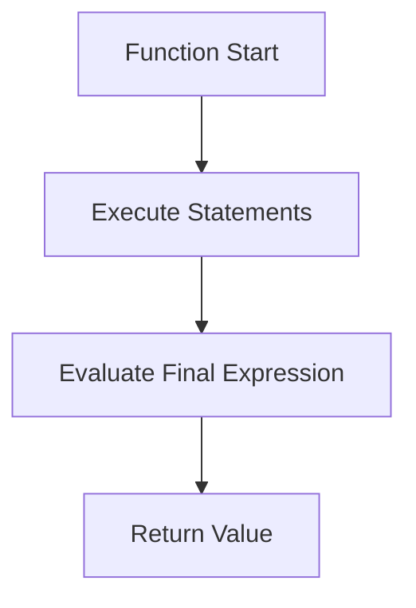
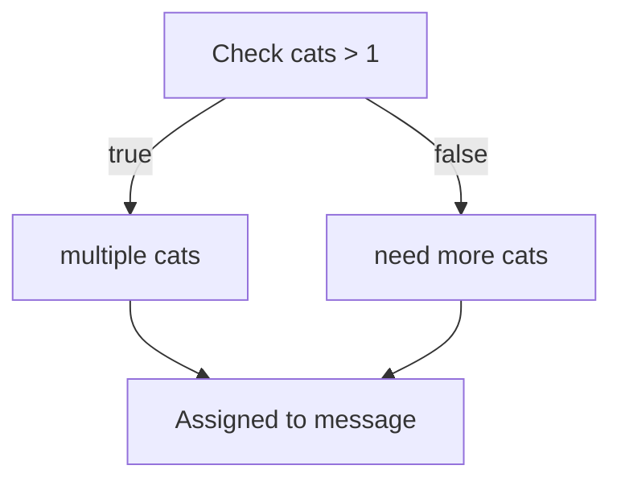
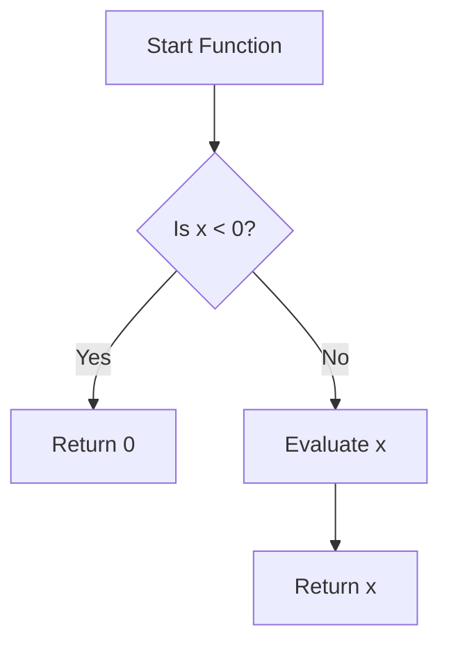

# Rust Study Notes: Statements, Expressions, and Automatic Returns

---

# 1. Expressions and Statements in Rust

## Definition: Expression

An **expression** is any piece of code that **evaluates to a value**.

Examples include:

- arithmetic operations
    
- comparisons
    
- function calls
    
- conditionals

### Example

```rust
cats > 1
```

This expression evaluates to a Boolean (`true` or `false`).

---

## Definition: Statement

A **statement** performs an action but **does not produce a value that can be used further**.

Statements usually end with a **semicolon (`;`)**.

### Example

```rust
println!("Hello");
```

This prints text but does not produce a usable value.

---

## Expression Vs Statement Comparison

|Feature|Expression|Statement|
|---|---|---|
|Produces a value|Yes|No|
|Ends with semicolon|Usually no|Usually yes|
|Example|`cats > 1`|`println!("hi");`|
|Can be assigned to variable|Yes|No|

---

# 2. Automatic Return in Rust Functions

## Concept

Rust allows functions to **automatically return the final expression** without using the `return` keyword.

### Rule

A function may contain:

- **Multiple statements**
    
- **One final expression**

That final expression becomes the **return value of the function**.

---

## Example: Explicit Return

```rust
fn multiply(x: f64, y: f64) -> f64 {
    return x * y;
}
```

### Explanation

1. The function receives two parameters.
    
2. `x * y` computes the product.
    
3. `return` explicitly sends the value back.

---

## Example: Automatic Return

```rust
fn multiply(x: f64, y: f64) -> f64 {
    x * y
}
```

### Step-by-Step

1. `x * y` is evaluated.
    
2. It is the **last expression** in the function.
    
3. Rust automatically returns the value.
    
4. No `return` keyword is needed.

---

## Invalid Pattern

Rust does **not allow multiple trailing expressions**.

```rust
fn example() -> i32 {
    5
    10
}
```

This produces a **compiler error**.

### Correct Structure

```Python
Statements
Statements
Statements
Final Expression
```

---

## Function Execution Flow



---

# 3. Expressions Inside Conditional Blocks

Rust treats **if blocks as expressions**.

This means an entire `if` statement can **produce a value**.

---

## Example

```rust
let message =
    if cats > 1 {
        "multiple cats"
    } else {
        "need more cats"
    };
```

### Step-by-Step Explanation

1. Rust evaluates `cats > 1`.
    
2. If true, `"multiple cats"` becomes the value.
    
3. Otherwise `"need more cats"` becomes the value.
    
4. That value is assigned to `message`.

---

## Conditional Expression Flow



---

## Important Syntax Rule

The entire conditional expression must end with a **semicolon** when used with `let`.

Correct:

```rust
let message = if cats > 1 {
    "multiple cats"
} else {
    "need more cats"
};
```

---

# 4. Multiple Statements Before the Final Expression

Rust allows many statements before the return expression.

Example:

```rust
fn example() -> i32 {
    let a = 5;
    let b = 10;
    a + b
}
```

## Explanation

1. `a` is assigned `5`.
    
2. `b` is assigned `10`.
    
3. `a + b` is the final expression.
    
4. Rust automatically returns `15`.

---

# 5. Early Returns in Rust

Sometimes a function should exit **before reaching the final expression**.

In these cases, the `return` keyword is required.

---

## Example: Early Return

```rust
fn check_value(x: i32) -> i32 {
    if x < 0 {
        return 0;
    }

    x
}
```

### Explanation

1. If `x` is negative, the function immediately returns `0`.
    
2. Otherwise execution continues.
    
3. The final expression `x` becomes the return value.

---

## Early Return Flow



---

# 6. Expressions as First-Class Values

In Rust, **entire expressions can be used anywhere a value is expected**.

Example: assigning the result of an `if` expression.

```rust
let result = if value > 10 { 100 } else { 50 };
```

This means:

- the entire `if` block behaves like a **single value-producing expression**.

This feature allows **concise functional-style programming**.

---

# 7. Type Safety in Comparisons

Rust enforces **strict type checking**.

Invalid comparisons produce **compile-time errors**.

---

## Example: Type Error

```rust
let a = "1.1";
let b = 1.1;

if a == b {
    println!("Equal");
}
```

This will **not compile**.

Rust does not automatically convert between types.

---

## Comparison Type Rules

|Comparison|Result|
|---|---|
|same types|allowed|
|different types|compile error|
|implicit coercion|not allowed|

---

# 8. No Null or Undefined in Rust

Rust does **not support**:

- `null`
    
- `nil`
    
- `undefined`

Unlike many languages, Rust avoids these concepts entirely.

Instead, Rust uses safer constructs (introduced later) such as **optional value types**.

This design prevents many runtime errors related to **null references**.

---

## Conceptual Comparison

|Language Feature|Rust|
|---|---|
|null values|Not supported|
|undefined values|Not supported|
|implicit coercion|Not supported|
|safer alternatives|Provided by type system|

---

# Key Points Summary

- An **expression produces a value**, while a **statement performs an action**.
    
- Rust functions automatically return the **last expression** if no semicolon is used.
    
- Functions may contain **multiple statements followed by one final expression**.
    
- `if` blocks are **expressions**, meaning they can return values.
    
- Early exits from functions require the **`return` keyword**.
    
- Rust enforces **strict type checking**, preventing invalid comparisons.
    
- Entire expressions (including conditionals) can be used anywhere a value is expected.
    
- Rust **does not support null or undefined values**, improving safety and preventing common runtime errors.