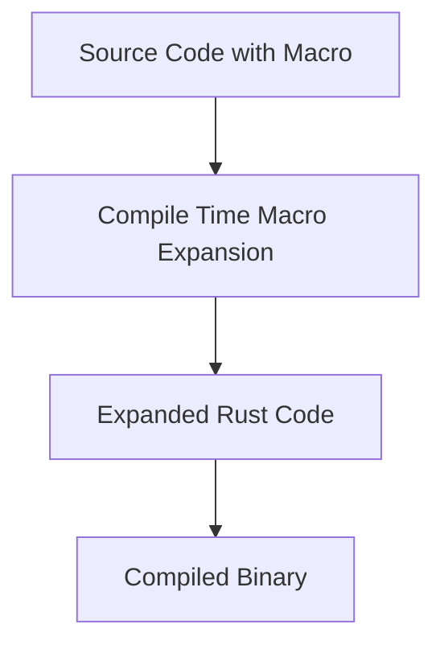
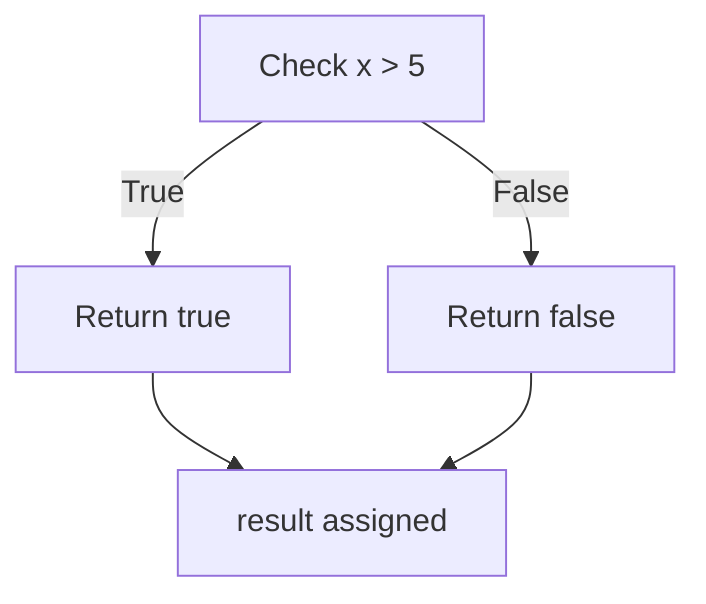
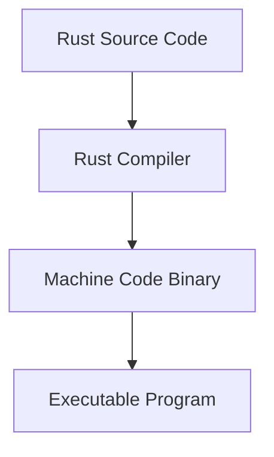
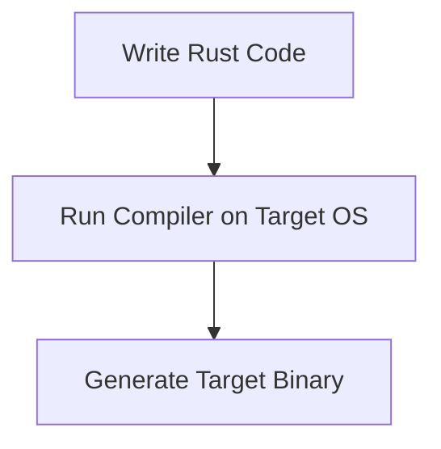

# Rust Study Notes: Strings, Macros, Types, and Language Characteristics

---

# 1. Strings and String Interpolation

## Definition: String

A **string** is a sequence of characters used to represent text.  
Rust provides macros that support **string interpolation**, allowing values to be inserted into formatted strings.

---

## String Formatting with `format!`

The `format!` macro constructs formatted strings.

### Example

```rust
let name = "Alice";
let message = format!("Hi, {}", name);
```

### Step-by-Step Explanation

1. `format!` is called with a string template.
    
2. `{}` is a placeholder.
    
3. The variable `name` is inserted where `{}` appears.
    
4. The macro returns a new formatted string.

Result:

```Python
Hi, Alice
```

---

## Macros Supporting String Interpolation

|Macro|Purpose|Output|
|---|---|---|
|`format!`|Returns a formatted string|String|
|`println!`|Prints formatted text to console|Console output|
|`panic!`|Stops program execution with error message|Runtime error|

### Example

```rust
println!("Hello {}", name);
```

---

## How Macros Work

Macros operate **at compile time**.

They expand into additional Rust code before compilation.

### Macro Expansion Concept



Macros are therefore considered **compile-time syntax transformations**.

---

# 2. Floating-Point Numbers

## Definition: Float

A **floating-point number** represents numbers with decimal values.

Rust supports two main float types:

|Type|Precision|Size|
|---|---|---|
|`f32`|Single precision|32-bit|
|`f64`|Double precision|64-bit|

---

## Example

```rust
let mut value: f64 = 1.5;
```

### Explanation

1. `let mut` declares a **mutable variable**.
    
2. `1.5` indicates a **floating-point number**.
    
3. The type is explicitly annotated as `f64`.

---

## Type Inference

Rust can infer types automatically.

Example:

```rust
let x = 1.5;
```

Rust automatically assigns **`f64` by default**.

|Numeric Category|Default Type|
|---|---|
|Floating point|`f64`|
|Integer|`i32`|

---

# 3. Integers

## Definition: Integer

An **integer** is a whole number without decimal points.

Rust supports **signed and unsigned integers**.

|Type|Description|
|---|---|
|`i32`|Signed 32-bit integer|
|`u32`|Unsigned 32-bit integer|

---

## Example: Explicit Integer Type

```rust
let one: u32 = 1.99 as u32;
```

### Step-by-Step Explanation

1. `1.99` is a floating-point value.
    
2. `as u32` casts it to an unsigned integer.
    
3. The decimal portion is **discarded**.
    
4. The final value becomes `1`.

---

## Float-to-Integer Casting

|Input|Cast|Result|
|---|---|---|
|`1.99`|`as u32`|`1`|
|`5.7`|`as u32`|`5`|

Casting **truncates** decimal values.

---

# 4. Boolean Values and Conditional Expressions

## Definition: Boolean

A **boolean** represents logical truth values.

|Value|Meaning|
|---|---|
|`true`|condition satisfied|
|`false`|condition not satisfied|

---

## Example

```rust
let result = if x > 5 { true } else { false };
```

### Step-by-Step Explanation

1. Rust evaluates the condition `x > 5`.
    
2. If true, the expression evaluates to `true`.
    
3. Otherwise it evaluates to `false`.
    
4. The value is assigned to `result`.

---

## Conditional Expression Structure



---

# 5. Traits Vs Macros

## Macros

### Definition

A **macro** is a compile-time code generator that expands syntax into Rust code.

### Characteristics

- Runs at **compile time**
    
- Performs **code generation**
    
- Used for formatting, logging, DSL-like syntax

Examples:

- `format!`
    
- `println!`
    
- `panic!`

---

## Traits

### Definition

A **trait** defines shared behavior that multiple types can implement.

Traits are conceptually similar to:

- **interfaces**
    
- **behavior contracts**

Traits allow **polymorphism and code reuse**.

---

## Trait Vs Macro Comparison

|Feature|Macros|Traits|
|---|---|---|
|Execution time|Compile time|Runtime / compile-time dispatch|
|Purpose|Code generation|Behavior abstraction|
|Similar concept|Syntax expansion|Interfaces|

---

# 6. Function Return Types

## Rule

In Rust, **normal functions must explicitly declare their return type**.

Example:

```rust
fn add(a: i32, b: i32) -> i32 {
    a + b
}
```

The `-> i32` specifies the return type.

---

## Type Inference Limitation

|Function Type|Return Type Inference|
|---|---|
|Normal functions|Not allowed|
|Closures|Allowed|

Closures (inline functions) can infer argument and return types.

Example closure:

```rust
let add = |a, b| a + b;
```

---

# 7. Rust Compilation Model

Rust compiles **directly to machine code**.

There is **no virtual machine or bytecode layer**.

## Compilation Pipeline



Rust can also compile to:

- **WebAssembly (WASM)**

---

# Comparison with Other Languages

|Language|Compilation Target|
|---|---|
|Rust|Native machine code|
|Java|Bytecode + JVM|
|C#|Intermediate Language + CLR|
|JavaScript|Interpreted / JIT|

---

# 8. Cross Compilation

## Definition

**Cross compilation** means compiling software for a different operating system than the one being used.

Example:

- Building a **Windows executable on macOS**.

---

## Rust Limitation

Direct cross-compilation is **not always available by default**.

Typical solutions include:

- Virtual machines
    
- Running the compiler on the target OS

Example workflow:



---

# 9. Rust Package Ecosystem

Rust packages are distributed through **crates**.

## Definition: Crate

A **crate** is a compiled package of Rust code.

Rust's package registry:

**crates.io**

---

## Comparison to Other Ecosystems

|Language|Package Registry|
|---|---|
|Rust|crates.io|
|JavaScript|npm|
|Python|PyPI|
|Java|Maven Central|

---

## Example Use Cases

Crates can provide:

- Data structures
    
- Networking
    
- Cryptography
    
- Databases
    
- Algorithms

---

# 10. Data Structure Libraries

Rust provides many data structures through crates.

Examples include:

|Structure|Description|
|---|---|
|Stack|LIFO collection|
|Queue|FIFO collection|
|Graph|Node-based relationships|
|Trees|Hierarchical structures|

Most implementations are available through **external crates**.

---

# 11. Type Casting and Memory

## Example

```rust
let y: i64 = x as i64;
```

### What Happens

1. Rust creates a **new value of type `i64`**.
    
2. The original value is **copied and converted**.
    
3. A new memory representation is created.

Reason:

Different numeric types require **different storage sizes**.

---

# 12. Null and Undefined Alternatives

Rust does **not include**:

- `null`
    
- `undefined`

This eliminates many runtime errors common in other languages.

Instead Rust uses **safe alternatives provided by its type system**.

---

# 13. Functional Concepts: Monads and Monoids

Rust does **not support higher-kinded types**, which are typically required for:

- **Monads**
    
- **Monoids**

These constructs are common in purely functional languages like **Haskell**.

Rust instead focuses on:

- practical functional features
    
- type safety
    
- performance

---

# 14. Cryptography Libraries

Rust does not include cryptography directly in the language.

However, cryptographic tools are available through **crates**.

Examples of possible features provided by external crates:

- encryption
    
- hashing
    
- digital signatures
    
- secure random number generation

---

# Key Points Summary

- Rust macros (`format!`, `println!`, `panic!`) support string interpolation and expand at compile time.
    
- Floating-point numbers default to `f64`, while integers default to `i32`.
    
- Type casting using `as` converts values and may truncate decimals.
    
- Conditional `if` expressions return values and can be assigned to variables.
    
- Macros and traits serve different purposes: macros generate code, traits define shared behavior.
    
- Rust functions must explicitly declare return types.
    
- Rust compiles directly to machine code without a virtual machine.
    
- Packages are distributed through crates hosted on `crates.io`.
    
- Type casting creates new values in memory due to different type sizes.
    
- Rust avoids null and undefined values, relying on safer type system constructs.