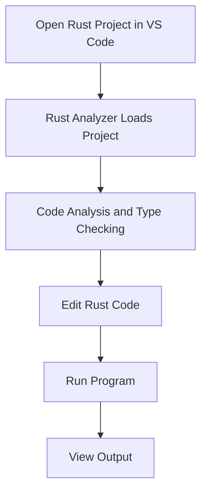
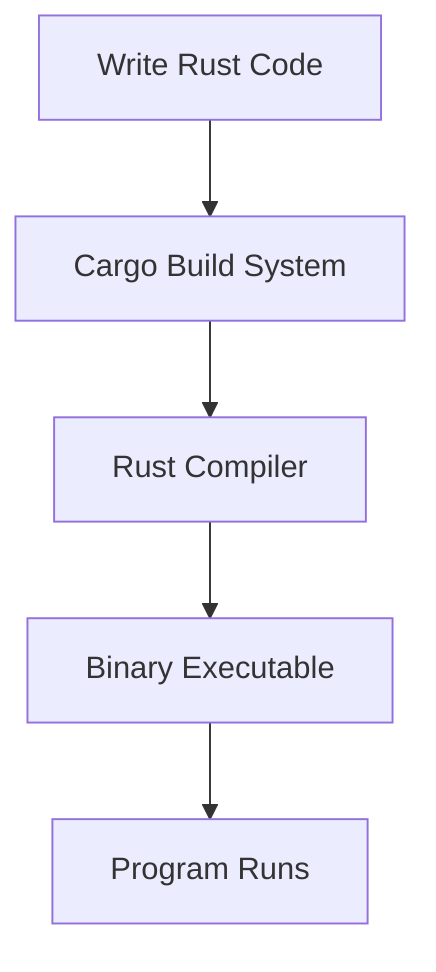
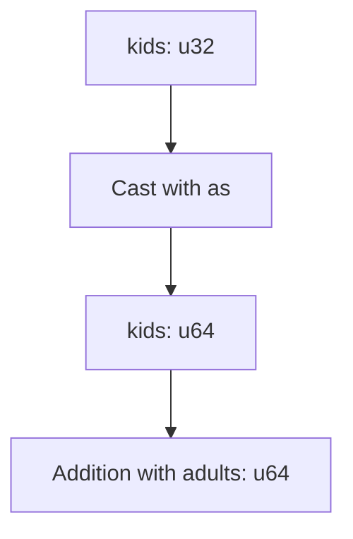
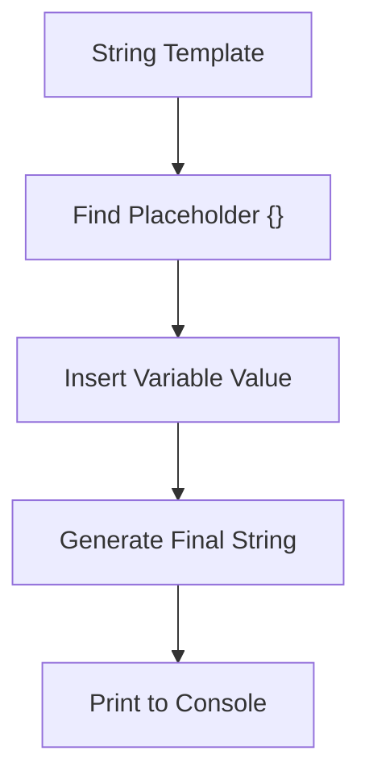
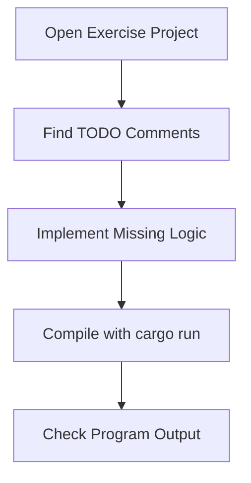

# Rust Study Notes: Development Environment, Rust Analyzer, and Basic Program Exercise

---

# 1. Rust Development Environment

## Visual Studio Code Setup

A common development setup for Rust includes:

- **Visual Studio Code (VS Code)** as the editor
    
- **Rust Analyzer** extension for language support

### Definition: Rust Analyzer

**Rust Analyzer** is a language server for Rust that provides development tools such as:

- type inference display
    
- code completion
    
- hover documentation
    
- inline diagnostics
    
- code actions
    
- run/debug commands

It integrates directly into editors like VS Code.

---

## Rust Language Servers

Rust has multiple language servers.

|Tool|Description|
|---|---|
|Rust Analyzer|Modern, fast language server widely used today|
|RLS (Rust Language Server)|Older implementation|

Rust Analyzer is generally preferred because it provides **faster performance and better IDE features**.

---

## Development Workflow in VS Code

Typical workflow:

1. Open project folder.
    
2. Rust Analyzer loads project.
    
3. Code analysis occurs in background.
    
4. Developer runs program using built-in run commands or terminal.

### Workflow Diagram



---

# 2. Rust Project Structure

Rust exercises are organized into directories.

Example structure:

```Python
project
 ├── part1
 │    ├── src
 │    │    └── main.rs
 │    └── README.md
 ├── part2
 ├── part3
 └── part7
```

---

## Important Components

|File|Purpose|
|---|---|
|`main.rs`|Entry point of the program|
|`README.md`|Instructions for running the exercise|
|`src/`|Source code directory|

---

# 3. Building and Running Rust Programs

Rust uses the **Cargo build system and package manager**.

## Command

```bash
cargo run
```

### What `cargo run` Does

1. Compiles the Rust program.
    
2. Produces a binary executable.
    
3. Runs the compiled program.

---

## Compilation Flow



---

# 4. Structure of the Exercise Program

The program includes:

- a `main` function
    
- function calls
    
- numeric calculations
    
- string output

---

## Example Program Structure

```rust
fn main() {
    println!("Hey, the city of {}", city_name);
    print_population(adults, kids, buildings);
}
```

### Step-by-Step Explanation

1. `main()` is the entry point of the program.
    
2. `println!` prints formatted text.
    
3. A function `print_population` is called.
    
4. The function receives several parameters.

---

# 5. Function Parameters and Types

The program uses typed parameters.

Example:

```rust
fn print_population(adults: u64, kids: u32, buildings: u32) {
}
```

---

## Numeric Types Used

|Type|Description|
|---|---|
|`u64`|Unsigned 64-bit integer|
|`u32`|Unsigned 32-bit integer|

These types define **how much memory is used and what values are allowed**.

---

# 6. Type Inference in Rust

## Definition

**Type inference** allows the compiler to determine variable types automatically without explicit annotations.

Example:

```rust
let population = adults + kids;
```

Rust determines the type based on the operands.

---

## Rust Analyzer Type Display

Rust Analyzer can display inferred types inside the editor.

Example:

```Python
population: i32
```

Displayed in **gray text** to indicate inferred types.

---

## Adding Explicit Types

Rust Analyzer allows inserting explicit type annotations.

Example transformation:

Before:

```rust
let population = adults + kids;
```

After:

```rust
let population: i32 = adults + kids;
```

---

# 7. Type Conversion Using `as`

When performing arithmetic between different numeric types, Rust requires explicit casting.

---

## Example Problem

Variables:

- `adults: u64`
    
- `kids: u32`

These cannot be directly added.

---

## Solution: Type Casting

```rust
let population = adults + kids as u64;
```

### Step-by-Step Explanation

1. `kids` is originally `u32`.
    
2. `kids as u64` converts it to `u64`.
    
3. Both operands now have the same type.
    
4. Addition becomes valid.

---

## Type Conversion Diagram



---

# 8. Calculating Derived Values

The exercise calculates:

- **total population**
    
- **buildings per person**

---

## Population Calculation

```rust
let population = adults + kids as u64;
```

---

## Buildings Per Person

```rust
let buildings_per_person = buildings as f64 / population as f64;
```

### Step-by-Step

1. Convert integers to floating point.
    
2. Perform division.
    
3. Store result as floating point value.

---

# 9. String Interpolation with `println!`

Rust uses `{}` placeholders for inserting variables into strings.

---

## Example

```rust
println!("Buildings per person: {}", buildings_per_person);
```

### Steps

1. Rust reads the format string.
    
2. `{}` acts as placeholder.
    
3. The variable value replaces `{}`.

---

## Formatting Process



---

# 10. Program Output

Initial incorrect output:

```Python
The city of Rustville
Population: 0
Adults: ...
Kids: ...
Buildings: ...
Buildings per person
```

Problem:

- Population was not calculated.

Expected corrected behavior:

```Python
The city of Rustville
Population: <correct value>
Buildings per person: <calculated value>
```

---

# 11. Exercise Workflow

Steps to complete the exercise:

1. Open project directory.
    
2. Locate `main.rs`.
    
3. Identify TODO sections.
    
4. Implement missing logic.
    
5. Compile and run using Cargo.

---

## Exercise Workflow Diagram



---

# Key Points Summary

- Rust development commonly uses **VS Code with Rust Analyzer** for code intelligence and type inspection.
    
- Rust projects are structured with a `src/main.rs` entry point and built using **Cargo**.
    
- `cargo run` compiles and executes Rust programs.
    
- Rust Analyzer displays **inferred types** and can insert explicit annotations.
    
- Arithmetic between different numeric types requires **explicit casting using `as`**.
    
- String interpolation in Rust is handled using macros like `println!`.
    
- The exercise demonstrates basic Rust concepts: functions, numeric types, type casting, arithmetic operations, and formatted output.