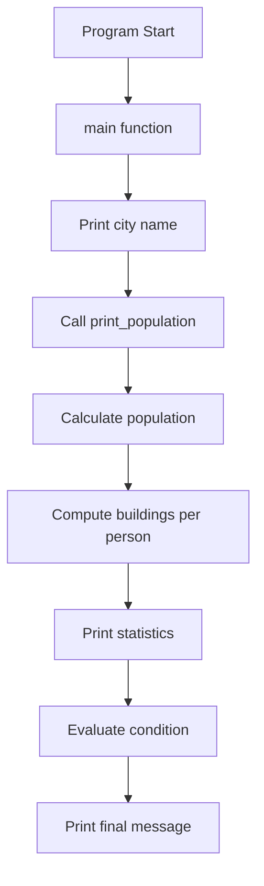
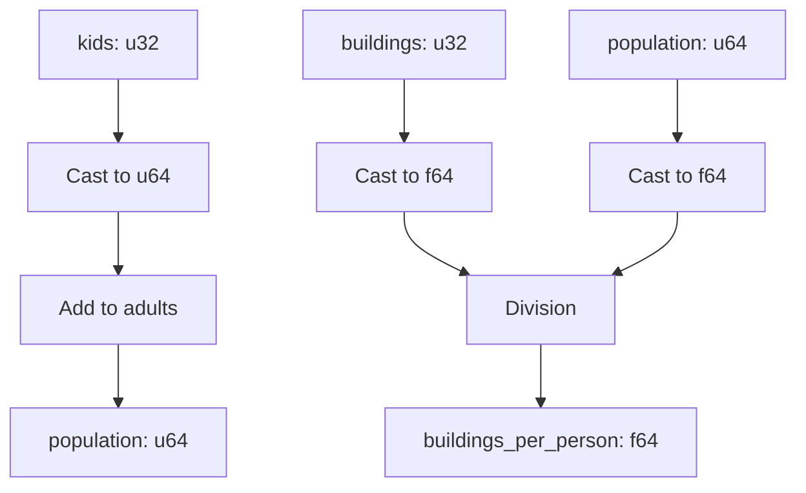
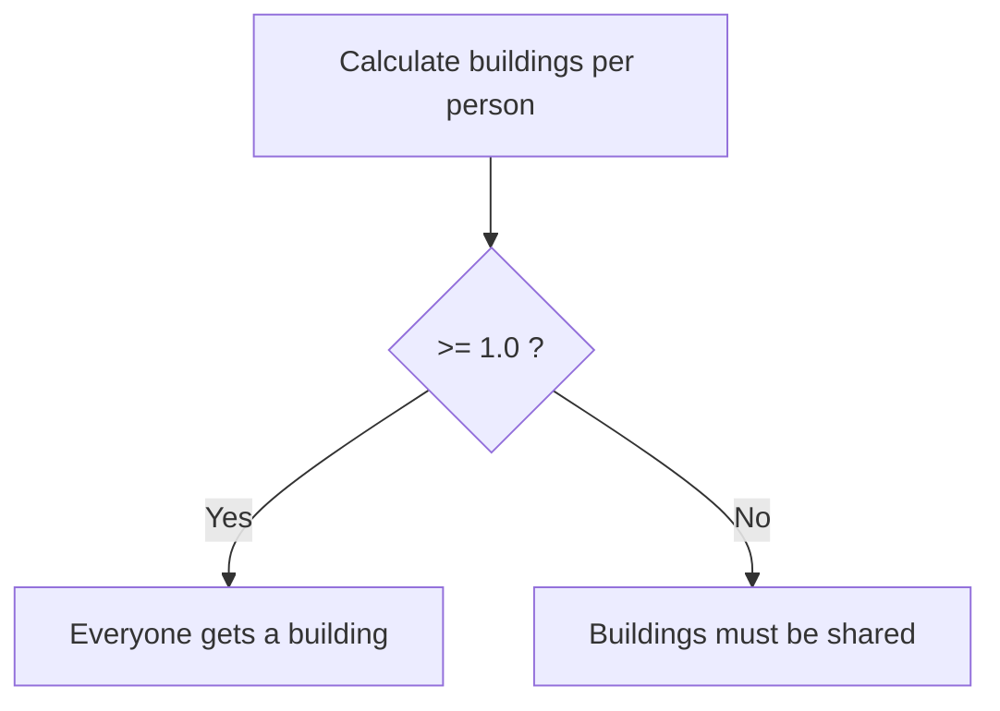

# Rust Study Notes: Population Calculation Program

---

# 1. Program Overview

This Rust program models a simple **city population report**.  
It performs the following tasks:

1. Defines a city name.
    
2. Prints an introductory message.
    
3. Calculates population using adults and kids.
    
4. Computes the ratio of **buildings per person**.
    
5. Displays population statistics.
    
6. Determines whether buildings must be shared.

---

# 2. Program Structure

Rust programs typically follow this structure:



---

# 3. Complete Program Code

```rust
fn main() {
    let city_name: &str = "Rustville";

    println!("The city of {}:\n", city_name);

    print_population(1_324_578, 114_293, 108_097);
}

fn print_population(adults: u64, kids: u32, buildings: u32) {

    let population: u64 = adults + kids as u64; 

    let buildings_per_person: f64 = buildings as f64 / population as f64;

    println!("    Population: {}", population);
    println!("        Adults: {}", adults);
    println!("        Kids: {}", kids);
    println!("    Buildings: {}", buildings);
    println!("    Buildings per person: {}\n", buildings_per_person);

    if buildings_per_person >= 1.0 {
        println!("Everyone can have their own building!");
    } else {
        println!("Buildings must be shared!");
    }
}
```

---

# 4. Key Concepts Used in the Program

## String References

|Type|Description|
|---|---|
|`&str`|A string slice referencing text data|

A string slice is a **reference to a string stored elsewhere in memory**.

---

## Integer Types

|Type|Description|
|---|---|
|`u64`|Unsigned 64-bit integer|
|`u32`|Unsigned 32-bit integer|

Unsigned integers can only represent **non-negative numbers**.

---

## Floating Point Types

|Type|Description|
|---|---|
|`f64`|64-bit floating-point number|

Used when calculations require **decimal precision**.

---

# 5. Numeric Type Conversions

Rust does not automatically convert numeric types.

Explicit casting is required using `as`.

Example used in the program:

```rust
kids as u64
```

and

```rust
buildings as f64
population as f64
```

---

## Numeric Conversion Flow



---

# 6. Conditional Logic

The program uses an **if expression** to determine whether buildings are sufficient.

Condition:

```rust
buildings_per_person >= 1.0
```

Meaning:

- If each person can have at least one building → success
    
- Otherwise → buildings must be shared

---

## Conditional Flow



---

# 7. Line-by-Line Explanation

## Program Entry

```rust
fn main() {
```

Defines the **entry point** of the Rust program.  
Execution begins here.

---

```rust
let city_name: &str = "Rustville";
```

Declares a variable named `city_name`.

Components:

|Part|Meaning|
|---|---|
|`let`|variable declaration|
|`city_name`|variable name|
|`&str`|string slice type|
|`"Rustville"`|assigned string value|

---

```rust
println!("The city of {}:\n", city_name);
```

Prints a formatted message.

Explanation:

- `{}` is a placeholder
    
- `city_name` replaces `{}` in the output
    
- `\n` creates a new line

Output example:

```Python
The city of Rustville:
```

---

```rust
print_population(1_324_578, 114_293, 108_097);
```

Calls the function `print_population`.

Arguments passed:

|Value|Meaning|
|---|---|
|`1_324_578`|number of adults|
|`114_293`|number of kids|
|`108_097`|number of buildings|

Underscores improve **number readability**.

---

## Function Definition

```rust
fn print_population(adults: u64, kids: u32, buildings: u32) {
```

Defines a function that receives three parameters.

|Parameter|Type|Meaning|
|---|---|---|
|adults|`u64`|number of adults|
|kids|`u32`|number of children|
|buildings|`u32`|number of buildings|

---

## Population Calculation

```rust
let population: u64 = adults + kids as u64;
```

Computes the total population.

Steps:

1. `kids` is converted from `u32` → `u64`.
    
2. Both values now share the same type.
    
3. Rust performs the addition.
    
4. Result stored in `population`.

---

## Buildings per Person

```rust
let buildings_per_person: f64 = buildings as f64 / population as f64;
```

Calculates the building availability ratio.

Steps:

1. Convert `buildings` to `f64`.
    
2. Convert `population` to `f64`.
    
3. Perform floating-point division.
    
4. Store result in `buildings_per_person`.

---

## Printing Statistics

```rust
println!("    Population: {}", population);
```

Displays total population.

---

```rust
println!("        Adults: {}", adults);
```

Displays adult population.

---

```rust
println!("        Kids: {}", kids);
```

Displays number of children.

---

```rust
println!("    Buildings: {}", buildings);
```

Displays number of buildings.

---

```rust
println!("    Buildings per person: {}\n", buildings_per_person);
```

Displays the computed ratio.

`\n` adds a blank line for formatting.

---

## Conditional Evaluation

```rust
if buildings_per_person >= 1.0 {
```

Checks whether at least **one building exists per person**.

---

### Case 1: Enough Buildings

```rust
println!("Everyone can have their own building!");
```

Printed if the condition is **true**.

---

### Case 2: Not Enough Buildings

```rust
} else {
    println!("Buildings must be shared!");
}
```

Executed if the condition is **false**.

---

# 8. Example Program Output

Example output may look like:

```Python
The city of Rustville:

    Population: 1438871
        Adults: 1324578
        Kids: 114293
    Buildings: 108097
    Buildings per person: 0.0751

Buildings must be shared!
```

---

# 9. Key Points Summary

- Rust programs start execution in the `main()` function.
    
- Variables can include explicit types such as `u64`, `u32`, and `f64`.
    
- Rust requires explicit numeric type conversions using `as`.
    
- Floating-point calculations are necessary when decimal precision is required.
    
- `println!` supports string interpolation using `{}` placeholders.
    
- Conditional logic using `if` determines program behavior based on computed values.
    
- Functions can be declared anywhere in a file and called from `main`.