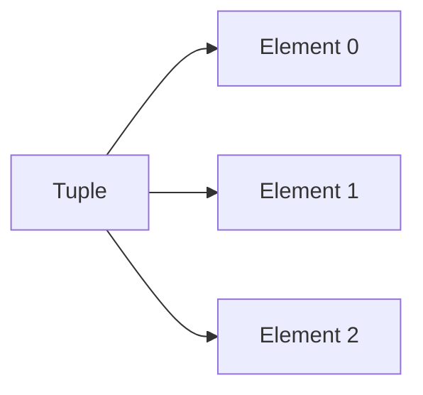
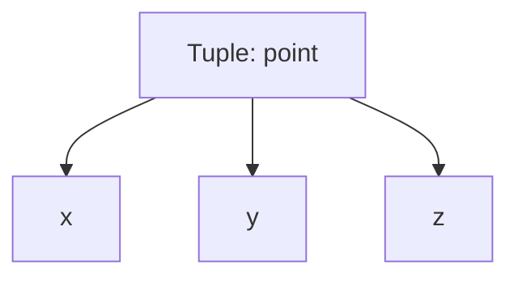
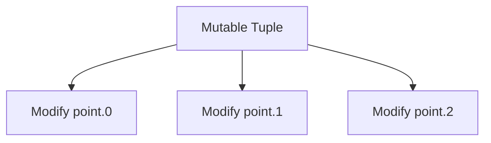
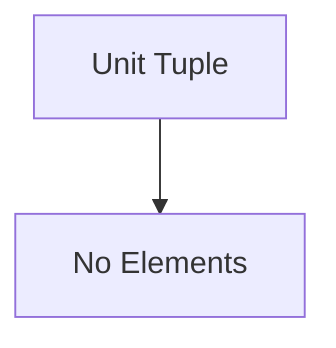

# Rust Study Notes: Collections Part 1 — Tuples, Mutability, and the Unit Type

---

# 1. Introduction to Tuples

## Definition: Tuple

A **tuple** is a fixed-size collection that can hold multiple values, potentially of **different types**.

Characteristics:

- Ordered collection
    
- Fixed length (cannot change at runtime)
    
- Elements accessed by **index**
    
- Can store mixed data types

---

## Tuple Syntax

Tuples are created using **parentheses**.

### Example

```rust
let point = (0, 0, 0);
```

This creates a tuple containing three values.

### Tuple Type

```rust
(i64, i64, i64)
```

This represents the type of the tuple.

---

## Tuple Structure



|Index|Value|Type|
|---|---|---|
|0|0|i64|
|1|0|i64|
|2|0|i64|

---

# 2. Accessing Tuple Elements

Tuple values are accessed using **dot notation with an index**.

## Example

```rust
let point = (0, 0, 0);

let x = point.0;
let y = point.1;
let z = point.2;
```

## Step-by-Step

1. `point` is a tuple containing three values.
    
2. `point.0` retrieves the first element.
    
3. `point.1` retrieves the second element.
    
4. `point.2` retrieves the third element.

---

# 3. Tuple Destructuring

## Definition: Destructuring

**Destructuring** is a technique used to extract multiple values from a data structure into separate variables.

---

## Example

```rust
let point = (0, 0, 0);

let (x, y, z) = point;
```

### Explanation

1. Rust matches the structure of the tuple.
    
2. The first element is assigned to `x`.
    
3. The second element is assigned to `y`.
    
4. The third element is assigned to `z`.

---

## Equivalent Operations

|Method|Code|
|---|---|
|Index Access|`point.0`, `point.1`, `point.2`|
|Destructuring|`let (x, y, z) = point;`|

Destructuring is essentially **syntactic sugar** for index access.

---

## Destructuring Diagram



---

# 4. Partial Destructuring

Sometimes only certain elements are needed.

Rust allows ignoring elements using **underscore (`_`)**.

---

## Example

```rust
let point = (10, 20, 30);

let (x, y, _) = point;
```

### Explanation

- `x` receives the first value
    
- `y` receives the second value
    
- `_` ignores the third value

---

## Example: Extract Only One Value

```rust
let (x, _, _) = point;
```

The underscores indicate values that should **not be stored**.

---

## Meaning of `_`

|Symbol|Meaning|
|---|---|
|`_`|Ignore this value|
|variable name|Store this value|

---

# 5. Mutable Tuples

## Definition: Mutability

In Rust, variables are **immutable by default**.  
To modify a variable, it must be declared using `mut`.

---

## Mutable Tuple Example

```rust
let mut point = (0, 0, 0);

point.0 = 17;
point.1 = 42;
point.2 = 9;
```

### Step-by-Step

1. `let mut point` creates a mutable tuple.
    
2. Individual tuple elements can now be reassigned.
    
3. Each element is updated through its index.

---

## Mutation Process



---

## Why `mut` is Required

Without `mut`:

```rust
let point = (0, 0, 0);
point.0 = 17;
```

This results in a **compiler error** because the tuple is immutable.

---

# 6. Tuple Size Characteristics

Tuples have a **fixed size**.

This means:

- Number of elements cannot change
    
- Elements cannot be added or removed
    
- Tuple structure remains constant

---

## Example

Valid:

```rust
let tuple = (1, 2, 3);
```

Invalid operation:

```Python
tuple.push(4)
```

Tuples do not support **dynamic resizing**.

---

# 7. The Unit Type

## Definition: Unit

The **unit type** is a tuple containing **zero elements**.

```rust
()
```

It is known as a **zero-length tuple**.

---

## Properties of Unit

|Property|Description|
|---|---|
|Elements|None|
|Size|0|
|Values|Only one possible value|

Unit represents **the absence of meaningful information**.

---

## Unit Structure



---

# 8. Unit as a Return Type

In Rust, **every function must return a value**.

When a function returns nothing meaningful, it returns **unit**.

---

## Example

```rust
fn main() {
    println!("Hello world");
}
```

This function implicitly returns:

```rust
()
```

Equivalent representation:

```rust
fn main() -> () {
    println!("Hello world");
}
```

---

## Return Flow

```mermaid
flowchart TD
A[Function Execution] --> B[No Explicit Return]
B --> C[Return Unit ()]
```

---

# 9. Unit in Expressions

Even expressions like `println!` technically return **unit**.

Example:

```rust
let result: () = println!("Hello");
```

## Explanation

1. `println!` prints text to the console.
    
2. The macro still produces a value.
    
3. That value is `()`.

---

# Unit Compared to Other Languages

|Language|Equivalent Concept|
|---|---|
|Rust|`()`|
|C / C++|`void`|
|Java|`void`|
|Python|`None`|

Rust’s unit type behaves similarly to **void**, but it is an actual value.

---

# 10. Why the Unit Type Exists

Rust requires **every function to have a return type**.

When no meaningful value is returned, unit serves as the **default placeholder**.

Advantages:

- Maintains type consistency
    
- Keeps the type system strict
    
- Allows expressions to always return something

---

# Key Points Summary

- A **tuple** is a fixed-size ordered collection that can hold values of different types.
    
- Tuple elements are accessed using **dot notation with numeric indices**.
    
- **Destructuring** allows unpacking tuple elements into variables.
    
- The underscore `_` is used to ignore unwanted values during destructuring.
    
- Tuples are **immutable by default** but can be made mutable with `mut`.
    
- Tuple size is fixed and cannot change during runtime.
    
- The **unit type `()`** is a special tuple with zero elements.
    
- Unit is commonly used as the return type for functions that do not produce meaningful values.
    
- Even expressions like `println!` technically return the unit type.