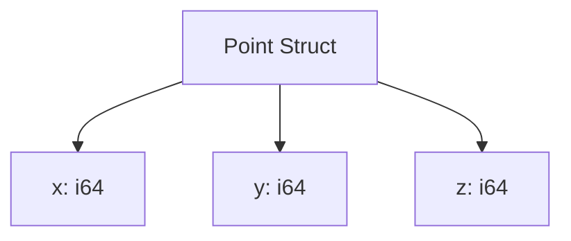
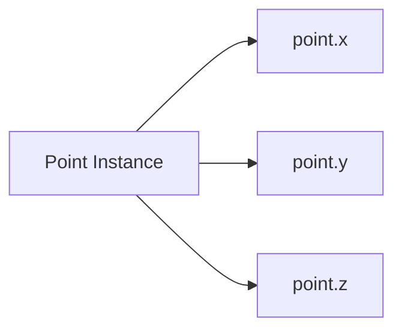
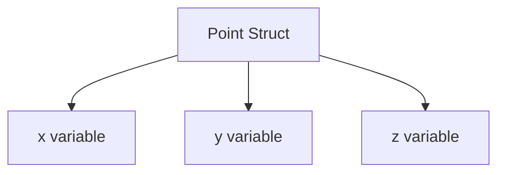
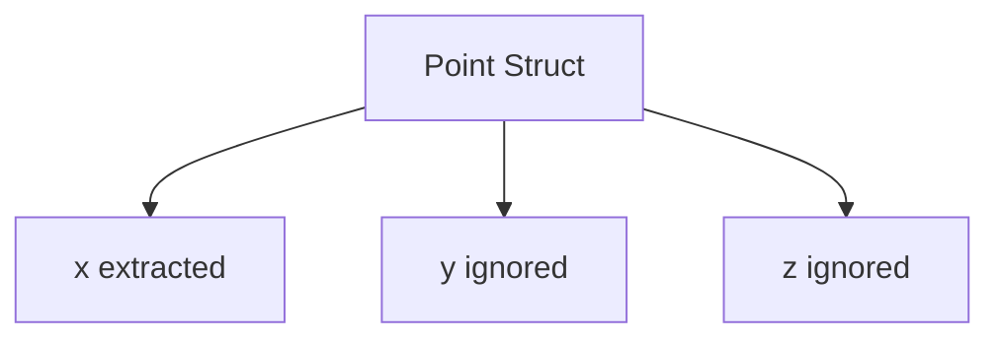
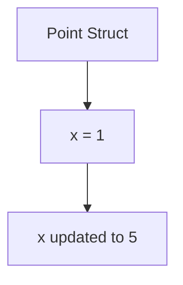
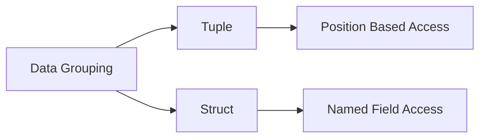
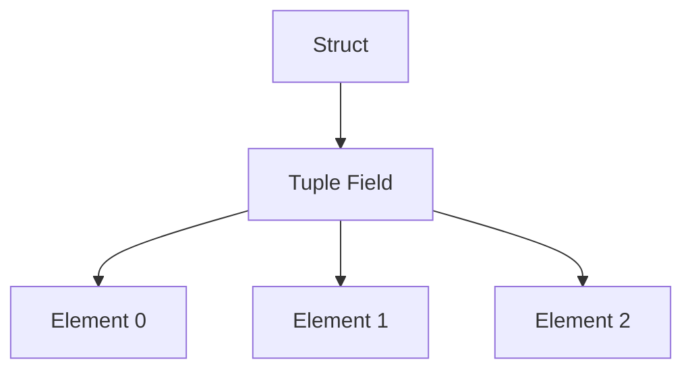

# Rust Study Notes: Structs, Named Fields, and Destructuring

---

# 1. Structs in Rust

## Definition: Struct

A **struct (structure)** is a custom data type that groups related values together using **named fields**.

Characteristics:

- Fields are **named**, not positional.
    
- Can contain different data types.
    
- Fixed structure determined at compile time.
    
- Used to model structured data such as objects, coordinates, or records.

---

## Struct Syntax

A struct is declared using the `struct` keyword.

### Example: 3D Point Struct

```rust
struct Point {
    x: i64,
    y: i64,
    z: i64
}
```

### Structure Visualization



|Field|Type|Meaning|
|---|---|---|
|x|i64|X coordinate|
|y|i64|Y coordinate|
|z|i64|Z coordinate|

---

# 2. Creating Struct Instances

## Struct Instantiation

Struct values are created using **curly braces** `{}` and field assignments.

### Example

```rust
let point = Point {
    x: 1,
    y: 2,
    z: 3
};
```

Explanation:

1. `Point` specifies the struct type.
    
2. Curly braces define field assignments.
    
3. Each field receives a value.

---

## Constructing a Struct with a Function

A common pattern is creating a **constructor function**.

### Example Function

```rust
fn new_point(x: i64, y: i64, z: i64) -> Point {
    Point {
        x: x,
        y: y,
        z: z
    }
}
```

### Step-by-Step Explanation

1. Function accepts parameters `x`, `y`, and `z`.
    
2. The return type is `Point`.
    
3. A new `Point` struct is created using the provided values.

---

# 3. Field Initialization Shorthand

Rust provides **field initialization shorthand** when variable names match field names.

## Equivalent Implementations

### Standard Version

```rust
fn new_point(x: i64, y: i64, z: i64) -> Point {
    Point {
        x: x,
        y: y,
        z: z
    }
}
```

### Shorthand Version

```rust
fn new_point(x: i64, y: i64, z: i64) -> Point {
    Point {
        x,
        y,
        z
    }
}
```

Explanation:

|Syntax|Meaning|
|---|---|
|`x: x`|field `x` receives variable `x`|
|`x`|shorthand for `x: x`|

---

# 4. Accessing Struct Fields

Struct fields are accessed using **dot notation**.

## Example

```rust
let point = Point { x: 1, y: 2, z: 3 };

let x_value = point.x;
```

Explanation:

- `point.x` retrieves the `x` field value.

---

# Field Access Diagram



---

# 5. Struct Destructuring

## Definition: Destructuring

**Destructuring** extracts values from a struct and assigns them to local variables.

---

## Example

```rust
let point = Point { x: 1, y: 2, z: 3 };

let Point { x, y, z } = point;
```

### Step-by-Step

1. Rust matches the structure of `Point`.
    
2. Each field value is extracted.
    
3. Variables `x`, `y`, and `z` are created.

Equivalent to:

```rust
let x = point.x;
let y = point.y;
let z = point.z;
```

---

## Destructuring Flow



---

# 6. Ignoring Fields During Destructuring

Sometimes only certain fields are needed.

Rust allows ignoring fields using **underscore `_`**.

## Example

```rust
let Point { x, y: _, z } = point;
```

Explanation:

|Field|Result|
|---|---|
|x|Stored in variable|
|y|Ignored|
|z|Stored in variable|

---

# 7. Ignoring Multiple Fields with `..`

Rust provides the **double-dot syntax (`..`)** to ignore remaining fields.

## Example

```rust
let Point { x, .. } = point;
```

Explanation:

- Extracts only `x`
    
- Ignores all other fields

---

# Destructuring Example Diagram



---

# 8. Mutable Structs

## Definition: Mutability

Rust variables are immutable by default.  
To modify struct fields, the struct instance must be declared with `mut`.

---

### Example

```rust
let mut point = Point {
    x: 1,
    y: 2,
    z: 3
};

point.x = 5;
```

### Step-by-Step

1. `mut` allows modification.
    
2. `point.x = 5` updates the field value.
    
3. The original struct is **modified**, not recreated.

---

## Mutation Flow



Important:

- This **mutates the existing struct**
    
- No new struct is created

---

# 9. Struct Size and Field Constraints

Structs have **fixed field definitions**.

Rules:

- Field count cannot change at runtime
    
- Field names cannot change
    
- Fields cannot be added or removed

---

## Allowed Operation

```rust
point.x = 10;
```

Modifies an existing field value.

---

## Disallowed Operations

|Operation|Reason|
|---|---|
|Add new field|Struct layout is fixed|
|Remove field|Struct definition is static|
|Rename field|Struct schema is compile-time defined|

---

# 10. Structs Vs Tuples

|Feature|Tuple|Struct|
|---|---|---|
|Field identification|Position|Name|
|Naming requirement|None|Required|
|Access syntax|`.0`, `.1`|`.field`|
|Readability|Lower|Higher|
|Use case|Lightweight grouping|Structured data models|

---

## Comparison Diagram



---

# 11. Nested Data Structures

Rust allows **nesting tuples and structs inside each other**.

Possible combinations include:

- Struct inside struct
    
- Tuple inside struct
    
- Struct inside tuple
    
- Tuple inside tuple

---

## Example

```rust
struct Position {
    point: (i64, i64, i64)
}
```

Example of struct containing a tuple.

---

# Nested Structure Diagram



---

# Key Points Summary

- **Structs** are user-defined data types with **named fields**.
    
- Struct instances are created using **curly braces and field assignments**.
    
- Rust provides **field initialization shorthand** when variable names match field names.
    
- Fields are accessed using **dot notation** (`point.x`).
    
- **Destructuring** extracts struct fields into variables.
    
- The `_` symbol ignores unwanted fields, while `..` ignores all remaining fields.
    
- Structs must be declared **mutable** to allow field modification.
    
- Mutating a field changes the **existing struct**, not a copy.
    
- Struct definitions are **fixed at compile time** and cannot change during execution.
    
- Rust supports **nested combinations** of structs and tuples.