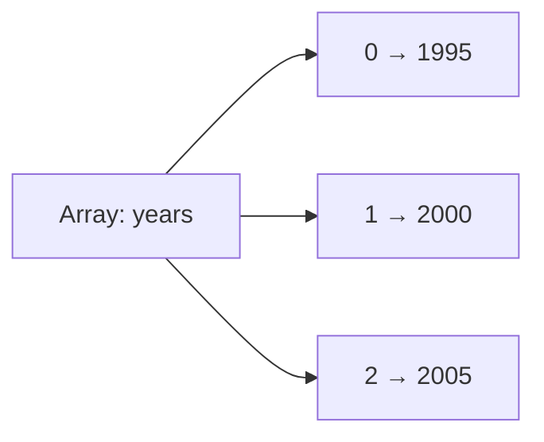
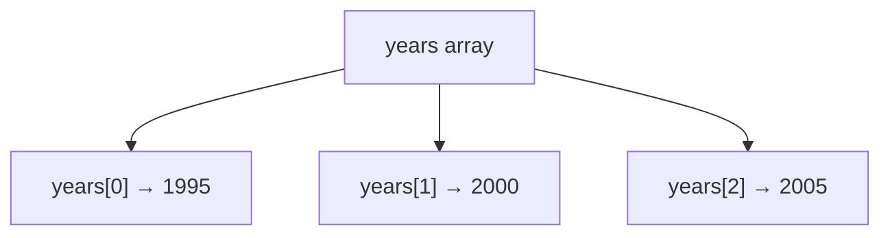
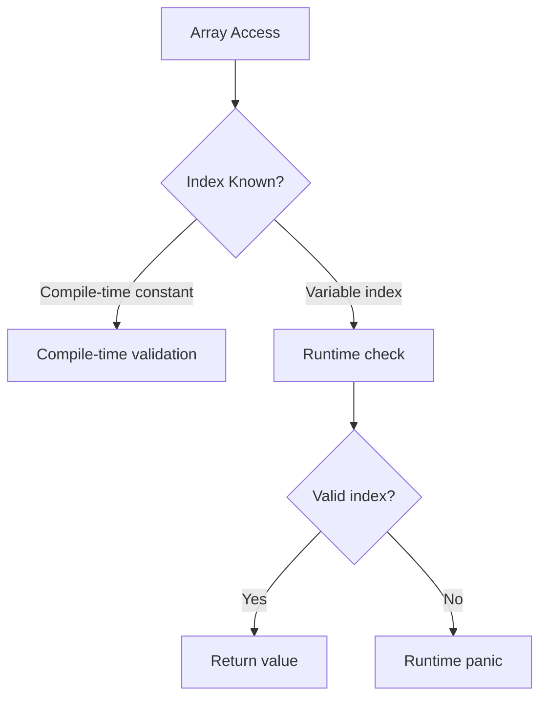
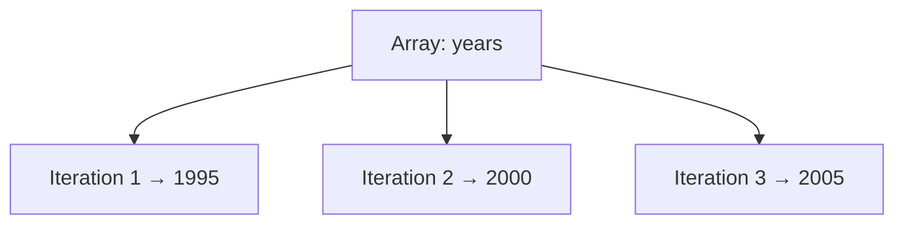
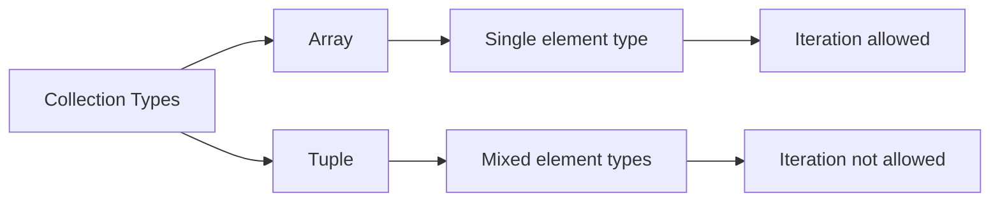

# Rust Study Notes: Arrays

---

# 1. Arrays in Rust

## Definition: Array

An **array** in Rust is a **fixed-size collection of elements where all elements have the same type**.

Characteristics:

- Fixed length determined at compile time
    
- All elements must have the same type
    
- Stored contiguously in memory
    
- Accessed using index notation

Arrays in Rust are similar to **C arrays**, rather than dynamic arrays found in languages like Python, JavaScript, or Ruby.

---

# 2. Array Syntax

Arrays are defined using **square brackets `[]`**.

## Example

```rust
let years: [i32; 3] = [1995, 2000, 2005];
```

## Syntax Breakdown

|Component|Meaning|
|---|---|
|`i32`|Type of each element|
|`3`|Number of elements|
|`[1995, 2000, 2005]`|Values stored in the array|

The **length (`3`) is part of the array's type**.

---

# Array Structure



|Index|Value|
|---|---|
|0|1995|
|1|2000|
|2|2005|

---

# 3. Array Constraints

Rust arrays have **two important restrictions**.

|Property|Description|
|---|---|
|Fixed type|All elements must share the same type|
|Fixed length|Size cannot change during program execution|

This means:

- You **cannot add or remove elements**
    
- The number of elements is **known at compile time**

---

# 4. Accessing Array Elements

Array elements are accessed using **index notation**.

## Example

```rust
let first_year = years[0];
```

Explanation:

1. `years` is the array.
    
2. `[0]` accesses the first element.
    
3. Rust arrays are **zero-indexed**.

---

# Index Access Diagram



---

# 5. Destructuring Arrays

Arrays support **destructuring**, similar to tuples.

## Example

```rust
let [first, second, third] = years;
```

Explanation:

|Variable|Value|
|---|---|
|first|1995|
|second|2000|
|third|2005|

---

# Ignoring Elements

Underscores `_` can ignore elements.

```rust
let [first, _, third] = years;
```

Explanation:

|Variable|Result|
|---|---|
|first|Stored|
|second|Ignored|
|third|Stored|

---

# 6. Mutable Arrays

Arrays can be modified if declared as **mutable**.

## Example

```rust
let mut years = [1995, 2000, 2005];

years[2] = 2010;
```

## Step-by-Step

1. `mut` allows modification.
    
2. `years[2]` refers to the third element.
    
3. The value `2005` is replaced with `2010`.

---

# 7. Index Bounds and Runtime Safety

Rust performs **bounds checking** when accessing arrays.

## Compile-Time Check

If a constant index is out of bounds:

```rust
years[5]
```

Rust produces a **compile-time error**.

---

## Runtime Check

If the index is stored in a variable:

```rust
let index = x;
years[index]
```

Rust cannot know the value beforehand.

Result:

- Rust performs a **runtime check**
    
- If out of bounds → **program panics**

---

# Bounds Checking Flow



---

# 8. Iterating Over Arrays

One major advantage of arrays is that **they can be iterated over**.

Iteration means executing code for each element.

---

## Example

```rust
let years = [1995, 2000, 2005];

for year in years.into_iter() {
    println!("Next year: {}", year + 1);
}
```

### Step-by-Step

1. `years.into_iter()` produces an iterator.
    
2. The loop runs once per element.
    
3. Each iteration assigns the element to `year`.

Execution:

|Iteration|year|Output|
|---|---|---|
|1|1995|Next year: 1996|
|2|2000|Next year: 2001|
|3|2005|Next year: 2006|

---

## Iteration Diagram



---

# 9. Why Arrays Can Be Iterated

Arrays support iteration because **all elements share the same type**.

Rust requires every variable to have a **single, known type**.

During iteration:

- The variable `year` must have one consistent type.
    
- Since all array elements are `i32`, this works safely.

---

# 10. Why Tuples Cannot Be Iterated

Tuples allow **mixed types**.

Example:

```rust
let tuple = (10, 20, true);
```

Types:

|Element|Type|
|---|---|
|10|i32|
|20|i32|
|true|bool|

If we attempted iteration:

- First two iterations → `i32`
    
- Third iteration → `bool`

Rust cannot assign multiple types to the same variable during iteration.

Therefore **tuples cannot be iterated**.

---

## Comparison Diagram



---

# 11. Arrays Vs Tuples Vs Structs

|Feature|Array|Tuple|Struct|
|---|---|---|---|
|Element types|Same type|Mixed types allowed|Mixed types allowed|
|Length|Fixed|Fixed|Fixed fields|
|Field access|Index|Index|Field name|
|Iteration|Supported|Not supported|Not supported|
|Use case|Lists of same type|Small grouped values|Structured records|

---

# 12. Limitations of Arrays

Arrays are **less flexible** than many collections.

Limitations:

- Cannot grow
    
- Cannot shrink
    
- Fixed size determined at compile time

Rust provides other collections (such as vectors) for **dynamic resizing**, which are introduced later.

---

# Key Points Summary

- Arrays are **fixed-size collections of elements of the same type**.
    
- Array types include both **element type and length** (e.g., `[i32; 3]`).
    
- Elements are accessed using **index notation** (`array[index]`).
    
- Rust performs **bounds checking** to prevent invalid access.
    
- Arrays can be **mutated** if declared with `mut`.
    
- Arrays support **destructuring** similar to tuples.
    
- Arrays can be **iterated over**, unlike tuples and structs.
    
- Iteration is possible because **all elements share the same type**.
    
- Arrays trade flexibility for **performance and type safety**.