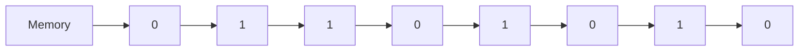
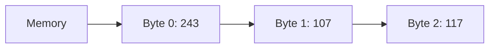
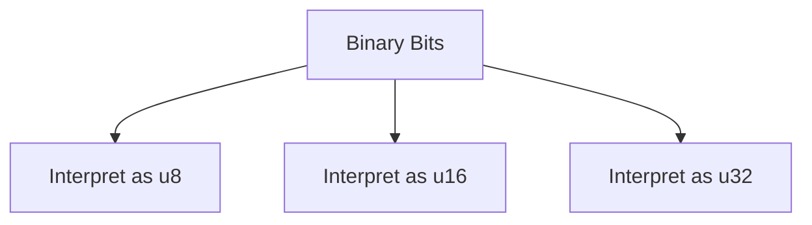
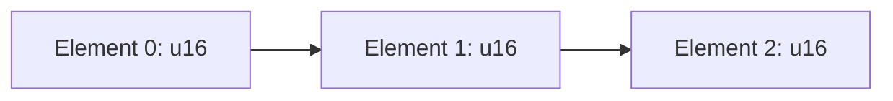
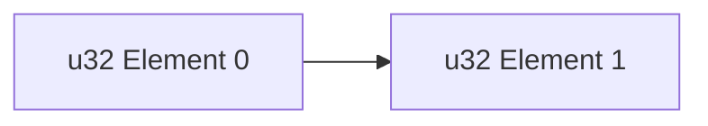
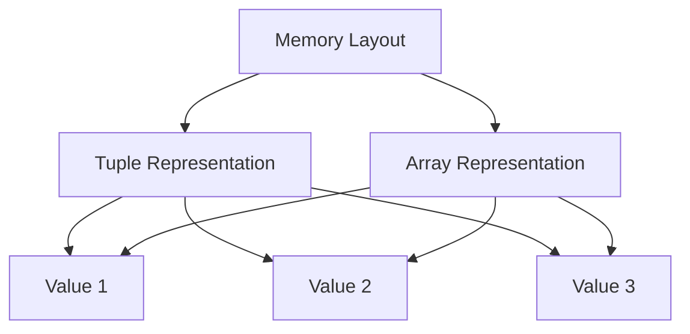
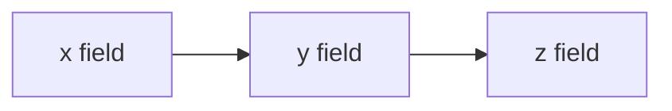
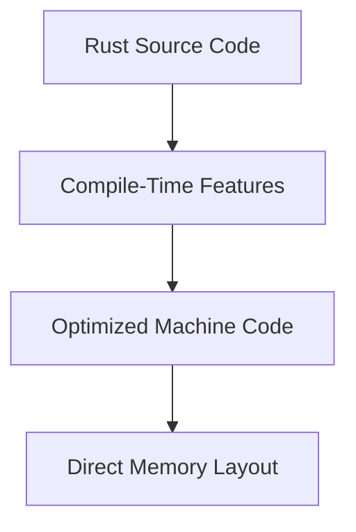

# Rust Study Notes: Memory Representation

---

# 1. Introduction to Memory

## Definition: Memory

**Memory** is the storage system used by a computer to hold data during program execution.

At the lowest level, memory is composed of **bits**, which store binary values.

|Term|Definition|
|---|---|
|Bit|Smallest unit of data, representing either `0` or `1`|
|Byte|Group of **8 bits**|
|Memory|A long sequence of bits used to store program data|

Programs interpret these bits as **numbers, characters, arrays, or other data structures**.

---

## Conceptual Model of Memory

Memory can be imagined as a **long sequence of binary digits**.



This sequence of bits becomes useful when **grouped and interpreted as data types**.

---

# 2. Bits and Bytes

## Definition: Bit

A **bit** represents a single binary value:

- `0`
    
- `1`
    

Bits alone are rarely useful for representing complex data.

---

## Definition: Byte

A **byte** consists of **8 bits**.

Example byte:

```
11110011
```

A byte can represent an integer between:

|Range|Explanation|
|---|---|
|0 – 255|Possible values of an unsigned 8-bit number|

Example conversions:

|Binary|Decimal|
|---|---|
|`11110011`|243|
|`01101011`|107|

These interpretations depend entirely on **how the program reads the bits**.

---

# 3. Memory as a Sequence of Bytes

A practical mental model is to imagine memory as an **array of bytes (`u8`)**.

### Example Representation

|Byte Index|Binary|Decimal|
|---|---|---|
|0|11110011|243|
|1|01101011|107|
|2|01110101|117|

Conceptually:

```rust
let memory: [u8; 3] = [243, 107, 117];
```

---

## Memory Layout Diagram



---

# 4. Interpreting Memory as Different Types

The same sequence of bits can be interpreted differently depending on the data type used.

Example:

|Interpretation|Data Type|Result|
|---|---|---|
|Two bytes separately|`u8`|243, 107|
|Two bytes together|`u16`|62315|

Thus, **the same memory can represent different values depending on how it is read**.

---

## Example: Interpreting Bits as `u16`

Two bytes:

```
11110011 01101011
```

If interpreted as a single 16-bit number:

```rust
let value: u16 = 62315;
```

---

## Interpretation Flow



The interpretation determines the **meaning of the stored bits**.

---

# 5. Memory Representation of Arrays

Consider a Rust array:

```rust
let values: [u16; 3] = [100, 200, 300];
```

### Key Properties

|Property|Explanation|
|---|---|
|Fixed size|3 elements|
|Element type|`u16`|
|Memory layout|contiguous|

---

## Memory Layout

Each `u16` occupies **2 bytes**.



Thus, the array uses:

```
3 × 2 bytes = 6 bytes
```

---

# 6. Memory Representation of Larger Types

Larger numeric types use more bytes.

|Type|Size|
|---|---|
|`u8`|1 byte|
|`u16`|2 bytes|
|`u32`|4 bytes|

Example:

```rust
let numbers: [u32; 2] = [1000, 2000];
```

Memory layout:



Each element occupies **4 bytes**.

---

# 7. Arrays vs Tuples in Memory

Rust arrays and tuples can have **identical memory representations**.

Example:

### Tuple

```rust
let tuple: (u16, u16, u16) = (10, 20, 30);
```

### Array

```rust
let array: [u16; 3] = [10, 20, 30];
```

Both structures store the **same values in adjacent memory locations**.

---

## Memory Comparison



Result:

- Same bytes
    
- Same layout
    
- No runtime difference
    

---

# 8. Struct Memory Representation

Structs also store their fields **sequentially in memory**, similar to tuples.

Example:

```rust
struct Point {
    x: u16,
    y: u16,
    z: u16
}
```

Example instance:

```rust
let pt = Point { x: 10, y: 20, z: 30 };
```

---

## Struct Memory Layout



Memory layout matches:

```
(u16, u16, u16)
```

Thus, structs behave similarly to **tuples with named fields**.

---

# 9. Field Order in Struct Memory

The **order of fields in a struct definition determines their memory layout**.

Example:

```rust
struct Point {
    x: u16,
    y: u16,
    z: u16
}
```

Memory order:

```
x → y → z
```

This is why Rust requires the struct name when creating or destructuring:

```rust
let Point { x, y, z } = pt;
```

The compiler must know **which order fields should occupy in memory**.

---

# 10. Zero Overhead Design

A key Rust design principle is **zero runtime overhead**.

Meaning:

- No hidden metadata
    
- No runtime object information
    
- No dynamic type storage
    

Memory stores **only the actual data**.

---

## Comparison with Object-Oriented Languages

|Feature|Rust|Many OOP Languages|
|---|---|---|
|Metadata stored|No|Often yes|
|Class information|No|Often stored|
|Field descriptors|No|Often stored|
|Runtime overhead|Minimal|Higher|

Rust structures store **only raw values in memory**.

---

# 11. Why Rust Is Fast

Rust achieves high performance because:

- Data structures map directly to **simple memory layouts**
    
- No hidden allocations
    
- No extra metadata
    
- Minimal runtime overhead
    

Rust aims for performance close to **assembly language**.

---

## Performance Model



Most abstractions are **resolved during compilation**, not runtime.

---

# Key Points Summary

- Computer memory is fundamentally composed of **bits (0s and 1s)**.
    
- **Bytes (8 bits)** are the basic units used to represent data.
    
- Programs interpret sequences of bits as **numbers, arrays, or other types**.
    
- Memory can be conceptualized as an **array of bytes (`u8`)**.
    
- The same bits can represent different values depending on the **data type interpretation**.
    
- Arrays, tuples, and structs in Rust often have **identical memory layouts**.
    
- Struct fields are stored **sequentially according to their definition order**.
    
- Rust follows a **zero-overhead abstraction model**, meaning only the data itself is stored in memory.
    
- This minimal memory representation contributes significantly to **Rust’s high performance**. -