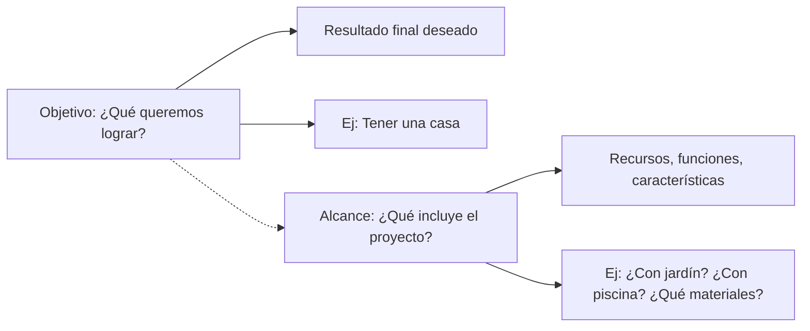
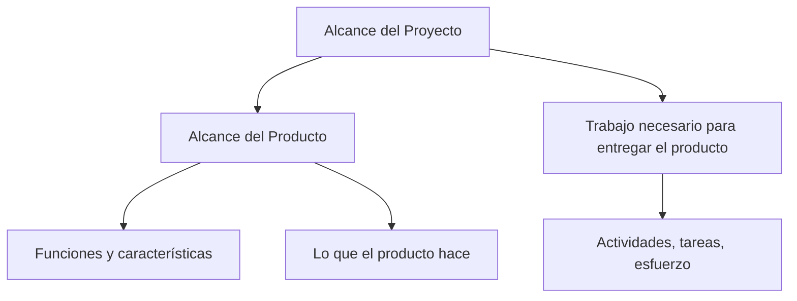

# 📌 Notas De Clase: Diferencia Entre Objetivos Y Alcance De Un Proyecto

## 🎯 ¿Qué Es Un Objetivo En Un Proyecto?

Los **objetivos** son las **metas o resultados esperados** que un proyecto busca alcanzar. Representan el **qué queremos lograr** al finalizar el proyecto.

- Pueden referirse a:
    
    - Un **producto** o servicio.
        
    - Una **posición estratégica**.
        
    - Un **resultado concreto**.

### Los Objetivos Deben Set SMART

|Criterio|Significado|
|---|---|
|**S**pecific|El objetivo debe set claro y centrarse en un área concreta.|
|**M**easurable|Debe poder medirse su progreso o resultado.|
|**A**chievable|Debe set realista y alcanzable con los recursos disponibles.|
|**R**elevant|Debe set pertinente y alinearse con las metas de la organización.|
|**T**ime-bound|Debe tener un tiempo límite definido para cumplirse.|

---

## 📦 ¿Qué Es El Alcance?

El **alcance** define **todo lo que se incluye (o no se incluye)** dentro del trabajo del proyecto. Es decir, **hasta dónde se va a llegar** con el proyecto.

Incluye:

- Funciones.
    
- Características.
    
- Calidad de materiales (en proyectos físicos).
    
- Entregables intermedios.

> 🔍 Ejemplo: Si el objetivo es **"construir una casa"**, el alcance define si tendrá jardín, piscina, cuántos pisos, tipo de acabados, etc.

---

## ⚖️ Diferencia Entre Objetivos Y Alcance

---

## 📚 Tipos De Alcance

El alcance se puede dividir en dos tipos principales:

|Tipo de Alcance|Definición|
|---|---|
|**Alcance del producto**|Características y funciones del producto o servicio que se entregará.|
|**Alcance del proyecto**|Trabajo necesario para crear el producto con esas características.|

---

## ✅ Importancia De Definir El Alcance

- Evita que el proyecto sea demasiado **ambicioso** o **limitado**.
    
- Ayuda a cumplir con:
    
    - Los **entregables** en tiempo y forma.
        
    - El **presupuesto** del proyecto.
        
- Evita que:
    
    - Se entreguen productos defectuosos.
        
    - Se agoten los recursos antes de finalizar el proyecto.

> ⚠️ Un alcance mal definido puede llevar al **fracaso del proyecto**.

---

## 📌 Enfoques Para la Reutilización Y Gestión Del Alcance

Según **Polo Usaola (2012)** se distinguen dos enfoques:

|Enfoque|Descripción|
|---|---|
|**Oportunista**|Aprovecha recursos disponibles aunque no se planeara usarlos.|
|**Proactivo**|Planifica desde el inicio pensando en la reutilización y objetivos futuros.|

---

## 📋 Requisitos Del Proyecto

### Tipos De Requisitos

1. **Requisitos de negocio**:
    
    - Qué necesita o desea la organización.
        
    - Se enfocan en el **valor del proyecto**.
        
2. **Requisitos técnicos**:
    
    - Qué soluciones técnicas se usarán.
        
    - Se enfocan en el **cómo se logrará**.

Ambos deben set documentados y **aceptados por el cliente**.

---

## 🧭 Factores a Considerar Para Definir Objetivos

- Necesidades y expectativas del cliente.
    
- Perspectivas de los interesados.
    
- Posibles conflictos entre grupos o partes interesadas.
    
- Poder de influencia de cada parte.
    
- Dinámica del **ciclo de vida del proyecto**.
    
- Participación activa y seguimiento de los interesados.

---

## 🛠️ Conclusión

Una correcta gestión del alcance y definición de los objetivos:

- Mejora la eficiencia.
    
- Ayuda a **cumplir expectativas**.
    
- Conduce al **éxito del proyecto**.
    
- Permite trabajar con **requisitos claros, medibles y viables**.

---

## MicroTest

- ¿La definición del alcance?:
	- Define y documenta las necesidades de los interesados con el fin de cumplir los objetivos del proyecto.
- ¿Qué característica no corresponde con un objetivo del proyecto para PMP?:
	- Sostenible.
- ¿Qué diferencia el alcance de un proyecto del alcance de un producto?:
	- El alcance de un proyecto es más amplio que el alcance de un producto.

<iframe title="A sixth sense for project management | Tres Roeder | TEDxCWRU" src="https://www.youtube.com/embed/3zqwlr8sp2Y?feature=oembed" height="113" width="200" allowfullscreen="" allow="fullscreen" style="aspect-ratio: 1.76991 / 1; width: 100%; height: 100%;"></iframe>
- **Introducción al Cambio** [[00:27](http://www.youtube.com/watch?v=3zqwlr8sp2Y&t=27)]: El orador enfatiza que el mundo actual ofrece oportunidades para mejorar y que la audiencia, al estudiar, se prepara para generar un impacto. Menciona su propia trayectoria professional de 30 años dedicada al cambio y el objetivo de hacer del mundo un lugar mejor.
- **Conciencia (Awareness)** [[03:56](http://www.youtube.com/watch?v=3zqwlr8sp2Y&t=236)]: Para set un líder de cambio, es fundamental set consciente de uno mismo, de los demás, de la situación y del entorno. Aunque los hechos y la información son importantes para asegurar un cambio positivo, también es crucial prestar atención a las personas y su comportamiento no verbal (expresiones faciales, movimientos, tono y velocidad de voz).
- **Decisiones de Cuerpo Completo (Whole Body Decisions)** [[05:04](http://www.youtube.com/watch?v=3zqwlr8sp2Y&t=304)]: Esta herramienta ayuda a procesar la información entrante utilizando el cerebro, el corazón y el instinto. Se menciona una investigación militar que indica que usar solo la corteza frontal del cerebro para tomar decisiones tiene un 70% de éxito. Para aumentar la probabilidad de éxito, también se debe escuchar al corazón y al instinto, ya que ambos proporcionan información valiosa.
- **Comunicación Clara (Clear Communication)** [[07:24](http://www.youtube.com/watch?v=3zqwlr8sp2Y&t=444)]: Para liderar, se necesitan seguidores, y esto se logra con una comunicación clara, donde la idea del emisor sea la misma que la del receptor. El orador ilustra esto con un ejemplo sobre cómo dar direcciones, mostrando que las personas prefieren diferentes formatos de comunicación (escrito, mapa, verbal). Por lo tanto, un líder debe comunicar de diversas maneras.
- **Adaptación (Adaptability)** [[09:24](http://www.youtube.com/watch?v=3zqwlr8sp2Y&t=564)]: El cambio no es una línea recta y las cosas no siempre salen según lo planeado, por lo que la capacidad de adaptación es crucial. El orador comparte su experiencia con un proyecto de un centro para adolescentes, donde tuvo que adaptar al equipo y la ubicación. Se enfatiza la importancia de rodearse de personas optimistas y realistas.
- **Diplomacia (Diplomacy)** [[11:22](http://www.youtube.com/watch?v=3zqwlr8sp2Y&t=682)]: El conflicto es una parte inevitable del cambio. Un líder no debe set juzgado por la existencia de conflictos, sino por cómo los maneja. Las personas procesan el cambio de tres maneras: racional (hechos y datos), emocional (sentimientos) y política (cómo el cambio afecta su influencia o prestigio).
- **Persistencia (Persistence)** [[12:47](http://www.youtube.com/watch?v=3zqwlr8sp2Y&t=767)]: Esta es la disciplina final. Si se ha sido consciente, se han tomado decisiones de cuerpo completo, se ha comunicado claramente, se ha adaptado y se ha actuado con diplomacia, entonces es memento de set persistente. Sin embargo, la persistencia no es una virtud en sí misma si se está equivocado. Implica saber cuándo avanzar, cuándo acelerar y cuándo retroceder, adaptándose al ritmo de cada esfuerzo de cambio.
- **Conclusión** [[14:49](http://www.youtube.com/watch?v=3zqwlr8sp2Y&t=889)]: Al aplicar estas seis disciplinas, la audiencia puede contribuir a que el mundo sea un lugar mejor, ayudando a instituciones, empleadores, comunidades y países a alcanzar nuevas alturas.

