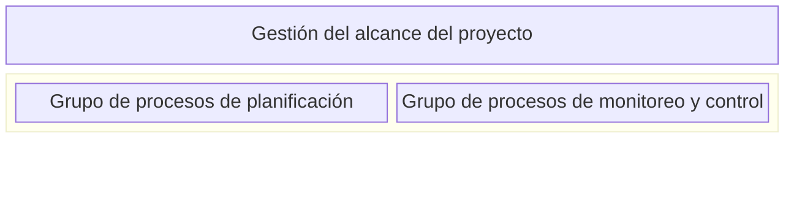
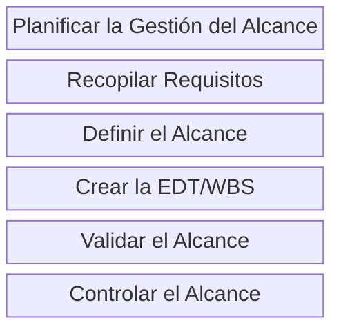
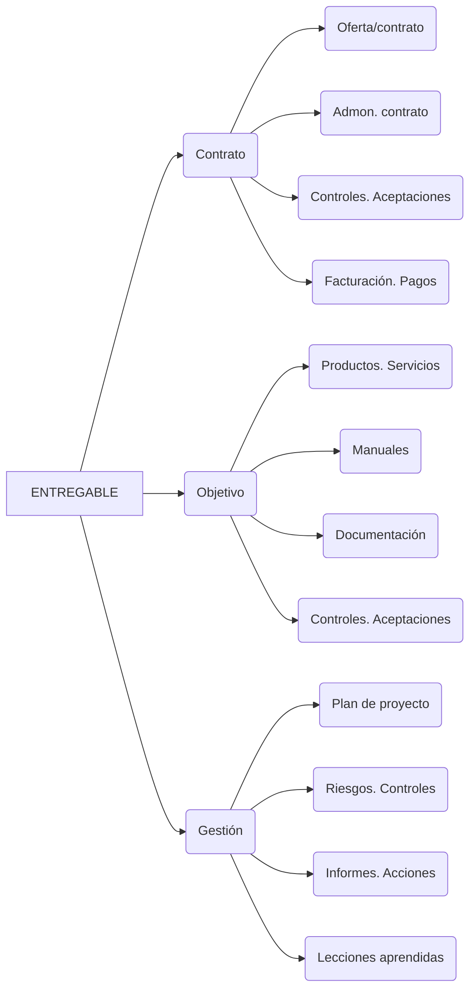

# 📅 Gestión Del Alcance Del Proyecto: Procesos Y Áreas De Conocimiento

## 🔄 Introducción

La **gestión del alcance del proyecto** incluye los procesos necesarios para garantizar que el proyecto incluya _todo y únicamente todo el trabajo requerido_ para completar el proyecto con éxito.

> ✅ El objetivo principal es **definir y controlar qué se incluye y qué no se incluye en el proyecto**.

## 🤝 Gestión Del Alcance: Fundamentos

- Control constante para asegurar que se está completando el trabajo planificado.
    
- No permitir modificaciones sin un sistema estructurado de control de cambios.
    
- Asegurar que los cambios estén alineados con el acta de constitución del proyecto.

## 🌍 Relación Con Los Grupos De Procesos

Según la guía PMBOK, la gestión del alcance está relacionada con:

- ✨ **Grupo de procesos de Planificación**
    
- ⚡️ **Grupo de procesos de Monitoreo y Control**

## ✍️ Procesos De Gestión Del Alcance

### ✏️ Planificar la Gestión Del Alcance

**Propósito:** Determinar cómo se definirá, validará y controlará el alcance.

**Entradas:**

- Acta de constitución del proyecto
    
- Plan para la dirección del proyecto
    
- Factores ambientales de la empresa
    
- Activos de procesos de la organización

**Herramientas y técnicas:**

- Juicio de expertos
    
- Análisis de datos
    
- Reuniones

**Salidas:**

- Plan de gestión del alcance
    
- Plan de gestión de requisitos

> Nota: El plan de gestión de requisitos se puede considerar parte del plan de alcance.

Contenidos del plan:

- Enunciado del alcance.
    
- EDT/WBS y su diccionario.
    
- Línea base del alcance.
    
- Aceptación formal.
    
- Control de cambios al alcance.

### 📊 Recopilar Requisitos

**Objetivo:** Documentar necesidades, deseos y expectativas de los interesados.

> ⚠️ Importante: _Recopilar requisitos ≠ requisitos del proyecto._

**Tipos de requisitos:**

- **Producto:** Técnicos, de seguridad, rendimiento.
    
- **Proyecto:** Organizativos, entregas, procedimientos.

**Resultado esperado:** Requisitos cuantificables y medibles.

### 📄 Definir El Alcance

**Objetivo:** Desarrollar una descripción detallada del producto y del proyecto.

**Entradas:**

- Acta de constitución.
    
- Entregables principales.
    
- Supuestos y restricciones.

**Herramientas utilizadas:**

- Análisis del producto (desglose, sistemas, ingeniería de valor).
    
- Identificación de alternativas.

> A medida que se obtiene más información, se ajusta el alcance de forma iterativa.

### 👥 Tipos De Entregables

### ✂ Crear la EDT/WBS (Estructura De Desglose Del Trabajo)

**Objetivo:** Dividir el proyecto en partes manejables.

**Beneficios:**

- Precisión en estimación de recursos, tiempo y costos.
    
- Medición del rendimiento del proyecto.
    
- Asignación clara de responsabilidades.
    
- Mejora la comunicación.
    
- Evaluación del impacto de cambios.

> Es clave para el seguimiento, control y comunicación efectiva del proyecto.

### ✅ Validar El Alcance

**Objetivo:** Asegurar que los entregables sean aceptados formalmente.

> Se diferencia del control de calidad:
> 
> - **Control de calidad:** Cumplimiento de requisitos.
> 
> - **Validación:** Aprobación del cliente o patrocinador.
>  

### 🔢 Controlar El Alcance

**Objetivo:** Supervisar el estado del alcance y del producto.

**Acciones:**

- Gestionar cambios a la línea base del alcance.
    
- Procesar cambios vía control integrado.
    
- Evitar la "corrupción del alcance" (scope creep).
    
- Medir el grado de cumplimiento respecto al alcance definido.

---

## 📈 Conclusión

La gestión del alcance es una parte fundamental de la dirección de proyectos. Asegura que se cumple todo lo planeado y nada más, con entregables bien definidos y validados, apoyados en una estructura organizativa (EDT) y procesos de control y monitoreo efectivos.

Perfecto, aquí tienes las **respuestas correctas en español** junto con una **guía de estudio clara y organizada** que puedes usar para repasar los conceptos clave de la **gestión del alcance y la EDT/WBS**.

---

## 📝 Guía De Estudio: Gestión Del Alcance Y la EDT/WBS

---

### ✅ Pregunta 1

**¿Cuál NO es un propósito de la EDT/WBS?**

**Respuesta correcta: b. Crear el cronograma del proyecto.**

**Explicación:**  
La **EDT (Estructura de Desglose del Trabajo)** o **WBS (Work Breakdown Structure)** es una herramienta fundamental para la **planificación del alcance**, pero **no tiene como propósito directo crear el cronograma**.  
Su función principal es:

- Descomponer el trabajo del proyecto en components más manejables.
    
- Servir como base para planificar los recursos, estimar tiempos y costos.
    
- Facilitar la asignación de responsabilidades.
    
- Medir el progreso del trabajo.

🔎 **Lo que sí hace la EDT:**

- Proporciona detalle suficiente para gestionar el trabajo. ✅
    
- Facilita la estimación del presupuesto. ✅
    
- Sirve como base de planificación del proyecto. ✅
    
- **No crea directamente el cronograma.** ❌

---

### ✅ Pregunta 2

**¿Qué afirmación NO es cierta sobre la gestión del alcance?**

**Respuesta correcta: a. Validar el alcance y controlar el alcance son dos términos equivalentes.**

**Explicación:**

- **Validar el alcance**: es el proceso en el que se revisan los entregables con el cliente para **obtener su aceptación formal**.
    
- **Controlar el alcance**: implica **monitorear el estado del proyecto y del producto**, así como **gestionar los cambios** al alcance definido.

🔄 **No son lo mismo.** Son procesos diferentes dentro del grupo de procesos de **monitoreo y control**, con propósitos distintos.

📌 **Lo que sí es cierto:**

- Los objetivos del proyecto se traducen en el alcance. ✅
    
- La EDT ofrece una estructura jerárquica y lógica del trabajo. ✅
    
- Mientras más claro y detallado sea el enunciado del alcance, más probable será el éxito del proyecto. ✅

---

### ✅ Pregunta 3

**¿Coinciden los requisitos del proyecto con los requisitos del producto?**

**Respuesta correcta: d. Los requisitos del proyecto son más amplios que los requisitos del producto.**

**Explicación:**

- **Requisitos del producto**: Se refieren a características, funciones, especificaciones técnicas o de desempeño del producto o servicio.
    
- **Requisitos del proyecto**: Abarcan tanto los requisitos del producto **como los relativos a la gestión del proyecto**, como cronogramas, presupuestos, calidad, procesos, documentación, etc.

🔎 **Ejemplo:**  
Si el proyecto es construir una app móvil:

- Requisitos del producto: compatibilidad, funcionalidades, interfaz, rendimiento.
    
- Requisitos del proyecto: entregas por fases, control de calidad, informes de advance, uso de herramientas, gestión de riesgos, etc.

---

## 🧠 Resumen Final Como Repaso

|Concepto|Descripción clave|
|---|---|
|**EDT/WBS**|Descompone el trabajo, **no crea el cronograma**, pero sirve de base para planificar recursos, tiempos y costos.|
|**Validar vs. Controlar alcance**|Validar: aceptación del cliente. Controlar: monitoreo y gestión de cambios. **No son equivalentes**.|
|**Requisitos del proyecto**|Incluyen los del producto **y más**. Abarcan todo lo necesario para ejecutar y gestionar el proyecto correctamente.|
