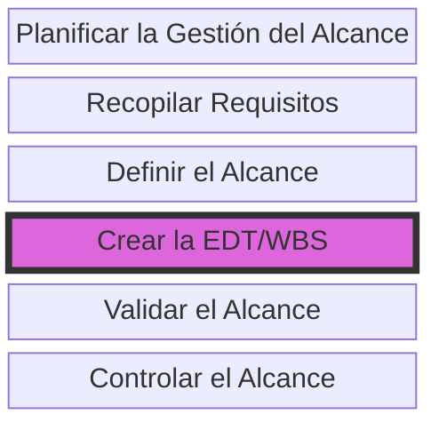

# 📘 Guía De Estudio: Gestión Del Alcance - Parte 2

**Tema central:** _Crear la EDT (Estructura de Desglose del Trabajo)_

---

## 🧩 ¿Qué Es la EDT (WBS)?

> **Definición:**  
> La EDT (Work Breakdown Structure) es una descomposición jerárquica del total del trabajo del proyecto, en components más pequeños y manejables, con el fin de alcanzar los objetivos del proyecto y entregar los entregables requeridos.

> **Importancia clave:**

- Proporciona un **marco de referencia** para lo que se debe entregar.
    
- Mejora la **estimación de costes**, la **asignación de recursos** y la **gestión del tiempo**.
    
- Sirve como base para **la planificación detallada, el seguimiento y control del proyecto**.

> ❌ La EDT **NO es**:

- Una lista de tareas.
    
- Un organigrama.
    
- Una secuencia de actividades.

---

## 🧾 Diccionario De la EDT

> Documento complementario que **define cada paquete de trabajo**, incluyendo:

- Su descripción.
    
- Criterios de aceptación.
    
- Código único de identificación.
    
- Relación con requisitos del alcance.
    
- Nivel de detalle suficiente para la asignación de recursos y tareas.

![[Pasted image 20250623093313.png]]
---

## 📌 Características De la EDT

- Se crea **al inicio** o en **puntos predefinidos** del proyecto.
    
- Los **paquetes de trabajo** están al nivel más bajo.
    
- Puede estructurarse por:
    
    - **Fases del ciclo de vida** del proyecto.
        
    - **Entregables principales**.
        
    - **Subcontratistas u organizaciones externas**.

---

## 🗃️ Entradas Para Crear la EDT

| Fuente                                     | Descripción                                                     |
| ------------------------------------------ | --------------------------------------------------------------- |
| 🗂️ Plan para la dirección del proyecto    | Incluye el plan de gestión del alcance y otros elementos clave. |
| 📄 Documentos del proyecto                 | Enunciado del alcance, documentación de requisitos.             |
| 🌐 Factores ambientales                    | Normativas, estándares industriales, culturales, etc.           |
| 🏛️ Activos de procesos de la organización | Plantillas, guías, lecciones aprendidas, políticas internas.    |

![[Pasted image 20250623093355.png]]
---

## 🛠️ Herramientas Y Técnicas

- **Juicio de expertos**  
    Personas con experiencia en proyectos similares, industrias o disciplinas relacionadas.
    
- **Descomposición**  
    Técnica guiada que consiste en dividir entregables grandes en subentregables manejables.

---

## 📤 Salidas

|Salida|Explicación|
|---|---|
|🧱 Línea base del alcance|Define qué se hará (y qué no) en el proyecto.|
|📝 Actualizaciones de documentos del proyecto|Registro de supuestos y documentos de requisitos actualizados.|

![[Pasted image 20250623095033.png]]
---

## 🧮 Complementos Clave

- **📊 Matriz de Asignación de Responsabilidades (MAR):**  
    Relaciona recursos humanos con los paquetes de trabajo definidos. Útil para seguimiento y control.
    
- **📘 Diccionario de la EDT:**  
    Incluye información detallada de cada componente de la EDT:
    
    - Entregables.
        
    - Hitos.
        
    - Recursos asignados.
        
    - Duración y fechas.
        
    - Costos estimados.
        
    - Criterios de calidad.

---

## 🧠 Conclusiones Del Professor

- La EDT **facilita la planificación, organización, seguimiento y control** del proyecto.
    
- Es una **herramienta clave de comunicación** entre equipo y partes interesadas.
    
- Permite una **gestión efectiva de cambios**, ya que cualquier modificación puede evaluarse fácilmente respecto a su impacto en otros components.
    
- En proyectos de software, puede basarse en metodologías en cascada o ciclo de vida clásico.
    
- Se debe mantener alineada con el enunciado del alcance y validarse con el cliente/patrocinador.

---

## 🔖 Diagrama Mermaid (resumen Visual De Procesos Del alcance)

---

## MicroTest

- Los tipos de entregables son:
	- Todo lo anterior es verdadero.
- ¿Cuál de los siguientes procesos no es un proceso perteneciente a la gestión del alcance?:
	- A. Planificar la gestión del tiempo.
- ¿Para qué sirve la matriz de asignación de responsabilidades?:
	- Para identificar por actividades los responsables del equipo de proyecto.