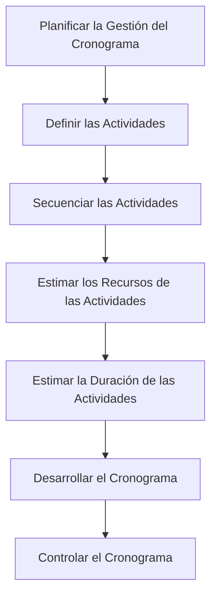
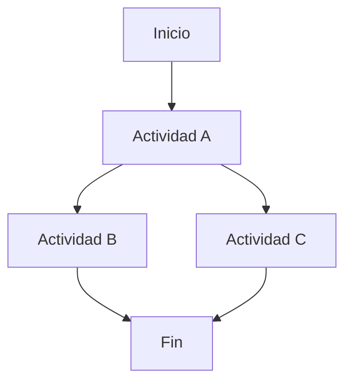

# 🕒 Gestión del Tiempo en los Proyectos – Parte 1

> La gestión del tiempo incluye **los procesos necesarios para administrar la finalización del proyecto a tiempo**, y se integra en dos grupos de procesos:

- 📘 **Planificación**
    
- 📊 **Monitoreo y Control**
    

---

## 🧭 Objetivo del Cronograma del Proyecto

> El cronograma contempla todas las actividades e información temporal del proyecto.  
> Se construye aplicando una metodología, herramientas y técnicas de programación.

---

## 📋 Procesos de la Gestión del Cronograma

---

## 1️⃣ Planificar la Gestión del Cronograma

> **Establece políticas, procedimientos y documentación** para planificar, desarrollar y controlar el cronograma.

### Contenido del plan:

- Metodología de planificación.
    
- Herramientas y criterios para el desarrollo y control.
    
- Calendario base.
    
- Procedimientos de control de cambios.
    
- Indicadores de rendimiento temporal.
    

---

## 2️⃣ Definir las Actividades

> Identificar las **acciones necesarias** para producir los entregables del proyecto.

### Entradas:

- Plan de gestión del cronograma.
    
- Línea base del alcance.
    
- Enunciado del alcance del proyecto.
    
- Documentos de requisitos.
    
- Factores ambientales.
    
- Activos de los procesos de la organización.
    

### Resultado:

- Lista de actividades con sus atributos.
    
- Lista de hitos.
    

🧠 **Tip**: Las actividades derivan de descomponer los _paquetes de trabajo_ del WBS (EDT).

---

## 3️⃣ Secuenciar las Actividades

> Determinar las **dependencias** entre actividades y su **orden de ejecución**.

### Tipos de relaciones:

- 🔚🔜 **Fin a inicio (FS)** – Más común.
    
- 🔚🔚 **Fin a fin (FF)**.
    
- 🔜🔜 **Inicio a inicio (SS)**.
    
- 🔜🔚 **Inicio a fin (SF)** – Rara vez usada.
    

### Tipos de dependencias:

- 📕 **Obligatorias** – Lógicas o legales (ej. por contrato).
    
- 📘 **Discrecionales** – Preferidas por experiencia.
    
- 🌐 **Externas** – Fuera del control del proyecto.
    
- 🏗️ **Internas** – Bajo control del equipo.
    

### Modificadores:

- 🕒 **Adelantos** (_lead_): anticipación a la actividad anterior.
    
- 🕢 **Retrasos** (_lag_): demora intencional.
    

---

## 🧮 Diagrama de Red del Cronograma

> Representación visual del flujo lógico del proyecto.

🧠 Se puede hacer manualmente o con software de gestión de proyectos (ej. MS Project, Primavera, GanttProject).

---

## 4️⃣ Estimar Recursos de las Actividades

> Determinar qué recursos (personas, equipos, materiales) se requieren y en qué cantidad.

### Enfoques:

- 🔝 **Top-down**: Basado en experiencias anteriores. Rápido pero menos preciso.
    
- 🔽 **Bottom-up**: Desde la actividad hacia arriba. Más detallado y exacto.
    

🧠 **Diferencia entre duración y esfuerzo**:

- **Duración** = tiempo total en calendario (se mide en días, semanas).
    
- **Esfuerzo** = trabajo total (se mide en personas-día, horas-hombre).
    

---

## 5️⃣ Estimar Duración de las Actividades

> Cuantificar cuánto tiempo tomará cada actividad, considerando los recursos asignados.

⚠️ La duración puede cambiar dependiendo del número y capacidad de recursos disponibles.

---

## 6️⃣ Desarrollar el Cronograma

> Combina duración, recursos, secuencia y restricciones para generar el **modelo de cronograma** del proyecto.

### Herramientas:

- 🛣️ **Método del Camino Crítico (CPM)**
    
    - Calcula fechas tempranas y tardías de inicio y fin.
        
    - Identifica ruta crítica (actividades sin holgura).
        
- 📊 **Diagramas de Gantt**
    
    - Cronograma en formato de barras.
        
    - Útil para comunicar avances.
        

### Tipos de cronogramas:

- 🧭 **Cronograma de hitos** – Presentación para alta gerencia.
    
- 🧱 **Cronograma de barras (Gantt)** – Para el equipo del proyecto.
    
- 🔗 **Diagrama de red** – Para el control detallado.
    

---

## 7️⃣ Controlar el Cronograma

> Supervisar el estado actual vs. el plan original (línea base del cronograma).

### Actividades:

- Medir el progreso.
    
- Evaluar causas de desviación.
    
- Gestionar cambios autorizados.
    
- Aplicar correcciones y actualizaciones.
    

---

## 🧠 Conclusión

- La **gestión del tiempo** es esencial para entregar un proyecto exitoso.
    
- Los **procesos se alimentan unos de otros** y deben integrarse con herramientas adecuadas.
    
- La **línea base del cronograma** es un punto de referencia clave para el control.
    
- El cronograma evoluciona iterativamente a medida que se mejora la precisión de las estimaciones.
    

---

## MicroTest

- Las estimaciones de la duración:
	- Serán más precisas cuando se disponga de más información y el que las realiza tenga experiencia.
- Indica cronológicamente la mejor práctica en la planificación para gestionar el tiempo:
	- Definir lista de actividades, establecer secuencia, estimar los recursos, estimación de la duración y desarrollo del cronograma.
- Indica cuál de las siguientes situaciones no es consecuencia del retraso en la finalización de un proyecto:
	- La calidad del producto se deteriora.

