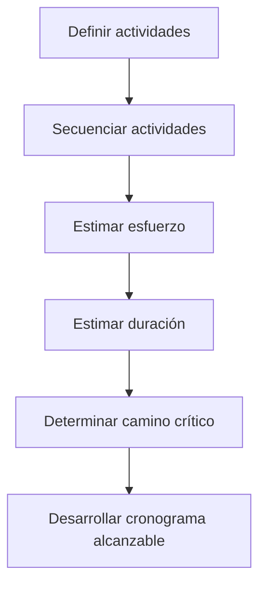
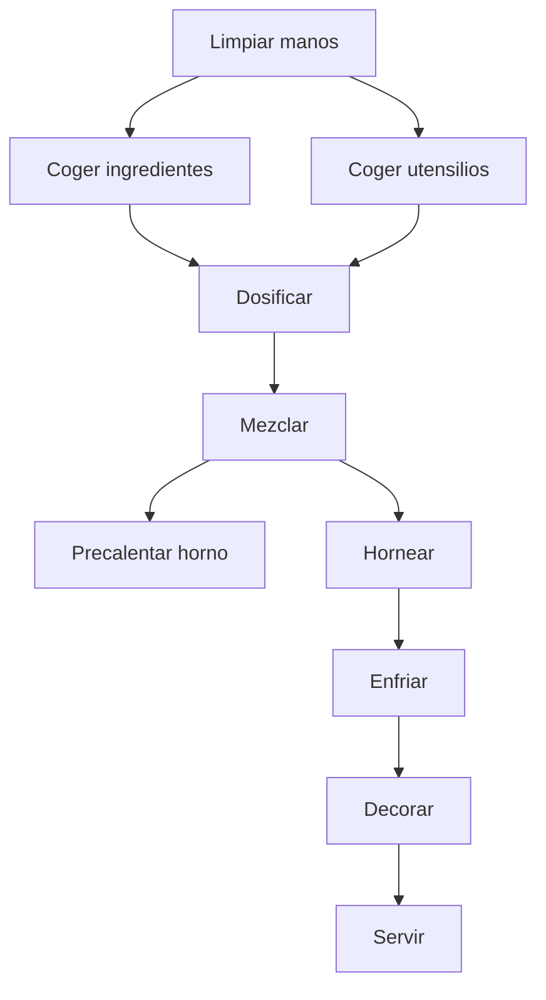

# 🧁 Clase: Cómo Hacer Un Cronograma – Ejemplo Práctico Con Un Pastel De Chocolate

> Esta clase se centra en **cómo aplicar los procesos de gestión del cronograma** del proyecto utilizando un ejemplo cotidiano: hacer un pastel de chocolate.  
> Permite comprender cómo se define, secuencia, estima y organiza el trabajo de forma planificada y lógica.

---

## ✅ Pasos Clave Para Elaborar Un Cronograma

---

## 🟠 1. Definición De Actividades

> Es el proceso de **identificar y detallar todas las actividades necesarias** para completar los entregables del proyecto.

Se recomienda usar el enfoque:

- Qué se hace
    
- Qué se necesita para hacerlo (entradas)
    
- Qué se obtiene al terminarlo (salidas)

### Ejemplos Del Caso Del Pastel

|Actividad|Entrada(s)|Acción|Salida(s)|
|---|---|---|---|
|Limpiar las manos|Jabón, agua, manos|Aplicar jabón, enjuagar|Manos limpias|
|Coger materias primas|Lista de ingredientes|Seleccionar harina, huevos, leche, chocolate…|Ingredientes en cantidad adecuada|
|Coger utensilios|Lista de utensilios|Buscar bol, batidora, horno|Utensilios listos para usar|
|Dosificar ingredientes|Ingredientes|Medir cantidades|Ingredientes dosificados|
|Mezclar ingredientes|Ingredientes dosificados|Mezclar base y cobertura|Masa y cobertura listas|
|Precalentar horno|Horno, energía|Encender y dejar calentar|Horno caliente|
|Hornear base|Molde con masa, horno|Cocinar la masa|Bizcocho cocido|
|Enfriar bizcocho|Bizcocho|Dejar reposar|Bizcocho frío|
|Decorar|Bizcocho frío, cobertura|Aplicar cobertura|Pastel decorado|
|Servir|Pastel decorado|Presentar en plato|Pastel listo para comer|

---

## 🟠 2. Secuenciar Actividades

> Determinar el **orden lógico de ejecución** de las actividades y sus dependencias.

### Ejemplo De Relaciones

- **A (Limpiar manos)** → Primera actividad (no tiene predecesoras)
    
- **D (Dosificar ingredientes)** → Require haber completado **B (materias primas)** y **C (utensilios)**

---

## 🟠 3. Estimar Esfuerzo

> **¿Cuántos recursos humanos y físicos** se requieren para cada actividad?  
> ¿Cuánto esfuerzo implica?

### Técnicas De Estimación

- 🧠 **Juicio experto**: basado en la experiencia previa.
    
- ⚙️ **Heurísticas**: reglas empíricas y estimaciones rápidas.

### Ejemplo

|Actividad|Esfuerzo estimado|
|---|---|
|Coger ingredientes|5 min|
|Coger utensilios|5 min|
|Dosificar|7 min|
|Mezclar|10 min|
|Precalentar horno|5 min|
|Hornear|30 min|
|Enfriar|15 min|
|Decorar|10 min|

---

## 🟠 4. Estimar Duración

> Determinar **cuánto tiempo llevará completar cada actividad**, considerando los recursos disponibles.

🧠 _Recuerda_:

- **Duración** = Tiempo en el calendario (ej. días, horas)
    
- **Esfuerzo** = Trabajo requerido (ej. persona/hora)

---

## 🟠 5. Determinar El Camino Crítico

> El **camino crítico** es la secuencia de actividades con **cero holgura**.  
> Cualquier retraso en estas actividades **afecta la fecha final** del proyecto.

🧠 En este ejemplo, actividades como hornear, enfriar y decorar seguramente están en el camino crítico.

---

## 🟠 6. Desarrollar El Cronograma

> Se integran todos los elementos anteriores en una herramienta de planificación (como Microsoft Project) para construir el **cronograma final**.

### Elementos Requeridos

- Lista de actividades
    
- Duraciones
    
- Relaciones de precedencia
    
- Recursos asignados
    
- Fechas estimadas de inicio y fin

🧠 Aunque se usó Microsoft Project en días, también es válido usar minutos si se desea mayor precisión.

---

## 📘 Resumen Visual

```mermaid
gantt
  title Cronograma: Hacer pastel de chocolate
  dateFormat  HH:mm
  axisFormat %H:%M
  section Preparación
  Limpiar manos           :a1, 00:00, 00:03
  Coger ingredientes      :a2, after a1, 00:05
  Coger utensilios        :a3, after a1, 00:05
  Dosificar ingredientes  :a4, after a2, 00:07
  Mezclar ingredientes    :a5, after a4, 00:10
  Precalentar horno       :a6, after a4, 00:10
  Hornear                 :a7, after a5, 00:30
  Enfriar bizcocho        :a8, after a7, 00:15
  Decorar                 :a9, after a8, 00:10
  Servir                  :a10, after a9, 00:05
```

---

## ✅ Conclusión

- La planificación del cronograma implica **mucho más que simplemente establecer fechas.**
    
- Se deben definir con claridad las actividades, secuenciarlas con lógica, estimar correctamente esfuerzo y duración.
    
- Herramientas como Microsoft Project ayudan a visualizar y validar el cronograma.
    
- **Ejercicios prácticos como el pastel de chocolate permiten comprender la lógica del cronograma en proyectos reales.**

---

## ✅ **Pregunta 1**

**Pregunta:**  
Para controlar la planificación, una directora de proyecto está reanalizando el proyecto para predecir su duración. Ella hace esto analizando la secuencia de actividades con la menor flexibilidad de programación. ¿Qué técnica está usando?

**Respuesta correcta:**  
**a. Método del camino crítico.**

**Justificación:**

- El **método del camino crítico (CPM, por sus siglas en inglés)** se utilize para identificar las actividades que **no tienen holgura (flexibilidad)**.
    
- Estas actividades forman la **ruta más larga del proyecto**, y **cualquier retraso en ellas impacta directamente la duración total del proyecto**.
    
- Es ideal para **predecir la duración** y hacer análisis de impacto.

---

## ✅ **Pregunta 2**

**Pregunta:**  
Si la estimación optimista para una actividad es de 12 días y la estimación pesimista es de 18 días, ¿cuál es la desviación estándar de esta actividad?

**Respuesta correcta:**  
**a. 1.**

**Justificación:**

- Fórmula de desviación estándar en **estimación PERT**:
    
$$
(σ)=Pesimista−Optimista6\text{Desviación estándar (σ)} = \frac{\text{Pesimista} - \text{Optimista}}{6} σ=18−126=66=1\text{σ} = \frac{18 - 12}{6} = \frac{6}{6} = 1

$$
- Esta fórmula se basa en la estadística aplicada a planificación de cronograma.

---

## ✅ **Pregunta 3**

**Pregunta:**  
Durante la planificación del proyecto se estima el tiempo necesario para cada actividad y, a continuación, se agregan las estimaciones para crear la estimación del proyecto. Te comprometes a completar el proyecto para esta fecha. ¿Qué hay de mal en este escenario?

**Respuesta correcta:**  
La estimación es demasiado larga y debe set creada por la gerencia

---
