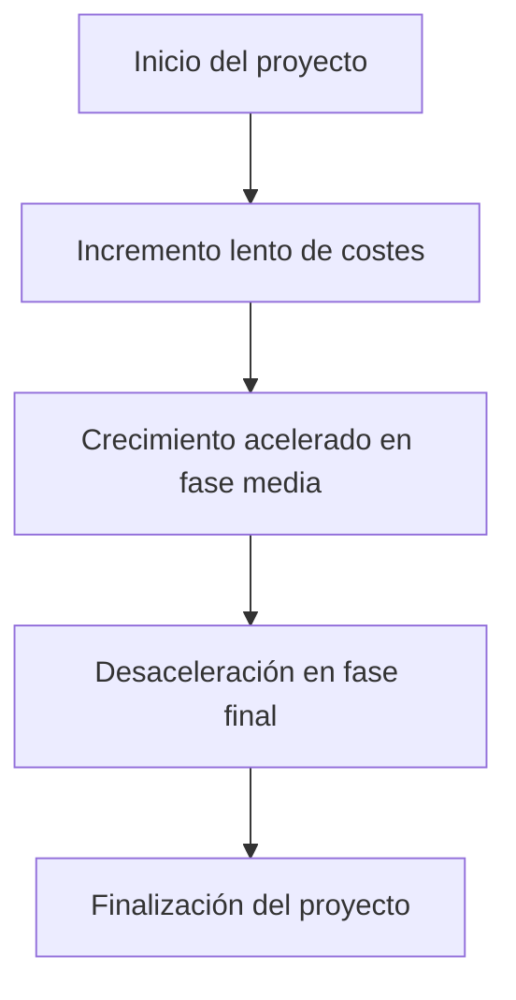

# 💰 Notas De Clase: Planificación Y Estimación De Costes En Proyectos

---

## 🎯 Objetivo De la Gestión De Costes

> Asegurar que el proyecto **se complete dentro del presupuesto aprobado**, mediante procesos bien definidos de **estimación**, **presupuestación** y **control** de los costes.

La gestión de costes debe:

- Considerar **requisitos de los interesados**.
    
- Incluir **políticas, procedimientos y documentación**.
    
- Tomar en cuenta los **criterios de medición de costes**, que pueden variar entre interesados.

---

## 🧱 Procesos De la Gestión De Costes

|Proceso|Descripción|
|---|---|
|**1. Estimar los costes**|Crear una aproximación de los recursos financieros requeridos para completar las actividades.|
|**2. Desarrollar el presupuesto**|Sumar los costes estimados de cada actividad para crear una **línea base de costes autorizada**.|
|**3. Controlar los costes**|Monitorizar el estado del proyecto para actualizar el presupuesto y gestionar cambios.|

---

## 📊 Herramientas Clave

### 1. 📈 **Curva S**

- Representa el **costo acumulado del proyecto a lo largo del tiempo**.
    
- Eje X: Tiempo.
    
- Eje Y: Costes acumulados.
    
- Permite visualizar la **evolución natural del gasto**:

### 2. ⚠️ **Plan De Respuesta a riesgos**

- **Mitigación de riesgos** implica costes adicionales.
    
- Debe estar contemplado en la **estimación total**.

### 3. 📈 **Análisis Del Valor Ganado (EVM - Earned Value Management)**

|Métrica|Significado|
|---|---|
|**PV (Planned Value)**|Valor planificado del trabajo programado.|
|**EV (Earned Value)**|Valor del trabajo realmente completado.|
|**AC (Actual Cost)**|Costo real incurrido.|

- Permite **medir desempeño** del proyecto respecto al plan.
    
- Detecta **desviaciones de presupuesto y cronograma**.

---

## 🔍 Tipos De Costes

|Tipo de Coste|Descripción|
|---|---|
|**Costes directos**|Costes claramente atribuibles a actividades específicas (ej. hormigón).|
|**Costes indirectos**|Costes generales necesarios para ejecutar el proyecto (ej. electricidad, alquiler).|
|**Costes variables**|Dependen del volumen de trabajo (ej. más plantas, más materiales).|
|**Costes fijos**|Permanecen constantes sin importar el volumen de trabajo (ej. renta de oficina).|

---

## 🧮 Métodos De Estimación De Costes

|Método|Cuándo se usa|
|---|---|
|**Bottom-Up**|Se tiene información detallada. Estimación a nivel de actividad o paquete de trabajo.|
|**Top-Down (Analogía)**|Hay poca información o se usa un proyecto similar previo como referencia.|
|**Juicio experto**|Se basa en la experiencia de expertos del dominio.|

---

## 📌 Consideraciones Importantes

- **Costes de seguimiento y control** también deben incluirse en la planificación.
    
- Se deben utilizar tanto **datos históricos** como **métricas actuales** del proyecto.
    
- La **línea base del coste** funciona como referencia para **comparar el desempeño** del proyecto.

---

## ✅ Conclusión

Planificar la gestión de costes no solo implica calcular lo que costará ejecutar el proyecto, sino **anticipar, documentar y controlar** cualquier factor económico que pueda impactar su éxito.

Esta planificación:

- **Permite reaccionar a tiempo ante desvíos.**
    
- **Establece expectativas realistas para el equipo y los interesados.**
    
- **Asegura sostenibilidad y control financiero.**

---

# MicroTest

- ¿Qué elementos no se tienen en cuenta a la hora de estimar el coste de los recursos?:
	- La planificación de las vacaciones de los recursos.
- La planificación de las vacaciones de los recursos.
	- Coste variable.
- ¿Qué es necesario para estimar el coste de una actividad?:
	- A. Definir la actividad, planificar los recursos, estimar el tiempo, conocer el Coste unitario, determinar el coste de la actividad.