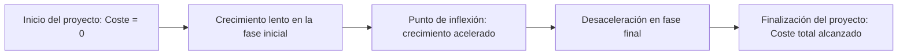
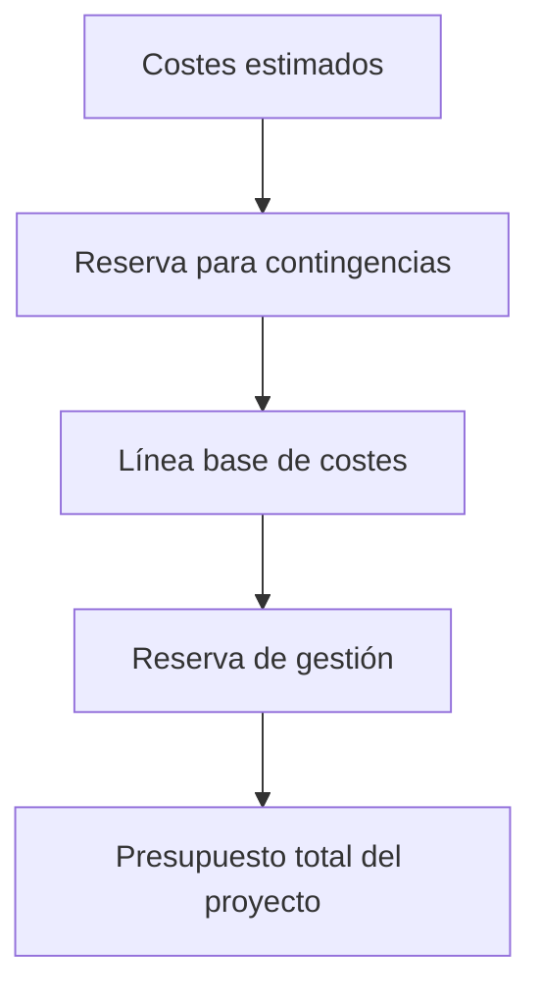

# 📘 Notas: Curva S, Imputación De Costes Y Presupuesto

---

## 1. 📈 ¿Qué Es la Curva S?

La **Curva S** es un gráfico matemático utilizado en gestión de proyectos que representa la **acumulación del coste o esfuerzo** (horas de trabajo, entregables, etc.) a lo largo del tiempo. Su forma característica en “S” se debe al patrón típico de advance de un proyecto:

### Fases En la Curva S

- 🔹 **Fase inicial**: crecimiento lento (planificación, preparación).
    
- 🔹 **Punto de inflexión**: actividad máxima, ejecución intensiva, mayores gastos.
    
- 🔹 **Fase final**: estabilización del esfuerzo, solo quedan revisiones, entregas, aprobaciones.

### Usos

- Comparar **advance planificado vs. real**.
    
- Detectar **desviaciones positivas o negativas**.
    
- Base para la metodología **Earned Value Management (EVM)**.
    
- Generar **proyecciones y tendencias**.

---

## 2. 💸 Imputación De Costes: Métodos

La **imputación de costes** es la forma en que se registran y distribuyen los costes a lo largo de una tarea o actividad.

### Métodos De Imputación

|Método|Características|Aplicación común|
|---|---|---|
|**1. Al inicio de la tarea**|Assume el 100% del coste al comenzar la tarea. Conservador desde control de costes.|Tareas indivisibles, subcontrataciones cerradas.|
|**2. Al final de la tarea**|Solo se considera el coste al finalizar. Conservador desde control de ejecución.|Compra de materiales que se facturan al recibir.|
|**3. A lo largo de la tarea**|Se distribuye el coste en diferentes hitos.|Subcontratos, entregas parciales, materiales en partes.|
|**4. Proporcional al advance**|Coste acumulado crece según progreso.|Construcción, ingeniería, tareas continuas.|

> 🧠 Nota: Los métodos 1 y 2 son extremos. El 3 y 4 son más flexibles y se ajustan mejor a la realidad del proyecto.

---

## 3. 📊 Cálculo Del Presupuesto

La planificación de costes termina con el desarrollo del **presupuesto del proyecto**, que se construye así:

### Components

1. **Suma de costes estimados** de actividades o paquetes de trabajo (reserva de tolerancia).
    
2. **Reserva para contingencias**:
    
    - Asociada a riesgos identificados en el **registro de riesgos**.
        
    - Forma parte de la **línea base de coste**.
        
    - Es controlada por el **director del proyecto**.
        
3. **Reserva de gestión**:
    
    - Para riesgos no identificados.
        
    - No forma parte de la línea base.
        
    - Controlada por el **patrocinador del proyecto**.
        
    - Se require autorización explícita para su uso.

### Diferencia Clave

- **Contingencia** = Riesgos previstos → gestión del PM.
    
- **Gestión** = Riesgos imprevistos → autorización del sponsor.

---

## 4. 📌 Aplicaciones Prácticas

- La **curva S** es fundamental para evaluar el progreso del proyecto frente al plan.
    
- Es clave para calcular el **Earned Value (Valor Ganado)** y detectar:
    
    - Retrasos.
        
    - Sobrepaso de presupuesto.
        
    - Necesidad de acciones correctivas.

### Consejo

> Siempre generar la curva planificada **antes del inicio del proyecto**, y actualizarla con el advance real **en cada revisión periódica**.

---

## ✅ Conclusiones

- La **curva S** es una herramienta visual poderosa para evaluar **tiempo vs. coste**.
    
- Imputar costes correctamente permite **controlar el presupuesto con precisión**.
    
- Distinguir entre **reservas de contingencia y de gestión** es esencial para una administración responsible del capital del proyecto.
    
- El **presupuesto final** no solo considera actividades, sino también los **riesgos**, su impacto, y las políticas de aprobación.

---

## MicroTest

- ¿Qué representa la curva S?:
	- La suma total del coste de las actividades.
- ¿Cuándo es el mejor memento para imputar los costes de una actividad?:
	- Lo más cercano possible a la aparición de la actividad.
- ¿La reserva forma parte indirectamente de la línea base?:
	- La reserva de tolerancia