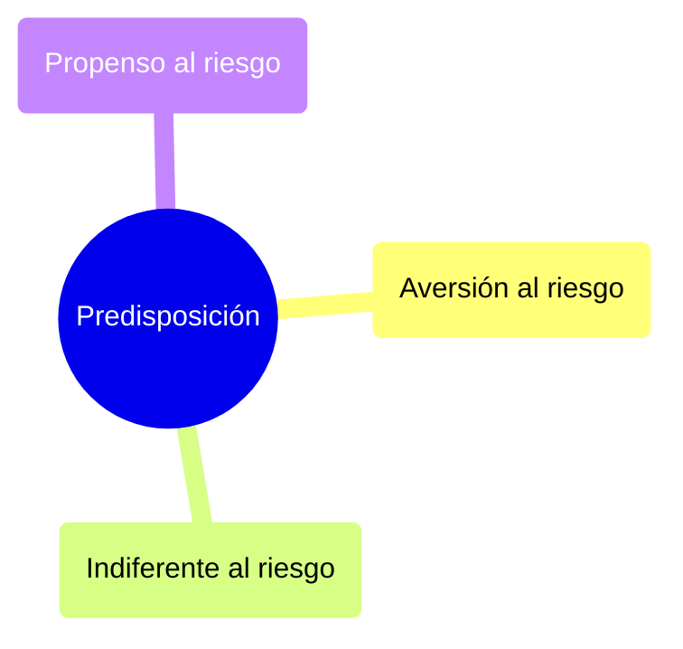
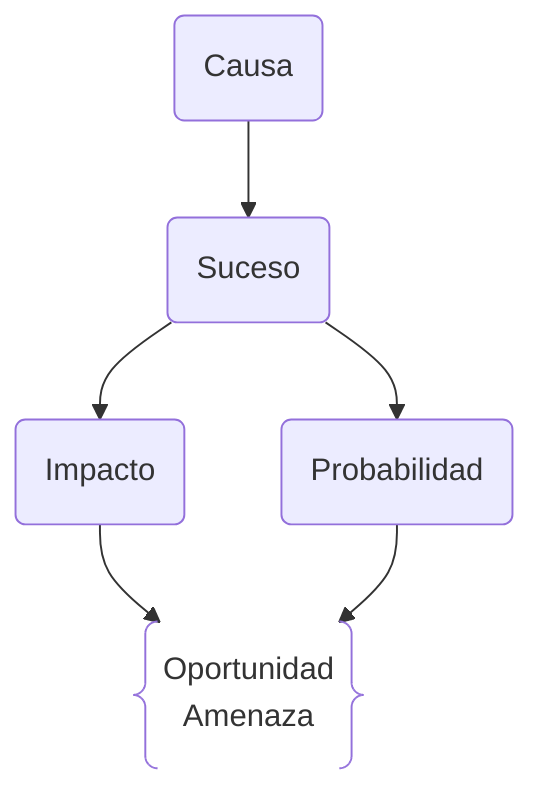

# 🎯 Gestión de Riesgos en Proyectos

## ✅ ¿Qué es un riesgo?

- Un **riesgo** es un evento o condición incierta que, si ocurre, afecta positiva o negativamente los objetivos del proyecto (alcance, coste, tiempo, calidad).
    
- La **incertidumbre** es cuando no conocemos la probabilidad de ocurrencia de un evento.
    
    - Ej: no saber si habrá una catástrofe natural nunca antes vista.
        
- El **riesgo** se presenta cuando sí podemos estimar la probabilidad.
    
    - Ej: posibilidad de lluvia según meteorología.
        

> La **probabilidad de ocurrencia** se mide en una escala de 0 (improbable) a 1 (seguro).

---

## 📐 Cuantificación del Riesgo

- No se evalúa solo por su **probabilidad**, sino también por su **impacto**.
    
- Un riesgo con alta probabilidad pero bajo impacto puede ser menos relevante que otro con baja probabilidad y alto impacto.
    

> Ejemplo:
> 
> - Riesgo 1: 90% probabilidad, pérdida de 100 €
>     
> - Riesgo 2: 10% probabilidad, pérdida de 100 000 €  
>     → Riesgo 2 es más crítico
>     

---

## 🧠 Análisis de la Tolerancia al Riesgo

- **Apetito de riesgo**: Grado de riesgo que se acepta en anticipación a una recompensa.
    
- **Tolerancia al riesgo**: Cantidad o nivel de riesgo que una organización puede soportar.
    
- **Umbral de riesgo**: Nivel a partir del cual se toman acciones específicas para mitigar o evitar el riesgo.
    

---

## 🧰 Gestión de Riesgos (PMBOK)

### 1. **Planificación de la gestión de riesgos**

- Define cómo se llevará a cabo la gestión de riesgos en el proyecto.
    
- Preguntas clave:
    
    - ¿Quién identificará los riesgos?
        
    - ¿Cuándo y cómo se identificarán?
        
    - ¿Qué escalas se usarán para priorizar?
        
    - ¿Se hará análisis cuantitativo?
        
    - ¿Con qué frecuencia se controlarán los riesgos?
        

---

### 2. **Identificación de riesgos**

- Determinar qué riesgos pueden afectar al proyecto.
    
- Documentar características de cada riesgo.
    

---

### 3. **Análisis cualitativo de riesgos**

- Prioriza riesgos según impacto y probabilidad.
    
- Usa herramientas como la **matriz de riesgo**.
    

---

### 4. **Análisis cuantitativo de riesgos**

- Analiza numéricamente los efectos de los riesgos sobre los objetivos del proyecto.
    

---

### 5. **Planificación de respuesta a los riesgos**

- Desarrollar opciones y acciones para aumentar oportunidades y reducir amenazas.
    
- Estrategias de respuesta personalizadas para cada riesgo.
    

---

### 6. **Monitoreo y control de riesgos**

- Realizar seguimiento de riesgos identificados.
    
- Detectar nuevos riesgos.
    
- Implementar planes de respuesta.
    
- Tomar decisiones correctivas.
    
- Redefinir planes o modificar objetivos si es necesario.
    

> 🔁 **La gestión de riesgos es un proceso iterativo y obligatorio.**

---

## 🔄 Ciclo del Riesgo

---

