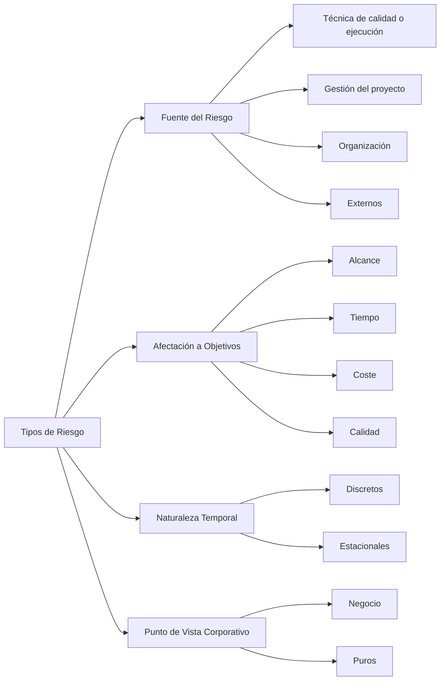
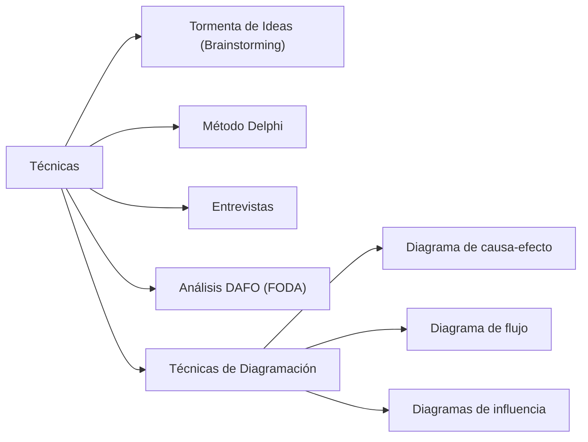
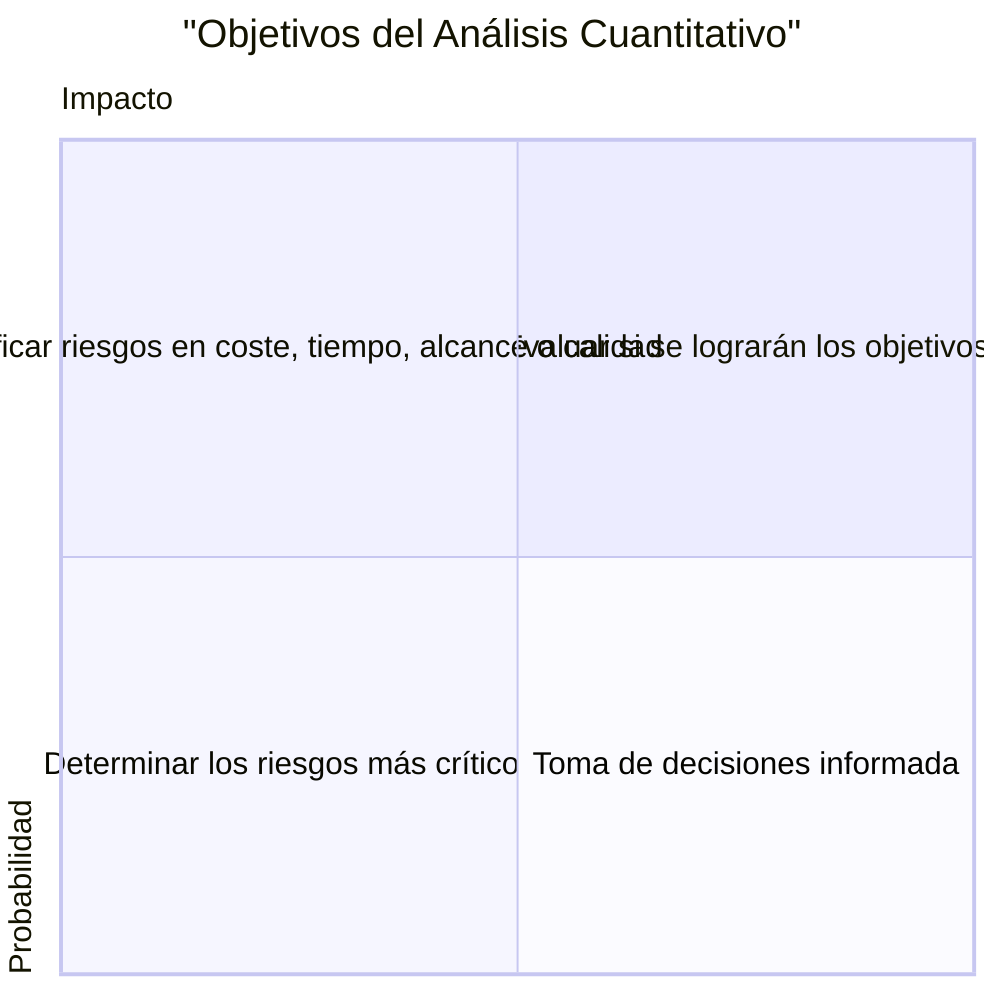
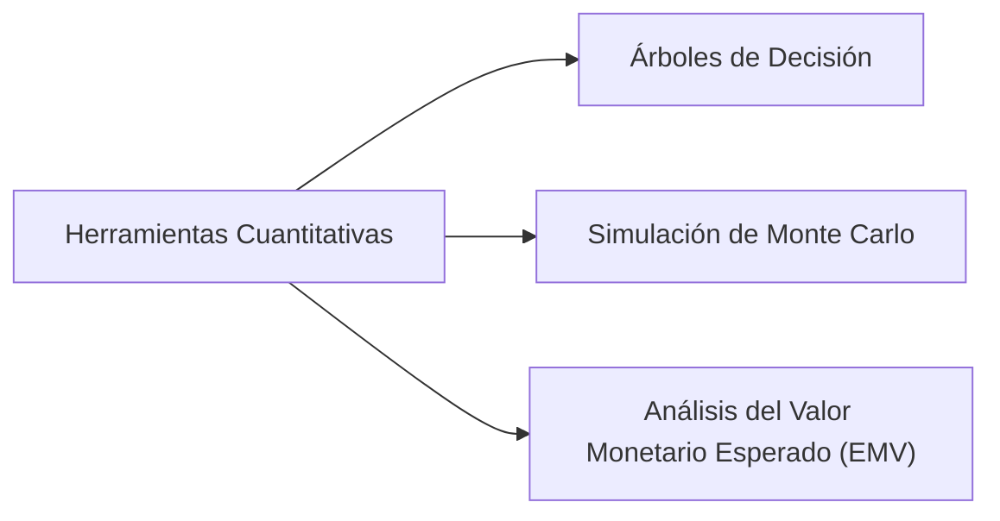

# 🧠 Análisis De Riesgos En Proyectos

## 📌 1. Identificación De Riesgos

- Se realiza **una vez establecido el plan de gestión de riesgos**.
    
- Es un **proceso iterativo**, ya que los riesgos pueden cambiar a lo largo del ciclo de vida del proyecto.
    
- Se documentan **las características** de los riesgos.

### 🧱 Estructura De Desglose De Riesgos (RBS)

- Representa los riesgos **de forma jerárquica**.
    
- Agrupa riesgos por **categorías** y **subcategorías**.
    
- Facilita la identificación de **áreas críticas** del proyecto.

---

## ⚠️ 2. Tipos De Riesgos

---

## 🧰 3. Técnicas De Identificación De Riesgos

---

## 🔍 4. Análisis Cualitativo De Riesgos

- Permite **priorizar los riesgos** identificados.
    
- Define niveles: **bajo, medio, alto**, con porcentajes asignados.
    
- Herramienta principal: **Matriz de Probabilidad e Impacto**.

### 📊 Matriz De Probabilidad - Impacto

Representa visualmente la exposición al riesgo combinando:

- **Probabilidad de ocurrencia**
    
- **Impacto sobre el proyecto**

> También conocida como **"mapa de calor"**, permite comparar y priorizar riesgos fácilmente.

📎 **Ejemplo gráfico incluido en tu archivo:**

---

## 📈 5. Análisis Cuantitativo De Riesgos

- Se realiza sobre los **riesgos prioritarios**.
    
- Asigna **valores numéricos** al impacto de los riesgos.
    
- Permite **decisiones bajo incertidumbre**.

### 🛠️ Herramientas De Análisis Cuantitativo

#### 📌 Valor Monetario Esperado (EMV)

- Técnica estadística que **estima el resultado promedio** bajo escenarios inciertos.
    
- Riesgos: valores negativos  
    Oportunidades: valores positivos
    
- Cálculo:  
    $EMV=∑(probabilidad×impacto)$

#### 📌 Simulación De Monte Carlo

- Se ejecuta el modelo del proyecto muchas veces con **valores aleatorios de entrada**.
    
- Genera una **distribución de probabilidad** de resultados:
    
    - Coste total
        
    - Duración
        
    - Fecha de entrega esperada

#### 📌 Análisis De Sensibilidad

- Determina qué riesgos tienen **mayor impacto potential**.
    
- Evalúa un riesgo a la vez, **manteniendo constantes los demás**.

## MicroTest

- ¿Qué se debe hacer con los riesgos no críticos?:
	- Documentarlos y revisarlos periódicamente.
- Si un proyecto tiene una probabilidad del 30 % de ganar 30 000 € y una probabilidad del 20 % de perder 30 000 €, ¿cuál es el valor monetario del proyecto?:
	[- 3000 €.](<Para calcular el **Valor Monetario Esperado (EMV)** del proyecto, usamos la fórmula:

$$
\text{EMV} = \sum (\text{Probabilidad} \times \text{Impacto})
$$

### Datos

* Probabilidad de ganar 30 000 €: 30% → $0.3 \times 30\,000 = +9\,000 €$
* Probabilidad de perder 30 000 €: 20% → $0.2 \times (-30\,000) = -6\,000 €$

### Cálculo

$$
\text{EMV} = 9\,000 - 6\,000 = \boxed{3\,000\,€}
$$

✅ Por tanto, **el valor monetario esperado del proyecto es de 3 000 €**.>)

- Si se tiene dificultades en evaluar el impacto en tiempo de un determinado riesgo, ¿qué se debe hacer?:
	- Evaluarlo cualitativamente.
