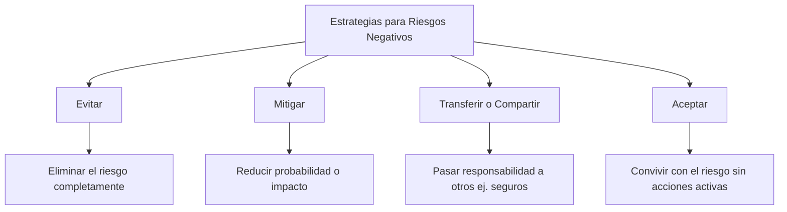
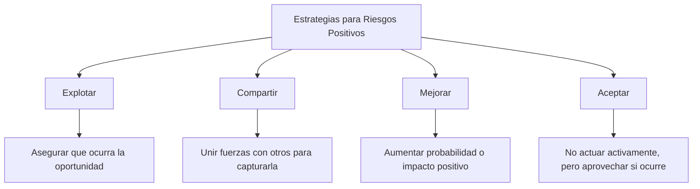

# 📌 Gestión De Riesgos – Parte 2

## 🎯 Definición General De Riesgo

> Según el PMI, un **riesgo** es un evento o condición incierta que, si ocurre, afecta al menos uno de los objetivos del proyecto.

- Puede tener efectos **positivos (oportunidades)** o **negativos (amenazas)**.

---

## ⚠️ Riesgos Negativos (Amenazas)

### Estrategias De Respuesta

---

## ✅ Riesgos Positivos (Oportunidades)

### Definición

- Son riesgos que, si ocurren, **benefician al proyecto**.
    
- La empresa **decide si tomarlos**, basándose en su estrategia.

### Estrategias De Respuesta

---

## 🧩 Planificación De la Respuesta a Los Riesgos

### Objetivos

- Desarrollar opciones para **reducir amenazas** y **potenciar oportunidades**.
    
- **Asignar un responsible** para cada respuesta planificada.

### Tipos De Planes

|Plan|Descripción|
|---|---|
|**Contingencia**|Acciones si se materializa un riesgo previsto|
|**Recuperación**|Acciones si el plan de contingencia falla|
|**Emergencia**|Respuestas ante eventos extremos no previstos|
|**Respuesta a riesgos**|Documento formal con todas las respuestas y responsables|

---

## 🔎 Supervisión Y Control De Riesgos

### Actividades

- Identificar **nuevos riesgos**
    
- Reevaluar riesgos ya identificados
    
- Monitorear ejecución de respuestas
    
- Vigilar **riesgos residuales**
    
- Activar planes de contingencia si corresponde

> Este proceso es **continuo** durante todo el ciclo de vida del proyecto.

---

## 🛠️ Herramientas Digitales Para la Gestión De Riesgos

| Herramienta    | Descripción                                                                                                  |
| -------------- | ------------------------------------------------------------------------------------------------------------ |
| **Comindwork** | Web app colaborativa para la gestión de proyectos; personalizable, permite diagrams de Gantt, tickets, etc. |
| **dotProject** | Herramienta de código abierto, enfocada en metodologías ágiles y gestión de tareas.                          |

----

## Microtest

- Contratar un seguro de coche es un ejemplo de:
	- Transferencia del riesgo.
- El cliente solicita un cambio que incrementa el riesgo del proyecto. ¿Cuál de las siguientes opciones se debe hacer antes que las demás?:
	- Analizar el impacto del cambio con el equipo de proyecto.
- Estamos dirigiendo un proyecto que lleva un retraso considerable. Vamos a contratar un experto para que se ocupe de las tareas que llevan más retraso. ¿Qué es esta acción?:
	- Una acción correctiva.
---

### ✅ **Preguntas mencionadas en el orden en que aparecen:**

1. **Una vez que se acuerda el alcance del proyecto con el cliente, ¿no cambiaría durante el proyecto?**
    
2. **¿El plan del proyecto incluye el cronograma, presupuesto, plan de respuestas a riesgos y plan de la disponibilidad de recursos?**
    
3. **¿La gestión de riesgos incluye la identificación, calificación, cuantificación, planificación con dos respuestas y seguimiento de los riesgos?**
    
4. **¿El objetivo principal de la comunicación en la gestión de proyectos es movilizar a la otra parte a la acción?**
    
5. **¿Desarrollar el equipo de proyectos no es un aspecto importante de la gestión de recursos?**
    
6. **¿El objetivo de la gestión de los costes es asegurar que el proyecto se complete superando el presupuesto aprobado?**
    
7. **¿Las técnicas de negociación no son útiles para que los clientes del proyecto lleguen a acuerdos entre las partes?**
    
8. **¿El alcance del proyecto debe acordarse solo con el cliente, no con la organización?**
    
9. **¿El alcance del proyecto define lo que está y no está incluido en el proyecto?**
    
10. **¿La dirección del proyecto se enfoca únicamente en los requisitos identificados sin considerar los diferentes intereses y expectativas de los stakeholders?**
    
11. **¿Cuál es una de las principales tareas durante el proceso de inicio del proyecto?**
    
	- (opciones implícitas: celebrar reunión de arranque, desarrollar el programa, controlar el riesgo)
    

12. **¿Qué es la estrategia empresarial?**
    
13. **¿Cuál es el propósito principal de una empresa?**
    
14. **¿Cuál es la finalidad del análisis de viabilidad de un proyecto?**
    
15. **¿En qué tres niveles se produce la integración del proyecto?**
    
16. **¿Cuál es la principal función de la gestión de la integración?**
    
17. **¿Qué son los objetivos estratégicos?**
    
18. **¿Cuál es el principal beneficio de la dirección de proyectos para los participantes?**
    
19. **¿Cuál es el principal beneficio de la dirección de proyectos para el desarrollo de las actividades empresariales?**
    
20. **¿Cuál es la principal razón para que las empresas realicen proyectos?**
    

---
