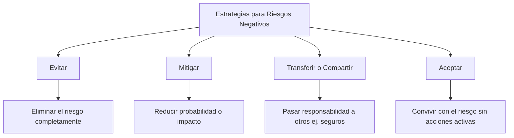
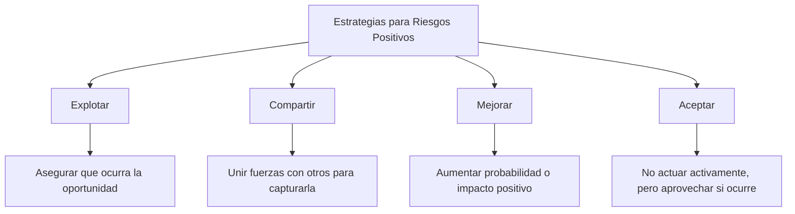

# 📌 Gestión De Riesgos – Parte 2

## 🎯 Definición General De Riesgo

> Según el PMI, un **riesgo** es un evento o condición incierta que, si ocurre, afecta al menos uno de los objetivos del proyecto.

- Puede tener efectos **positivos (oportunidades)** o **negativos (amenazas)**.

---

## ⚠️ Riesgos Negativos (Amenazas)

### Estrategias De Respuesta

---

## ✅ Riesgos Positivos (Oportunidades)

### Definición

- Son riesgos que, si ocurren, **benefician al proyecto**.
    
- La empresa **decide si tomarlos**, basándose en su estrategia.

### Estrategias De Respuesta

---

## 🧩 Planificación De la Respuesta a Los Riesgos

### Objetivos

- Desarrollar opciones para **reducir amenazas** y **potenciar oportunidades**.
    
- **Asignar un responsible** para cada respuesta planificada.

### Tipos De Planes

|Plan|Descripción|
|---|---|
|**Contingencia**|Acciones si se materializa un riesgo previsto|
|**Recuperación**|Acciones si el plan de contingencia falla|
|**Emergencia**|Respuestas ante eventos extremos no previstos|
|**Respuesta a riesgos**|Documento formal con todas las respuestas y responsables|

---

## 🔎 Supervisión Y Control De Riesgos

### Actividades

- Identificar **nuevos riesgos**
    
- Reevaluar riesgos ya identificados
    
- Monitorear ejecución de respuestas
    
- Vigilar **riesgos residuales**
    
- Activar planes de contingencia si corresponde

> Este proceso es **continuo** durante todo el ciclo de vida del proyecto.

---

## 🛠️ Herramientas Digitales Para la Gestión De Riesgos

| Herramienta    | Descripción                                                                                                  |
| -------------- | ------------------------------------------------------------------------------------------------------------ |
| **Comindwork** | Web app colaborativa para la gestión de proyectos; personalizable, permite diagrams de Gantt, tickets, etc. |
| **dotProject** | Herramienta de código abierto, enfocada en metodologías ágiles y gestión de tareas.                          |

----

## Microtest

- Contratar un seguro de coche es un ejemplo de:
	- Transferencia del riesgo.
- El cliente solicita un cambio que incrementa el riesgo del proyecto. ¿Cuál de las siguientes opciones se debe hacer antes que las demás?:
	- Analizar el impacto del cambio con el equipo de proyecto.
- Estamos dirigiendo un proyecto que lleva un retraso considerable. Vamos a contratar un experto para que se ocupe de las tareas que llevan más retraso. ¿Qué es esta acción?:
	- Una acción correctiva.