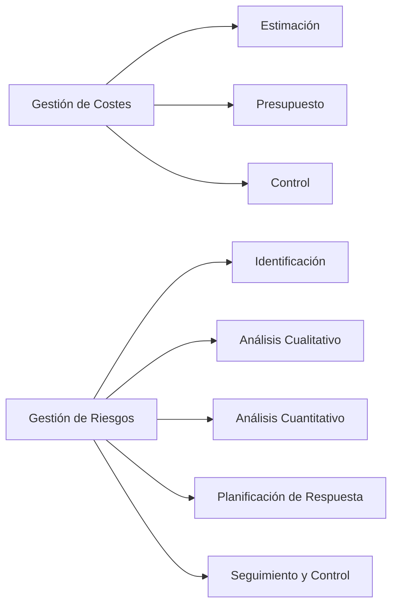

# 📑 Notas Detalladas — Gestión De Costes Y Gestión De Riesgos

## 1. Gestión De Costes Del Proyecto

### 1.1. Definición

- Incluye procesos para:
    
    - Estimar costes.
        
    - Presupuestar.
        
    - Controlar los costes.
        
- Objetivo: completar el proyecto **dentro del presupuesto aprobado**.
    
- Considera requisitos de los **interesados** (diferentes visiones y momentos de medición de costes).

### 1.2. Importancia De la Planificación De Costes

- Debe realizarse **antes** de estimar, presupuestar y controlar.
    
- Establece:
    
    - Formato de estimaciones.
        
    - Criterios para estructurar, estimar y controlar costes.

### 1.3. Métodos De Estimación De Costes

1. **Estimación detallada (bottom-up)**:
    
    - Se dispone de toda la información.
        
    - Se calcula coste de cada paquete de trabajo o actividad.
        
    - Luego se acumulan para reportes y seguimiento.
        
2. **Estimación análoga (top-down)**:
    
    - Se dispone de poca información.
        
    - Basada en similitudes con proyectos previous.
        
    - Utilizada por expertos que conocen bien el trabajo.
        
3. **Curva S o curva de advance**:
    
    - Gráfico de datos acumulados (costes, horas de trabajo) en relación con el tiempo.
        
    - Forma típica:
        
        - Inicio: crecimiento lento.
            
        - Fase media: crecimiento acelerado.
            
        - Final: crecimiento se desacelera.

---

## 2. Conceptos Clave De Riesgo En Proyectos

### 2.1. Definición

- Riesgo: evento o condición incierta con efecto positivo o negativo en objetivos.
    
- **Incertidumbre**: no se conoce la probabilidad de ocurrencia.
    
- **Situación de riesgo**: se puede estimar la probabilidad.

### 2.2. Tipos De Riesgos

- **Negativos** → amenazas.
    
- **Positivos** → oportunidades (estratégicos).

---

## 3. Gestión De Riesgos

### 3.1. Procesos Involucrados

1. Planificación de la gestión de riesgos.
    
2. Identificación de riesgos.
    
3. Análisis cualitativo.
    
4. Análisis cuantitativo.
    
5. Planificación de respuestas.
    
6. Seguimiento y control de riesgos.

### 3.2. Actividades Clave

- Identificar riesgos.
    
- Análisis cualitativo → priorizar riesgos según criterios establecidos.
    
- Análisis cuantitativo → impacto numérico.
    
- Desarrollar acciones para:
    
    - **Mejorar oportunidades**.
        
    - **Reducir amenazas**.
        
- Control y supervisión continua.

---

## 4. Planificación De la Gestión De Riesgos

### 4.1. Objetivo

- Definir cómo se gestionarán los riesgos durante el proyecto.
    
- Ajustar el nivel de gestión al **tamaño e importancia** del proyecto.

### 4.2. Escalas De Priorización

- Ejemplo de niveles: Muy bajo, Bajo, Medio, Alto, Muy alto.
    
- Cada valor asociado a un **porcentaje de probabilidad**.
    
- **Índice de disposición al riesgo** = Probabilidad × Impacto.

---

## 5. Planificación De la Respuesta a Los Riesgos

### 5.1. Objetivos

- Diseñar acciones para:
    
    - **Mejorar oportunidades** (riesgos positivos).
        
    - **Reducir amenazas** (riesgos negativos).
        
- Asignar un **propietario del riesgo** responsible de la ejecución y financiación de la respuesta.

### 5.2. Tipos De Planes Asociados

- **Plan de contingencias** → acciones si se manifiesta un riesgo identificado.
    
- **Plan de recuperación** → acciones si el plan de contingencias falla.
    
- **Plan de emergencias** → acciones ante situaciones críticas.
    
- **Plan de respuesta a riesgos** → documento formal con todos los riesgos y respuestas.

---

## 6. Seguimiento Y Control De Riesgos

### 6.1. Objetivo

- Detectar riesgos nuevos.
    
- Revaluar riesgos existentes.
    
- Comprobar efectividad de respuestas aplicadas.

### 6.2. Actividades

- Monitorear condiciones que activan planes de contingencia.
    
- Seguimiento de riesgos residuales.
    
- Revisión periódica durante todo el ciclo de vida del proyecto.

---

---
