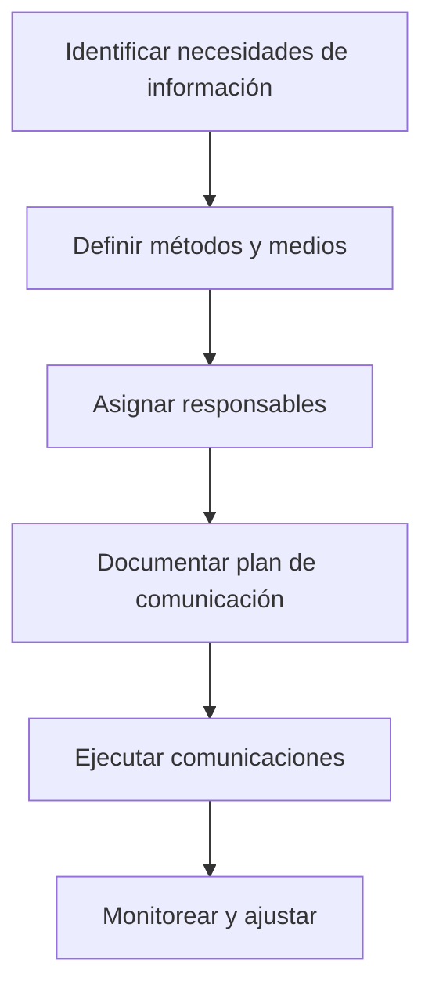

# 📚 Comunicación Y Planificación De la Gestión De Las Comunicaciones

## 1. Definición De Comunicación

- **Según la RAE**: Transmisión de señales mediante un código común entre emisor y receptor.
    
- **En gestión de proyectos**:
    
    - Comprende todos los intercambios de información entre los interesados.
        
    - El **emisor** debe transmitir el mensaje con claridad, completitud y sin ambigüedad.
        
    - El **receptor** debe recibir y comprender el mensaje correctamente.
        
    - Incluye:
        
        - Generación.
            
        - Recolección.
            
        - Diseminación.
            
        - Almacenamiento.
            
        - Disposición final de la información.

## 2. Objetivo De la Comunicación En Proyectos

- Crear un **puente** entre:
    
    - Diferentes interesados.
        
    - Entornos culturales y organizacionales.
        
    - Niveles de experiencia.
        
    - Perspectivas e intereses.
        
- Garantizar que:
    
    - La **información correcta** llegue a la **persona adecuada**.
        
    - Se entregue **en el memento oportuno**.
        
    - Se use el **medio y formato apropiados**.

---

## 3. Dimensions De la Comunicación

|Dimensión|Tipos|
|---|---|
|**Alcance**|Interna (dentro del proyecto) / Externa (clientes, otros proyectos).|
|**Formalidad**|Formal (informes, memorandos) / Informal (correos, charlas).|
|**Dirección**|Vertical (arriba y abajo en la jerarquía) / Horizontal (entre colegas).|
|**Oficialidad**|Official (boletines, reportes) / No official (charlas informales).|
|**Medio**|Escrita / Oral.|
|**Expresión**|Verbal / No verbal (lenguaje corporal, tono de voz).|

---

## 4. Características De Una Buena Comunicación

1. **Clara** → mensaje directo, sin rodeos.
    
2. **Concisa** → evitar exceso de palabras, centrarse en lo esencial.
    
3. **Sencilla** → lenguaje comprensible, evitando tecnicismos innecesarios.
    
4. **Con conocimiento** → el emisor debe dominar el tema.
    
5. **Coherente** → ideas con orden lógico.
    
6. **Unidad** → hilo conductor en todo el mensaje.
    
7. **Natural** → fluidez y autenticidad.
    
8. **Interactiva** → fomentar el intercambio de ideas.
    
9. **Cuidado del lenguaje corporal** → coherencia entre lo verbal y lo no verbal.
    
10. **Relevante** → destacar lo importante para el receptor.

---

## 5. Planificación De la Gestión De Las Comunicaciones

### 5.1 Propósito

Determinar las **necesidades de información** de los interesados y **cómo** se llevarán a cabo las comunicaciones para que sean efectivas.

### 5.2 Preguntas Clave Que Debe Responder

1. **Qué** se quiere comunicar.
    
2. **Cuándo** comunicarlo.
    
3. **Cómo** (medios y canales).
    
4. **Quién** es el receptor.
    
5. **Quién** transmite.
    
6. **Dónde** se realizará.
    
7. **Por qué** (motivación).

### 5.3 Elementos Del Plan De Comunicaciones

- Requisitos de comunicación de cada interesado.
    
- Tipo de información a comunicar.
    
- Responsible de transmitirla.
    
- Destinatarios.
    
- Métodos, canales y tecnologías.
    
- Procedimientos de escalamiento de problemas.
    
- Glosario común de términos.
    
- Matriz de distribución y responsabilidades.

---

## 6. Beneficios De Una Buena Planificación

- Entrega **eficiente y eficaz** de la información.
    
- Reducción de:
    
    - Retrasos en la entrega de mensajes.
        
    - Envío de información a la audiencia equivocada.
        
    - Falta de comunicación.
        
    - Malas interpretaciones.

## 7. Riesgos De Una Mala Planificación

- Mensajes retrasados.
    
- Información incompleta o enviada a destinatarios incorrectos.
    
- Malinterpretación del contenido.

---

## 8. Resumen Visual — Proceso De Gestión De Comunicaciones

---

## MicroTest

- De forma genérica y aplicada a la dirección de proyectos, ¿cuál es el objetivo principal de la comunicación?:
	- Orientar al receptor a la acciön.
- ¿Qué debemos de tener en cuenta en una buena comunicación?:
	- Qué, cuándo, cómo, quién, dónde, por qué.
- ¿Por qué es importante una buena planificación de las comunicaciones en la gestión de proyectos?:
	- Para evitar riesgos para el proyecto.
https://cmr.berkeley.edu/2021/02/63-2-nonverbal-behavior/
