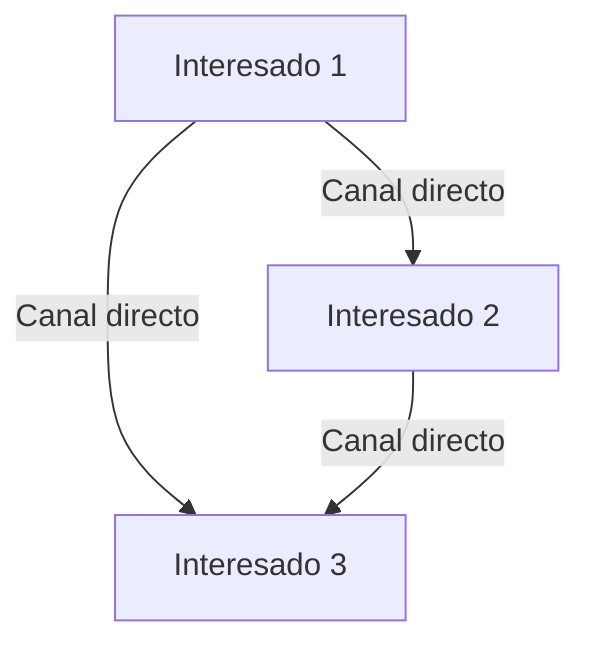
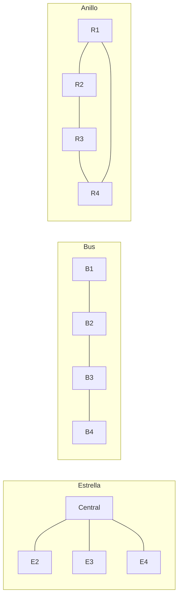

# Planificación Y Gestión De Las Comunicaciones (Parte 2)

## 1. Análisis De Requisitos De Comunicación

El análisis de requisitos determina las **necesidades de información** de los interesados del proyecto.

- **Cálculo de canales de comunicación**:  
    Fórmula:

    ```Python
    Número de canales = n × (n - 1) / 2
    ```

    Donde:

    - `n` = número de interesados
        
    - La fórmula aplica cuando todos los interesados están interconectados.
        
- **Tipos de interconexión**:
    
    - **Interconexión total**: todos los interesados tienen canales directos entre sí.
        
    - **Interconexión parcial**: comunicación possible, pero a través de nodos intermedios.



---

## 2. Topologías De Interconexión

- **Estrella**:
    
    - Cada nodo conectado a un nodo central.
        
    - Alta dependencia del nodo central.
        
    - Fallo en el nodo central → fallo total.
        
- **Bus**:
    
    - Todos los nodos conectados a un medio común (bus).
        
    - Fácil de añadir/eliminar nodos.
        
    - Fallo en el bus → caída total.
        
- **Árbol**:
    
    - Conexión de varios buses formando ramas.
        
    - Uso de dispositivos para unir y duplicar líneas.
        
- **Anillo**:
    
    - Nodos conectados en un circuito cerrado.
        
    - Comunicación en una sola dirección.
        
    - Control distribuido entre nodos.



---

## 3. Selección De Tecnología De Comunicación

Factores a considerar:

- **Urgencia** de la información.
    
- **Disponibilidad** de tecnología.
    
- **Recursos humanos** disponibles.
    
- **Sensibilidad** y **confidencialidad** de la información.
    
- **Duración** y **entorno** del proyecto (físico o virtual).

---

## 4. Modelos De Comunicación

Secuencia básica de un modelo de comunicación:

1. **Emisor**:
    
    - Codifica el mensaje cuidadosamente.
        
    - Selecciona el medio adecuado.
        
    - Envía información clara y completa.
        
    - Confirma que fue comprendida.
        
2. **Receptor**:
    
    - Decodifica cuidadosamente.
        
    - Confirma comprensión mediante retroalimentación.

---

## 5. Métodos De Comunicación

- **Interactiva**:
    
    - Multidireccional.
        
    - Ej.: reuniones, videollamadas, mensajería instantánea.
        
- **Push (empujar)**:
    
    - Información enviada a receptores específicos.
        
    - No garantiza que haya sido comprendida.
        
    - Ej.: correos, memorandos, comunicados.
        
- **Pull (tirar)**:
    
    - Información disponible para set consultada.
        
    - Útil para grandes volúmenes o audiencias amplias.
        
    - Ej.: intranet, bases de datos, cursos en línea.

---

## 6. Contenido Del Plan De Gestión De Comunicaciones

Debe incluir:

- **Información a comunicar** (idioma, formato, nivel de detalle).
    
- **Plazos** y **secuencia** de distribución.
    
- **Responsables** de la comunicación.
    
- **Métodos y tecnologías** de transmisión.
    
- **Procedimientos de escalamiento** (plazos, jerarquías).
    
- **Diagrams de flujo** de la información.
    
- **Flujos de trabajo** con secuencia de autorizaciones.
    
- **Listas de informes y planes de reunión**.

---

## MicroTest

- ¿Cuál de estos factores no afecta habitualmente a la selección de la tecnología de comunicaciones?:
	- El alcance del proyecto.
- ¿Cuánto tiempo pasa el director de proyectos comunicando tanto de forma formal como informal?:
	- Entre eI 75 % y eI 90 %.
- ¿Cuál no es uno de los objetivos prioritarios de las reuniones de trabajo dentro del proyecto?:
	- Aumentar la autoridad de líder de proyectos.