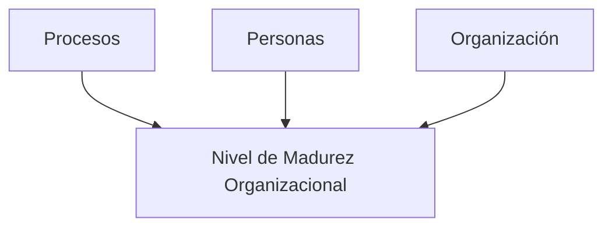

# Gestión De Los Recursos Humanos En Proyectos

## 1. Introducción

La **gestión de recursos humanos** en un proyecto implica organizar, gestionar y dirigir el **equipo del proyecto**. Este equipo está compuesto por personas con **roles** y **responsabilidades** definidos para completar el proyecto.

Los **directories de proyecto** combinan:

- **Habilidades técnicas**
    
- **Habilidades interpersonales**
    
- **Habilidades conceptuales**

Esto les permite analizar situaciones e interactuar de manera apropiada con el equipo y otros interesados.

---

## 2. Principios Clave Según PMBOK

- Participación activa de **todos los miembros** en la planificación y toma de decisiones.
    
- **Aprovechar la experiencia** de cada miembro para fortalecer el compromiso.
    
- El equipo de dirección:
    
    - Lidera y dirige el proyecto.
        
    - Presta atención a aspectos humanos que puedan impactar en el éxito.
        
    - Mantiene un comportamiento **ético y professional**.
        
    - Considera factores como:
        
        - Ubicación geográfica.
            
        - Necesidades de comunicación.
            
        - Diferencias culturales.

---

## 3. Evaluación Del Nivel De Madurez Organizacional

Para evaluar el grado de madurez en gestión de proyectos, considerar:

### 3.1 Procesos

- ¿Existe un mecanismo formal o estandarizado de seguimiento?
    
- ¿Se supervisa el portafolio completo de proyectos?

### 3.2 Personas

- ¿Se prioriza a las personas en la gestión de proyectos?
    
- ¿Conocen los proyectos en los que participan?
    
- ¿Están habituadas a trabajar en una **organización orientada a proyectos**?

### 3.3 Organización

- ¿Existe una **Oficina de Gestión de Proyectos** (PMO)?
    
- ¿Está integrada con el departamento de RRHH?
    
- ¿La organización es **orientada a proyectos**?

---

## 4. Planificación De la Gestión De Recursos Humanos

Proceso para **identificar y documentar**:

- Roles y responsabilidades.
    
- Habilidades necesarias.
    
- Relaciones de comunicación.

### Preguntas Clave

- ¿Cómo y cuándo se incorporará cada miembro?
    
- ¿Qué capacidades actuales posee cada persona?
    
- ¿Qué necesidades de capacitación existen?
    
- ¿A qué reuniones debe asistir cada persona?
    
- ¿Con qué frecuencia debe entregar informes?
    
- ¿Existirá un sistema de recompensas? ¿De qué tipo?
    
- ¿Cuándo y cómo se liberará a cada persona del proyecto?
    
- ¿Qué medidas protegerán al equipo de influencias externas?

---

## 5. Estimación De Recursos Para Actividades

- Determinar **personas, equipos y materiales** necesarios.
    
- Definir **cantidades** y **disponibilidad** de recursos.
    
- Relación entre **número de recursos disponibles** y **duración de la actividad**.
    
- Identificar **mínimos necesarios** para su ejecución.

---

## 6. Adquisición Del Equipo Del Proyecto

- Reclutamiento de recursos humanos para completar el trabajo.
    
- Disposición:
    
    - A tiempo completo.
        
    - A tiempo parcial.
        
- La adquisición se realiza durante la ejecución, pero la planificación comienza con miembros clave.
    
- En proyectos grandes:
    
    - No se contrata todo el equipo antes de iniciar.
        
    - Se incorporan progresivamente durante la ejecución.
        
- Importancia de **negociar** e **influir** para conseguir recursos adecuados.
    
- Considerar **recursos alternativos** en caso de escasez.

---

## MicroTest

- En el nivel de madurez de una organización, ¿en cuál se trabaja en la integración de los grupos funcionales para formar un equipo de proyecto eficiente?:
	- Nivel 3.
- ¿Cuál es la responsabilidad del líder del proyecto?:
	- Tomar prestada una parte de la capacidad de la organizaciön.
- ¿Cómo identifica el director funcional los perfiles y la cantidad de los recursos?:
	- Por medio de la matriz de asignación de responsabilidades.
- 