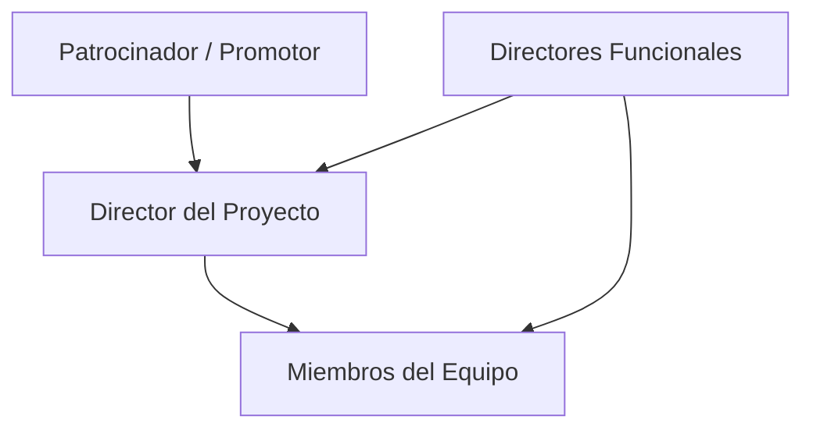
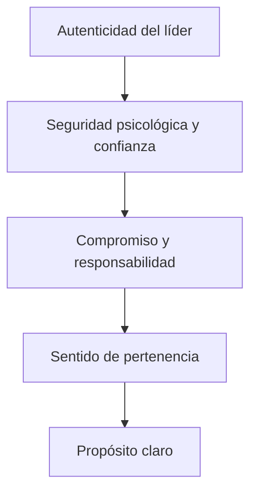

# Formación Y Dirección Del Equipo De Proyecto

## 1. Objetivos Del Desarrollo Del Equipo

El desarrollo del equipo de proyecto busca:

- Mejorar **competencias individuales**.
    
- Potenciar **interacciones** entre miembros.
    
- Fomentar el **trabajo en equipo**.
    
- Incrementar el **rendimiento del proyecto**.

### Metas Específicas

1. **Aumentar la competencia** para completar actividades del proyecto.
    
2. **Incrementar la confianza y cohesión** del equipo.
    
3. **Fomentar una cultura** de:
    
    - Cooperación.
        
    - Trabajo en equipo.
        
    - Compartir conocimiento y experiencia.

---

## 2. Dirección Del Equipo De Proyecto

Dirigir el equipo implica:

- Hacer **seguimiento del rendimiento** de cada miembro.
    
- Recoger **retroalimentación**.
    
- Resolver **incidencias y conflictos**.
    
- Coordinar **cambios** para mejorar el desempeño.
    
- Mantener un **comportamiento professional y ético**.

### Resultados Del Proceso

- Actualización del **plan de gestión del personal**.
    
- Creación de **solicitudes de cambio**.
    
- Aportes a **bases de conocimiento** y **lecciones aprendidas**.

---

## 3. Gestión En Organizaciones Matriciales

- La complejidad aumenta cuando:
    
    - Hay más miembros en el equipo.
        
    - Los miembros tienen **double dependencia**:
        
        - Gerente funcional.
            
        - Director de proyecto.
            
- La **gestión efectiva** de esta double línea de mando es crítica para el éxito.

---

## 4. Actores Y Roles En El Proyecto

### 4.1 Patrocinador O Promotor

- Proporciona recursos financieros (dinero o especie).
    
- Autoriza y apoya el proyecto.

### 4.2 Directories Funcionales

- Autoridad sobre una unidad de negocio.
    
- Supervisan el **desempeño financiero** del proyecto.
    
- Pueden participar varias unidades en un solo proyecto.

### 4.3 Director Del Proyecto

- Responsible de **dirigir y coordinar** el proyecto.
    
- Supervisa la ejecución y el cumplimiento de objetivos.

### 4.4 Miembros Del Equipo De Proyecto

- Ejecutan el trabajo técnico y administrativo.
    
- Ejemplos:
    
    - Arquitectos
        
    - Ingenieros
        
    - Delineantes
        
    - Personal administrativo
        
    - Departamento jurídico
        
    - Contabilidad

---

## 5. Relación Entre Actores Del Proyecto

---

## MicroTest

- ¿Quién es la persona o entidad que provee recursos financieros al proyecto?:
	- Patrocinador.
- ¿Quién aprueba el cronograma final?:
	- Director funcional.
- ¿Quién debe significar los principales riesgos del proyecto?:
	- patrocinador

## Saber Mas

# Fórmula Magna Para Un Liderazgo Irresistible

## 1. Dos Preguntas Iniciales

1. ¿Podemos vivir en un mundo sin **recursos humanos**? → **No**.
    
2. ¿Podemos vivir en un mundo sin el **departamento de RR. HH.**? → **Sí**.

---

## 2. Contexto Del Ponente

- **Nombre:** Janasoto.
    
- **Experiencia:** +20 años en roles gerenciales (soporte y negocio).
    
- **Actualidad:** Rol en negocio en empresa de 800.000 empleados.
    
- **Enfoque:** Excelencia, generación de valor, liderazgo.
    
- **Objetivo:** Compartir la **fórmula magna** para:
    
    - Crear una experiencia irresistible para el empleado.
        
    - Aumentar el compromiso y la productividad.

---

## 3. Evolución De Recursos Humanos

- Antes: **Administración de nóminas**.
    
- Ahora: **Socio estratégico**, responsible de talento.
    
- Automatización → procesos administrativos más eficientes.
    
- Proporción promedio: **2,57 RR. HH. Por cada 1.000 empleados**.
    
- Limitaciones:
    
    - Pocos recursos e infraestructura.
        
    - RR. HH. **no es suficiente** por sí solo para transformar el talento.

---

## 4. Responsabilidad Del Talento

- RR. HH. → dos áreas clave:
    
    1. Servicios compartidos.
        
    2. Centros de excelencia.
        
- **El talento es responsabilidad de los líderes de negocio**, no solo de RR. HH.
    
- Necesidad de **decisiones transformacionales**.

---

## 5. Historia Personal

- El ponente reconoce su **fracaso inicial** al intentar crear un lugar irresistible.
    
- **Impacto professional** en 20 años:
    
    - +4.000 entrevistas.
        
    - +1.000 coachings.
        
    - +1.200 mentorías.
        
    - +780.000 correos.
        
    - +12.000 personas impactadas.
        
- Cambio de enfoque: salir de RR. HH. Y enfocarse en la **experiencia del empleado**.

---

## 6. La Fórmula Magna

Una **pirámide** de 5 niveles:

Mermaid

Copy code

---

### 6.1 Caso Positivo

1. **Líder auténtico** en inducción.
    
2. Genera **confianza y seguridad psicológica**.
    
3. Define **objetivos claros**.
    
4. Fomenta **compromiso y responsabilidad**.
    
5. Desarrolla **pertenencia y propósito**.
    
6. Resultado: gerente motivado, comprometido y exitoso.

---

### 6.2 Caso Negativo

- Líder ausente, poco auténtico, sin reuniones 1 a 1.
    
- Falta de escucha y de visión.
    
- Sin objetivos claros ni ambiente inclusivo.
    
- Resultado: renuncia del empleado, pérdida de inversión.

---

## 7. Evidencia De Éxito

- Métricas de satisfacción **por líder** y **por trabajo** (1 a 5).
    
- Antes de la fórmula: resultados variables.
    
- Después de aplicarla: consistentemente entre **4 y 5**.

---

## 8. Conclusiones

- RR. HH. Debe:
    
    - Comprender el negocio.
        
    - Conocer el mercado.
        
    - Ejecutar con eficiencia.
        
- Los líderes de negocio deben:
    
    - **Tomar control del talento**.
        
    - Escuchar a los empleados.
        
    - Generar compromiso y valor.
        
    - Set **evangelistas** y **agentes de transformación**.

---

## 9. Pregunta Final

> ¿Eres un líder magna?  
> **Sí o No**.