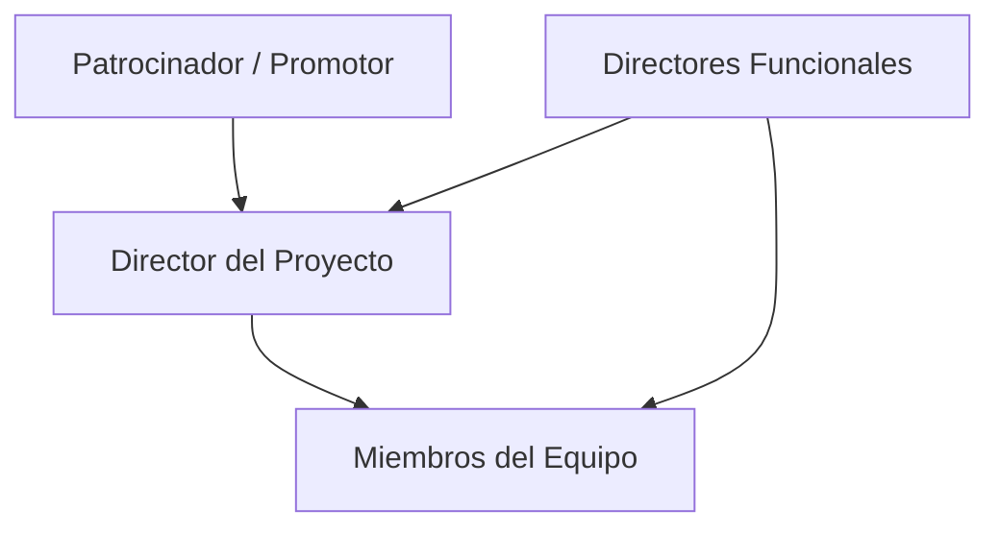

# Formación Y Dirección Del Equipo De Proyecto

## 1. Objetivos Del Desarrollo Del Equipo

El desarrollo del equipo de proyecto busca:

- Mejorar **competencias individuales**.
    
- Potenciar **interacciones** entre miembros.
    
- Fomentar el **trabajo en equipo**.
    
- Incrementar el **rendimiento del proyecto**.

### Metas Específicas

1. **Aumentar la competencia** para completar actividades del proyecto.
    
2. **Incrementar la confianza y cohesión** del equipo.
    
3. **Fomentar una cultura** de:
    
    - Cooperación.
        
    - Trabajo en equipo.
        
    - Compartir conocimiento y experiencia.

---

## 2. Dirección Del Equipo De Proyecto

Dirigir el equipo implica:

- Hacer **seguimiento del rendimiento** de cada miembro.
    
- Recoger **retroalimentación**.
    
- Resolver **incidencias y conflictos**.
    
- Coordinar **cambios** para mejorar el desempeño.
    
- Mantener un **comportamiento professional y ético**.

### Resultados Del Proceso

- Actualización del **plan de gestión del personal**.
    
- Creación de **solicitudes de cambio**.
    
- Aportes a **bases de conocimiento** y **lecciones aprendidas**.

---

## 3. Gestión En Organizaciones Matriciales

- La complejidad aumenta cuando:
    
    - Hay más miembros en el equipo.
        
    - Los miembros tienen **double dependencia**:
        
        - Gerente funcional.
            
        - Director de proyecto.
            
- La **gestión efectiva** de esta double línea de mando es crítica para el éxito.

---

## 4. Actores Y Roles En El Proyecto

### 4.1 Patrocinador O Promotor

- Proporciona recursos financieros (dinero o especie).
    
- Autoriza y apoya el proyecto.

### 4.2 Directories Funcionales

- Autoridad sobre una unidad de negocio.
    
- Supervisan el **desempeño financiero** del proyecto.
    
- Pueden participar varias unidades en un solo proyecto.

### 4.3 Director Del Proyecto

- Responsible de **dirigir y coordinar** el proyecto.
    
- Supervisa la ejecución y el cumplimiento de objetivos.

### 4.4 Miembros Del Equipo De Proyecto

- Ejecutan el trabajo técnico y administrativo.
    
- Ejemplos:
    
    - Arquitectos
        
    - Ingenieros
        
    - Delineantes
        
    - Personal administrativo
        
    - Departamento jurídico
        
    - Contabilidad

---

## 5. Relación Entre Actores Del Proyecto

---

## MicroTest

- ¿Quién es la persona o entidad que provee recursos financieros al proyecto?:
	- Patrocinador.
- ¿Quién aprueba el cronograma final?:
	- Director funcional.
- ¿Quién debe significar los principales riesgos del proyecto?:
	- patrocinador