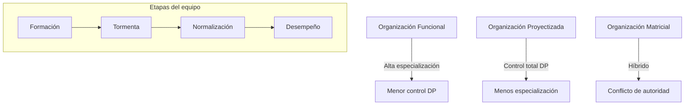

# Tipos De Organizaciones Y Organización Del Proyecto

## 1. Relación Entre Empresa Y Proyecto

- La **tipología y jerarquía** de la empresa afectan la organización del proyecto.
    
- Comprender esta relación ayuda a definir cómo debe actuar el **director de proyecto** y cómo planificar, comunicar y gestionar recursos.

---

## 2. Tipos De Organizaciones

### 2.1 Organización **Funcional**

- **Estructura:** Áreas especializadas (ej. ingeniería mecánica, fluidos, civil).
    
- Los **recursos** reportan al **responsible de área**, no al director de proyecto.
    
- **Rol del director de proyecto:** Coordinador entre áreas, sin autoridad directa sobre recursos.
    
- **Ventajas:**
    
    - Alta especialización → mayor eficiencia.
        
    - Aprovechamiento de conocimientos y experiencias previas.
        
    - Línea de reporte única.
        
- **Desventajas:**
    
    - Todas las decisiones sobre recursos pasan por responsables de área.
        
    - Menor control del director de proyecto.

---

### 2.2 Organización **Proyectizada**

- **Estructura:** Recursos asignados directamente a proyectos.
    
- **Reportan:** Solo al director de proyecto.
    
- **Ventajas:**
    
    - Comunicación y gestión simplificadas.
        
    - Autoridad total del director de proyecto sobre recursos.
        
- **Desventajas:**
    
    - Menos especialización → menor eficiencia.
        
    - Difícil aprovechar conocimientos previous.
        
    - Mayor impacto si un miembro se marcha.
        
    - Menor implicación de recursos al final del proyecto.

---

### 2.3 Organización **Matricial**

- **Híbrido** entre funcional y proyectizada.
    
- Recursos:
    
    - Organizados en **áreas funcionales**.
        
    - Asignados también a proyectos → tienen **dos jefes** (director de proyecto y responsible de área).
        
- **Ventajas:**
    
    - Mayor especialización.
        
    - Apoyo del área facilita reutilización de conocimientos.
        
    - Menor dependencia de una persona específica.
        
- **Desventajas:**
    
    - Autoridad dividida.
        
    - Posibles conflictos de prioridades.
        
- **Variantes:**
    
    - **Matricial fuerte:** autoridad principal del director de proyecto.
        
    - **Matricial débil:** autoridad principal del responsible de área.

---

## 3. Organización Del Proyecto

- Determinada por la **matriz de responsabilidades**.
    
- Debe considerar:
    
    - **EDT** (descomposición de tareas) para la planificación.
        
    - **Estructura organizativa**.

---

## 4. Etapas De Desarrollo Del Equipo (Modelo Forming–Storming–Norming–Performing)

### 4.1 **Form** (Formación)

- Equipo se incorpora al proyecto.
    
- Estado de ánimo positivo, entusiasmo inicial.
    
- Incertidumbre sobre roles.
    
- **Líder:** Definir objetivos, estructura, roles y procesos.

### 4.2 **Storm** (Tormenta)

- Aparecen conflictos y frustraciones.
    
- Desacuerdos sobre tareas, objetivos y roles.
    
- **Líder:** Mantener enfoque en tareas, clarificar roles, proveer herramientas, dividir tareas grandes.

### 4.3 **Norm** (Normalización)

- Resolución de diferencias.
    
- Aceptación mutua y cohesión.
    
- Reconocimiento de las diferencias como fortaleza.
    
- **Líder:** Impulsar cambios positivos, fomentar cultura de crítica constructiva, optimizar procesos.

### 4.4 **Perform** (Desempeño)

- Equipo trabaja de forma productiva y autónoma.
    
- Alta confianza y colaboración.
    
- **Líder:** Optimizar productividad, reforzar mejora continua y cultura positiva.

---

📌 **Resumen visual**:

---

## MicroTest

- Todas las siguientes son formas de poder derivadas de la posición del director de proyectos excepto:
	- Experto.
- ¿Qué técnica de resolución de conflictos está usando un director de proyectos cuando dice: «No puedo tratar ese problema ahora»?:
	- Retirada.
- Un miembro del equipo no está realizando bien su trabajo porque no tiene experiencia en sistemas de desarrollo del trabajo. Nadie más está disponible para hacer el trabajo, ¿cuál es la mejor solución possible?:
	- Pedir al miembro del equipo que haga formación.
