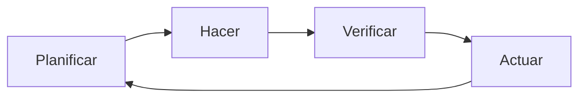
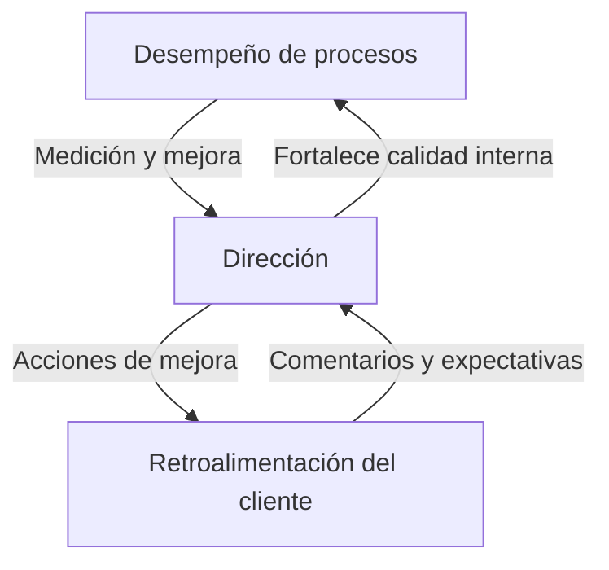

# Tema 8.1 – Gestión De la Calidad En Proyectos E ISO 9001

## Concepto De Calidad

- **Definición**: grado en que un producto o proceso cumple requisitos y especificaciones.
    
- **Características**:
    
    - Confiabilidad, efectividad, seguridad.
        
    - Ausencia de defectos, errores o fallas.
        
    - Cumplimiento de estándares de desempeño.
        
    - Satisfacción de las necesidades y expectativas del cliente.
        
    - Relación con mejora continua, eficiencia y resiliencia en todo el ciclo de vida.

## Gestión De la Calidad

- **Enfoque sistemático** para garantizar y mejorar la calidad.
    
- Implica implementar **procesos, políticas y prácticas** para:
    
    - Controlar
        
    - Medir
        
    - Evaluar
        
    - Mejorar

## El Dilemma De la Calidad

- Surge al existir **tensión entre calidad y otros objetivos** (costes, eficiencia, plazos, competitividad).
    
- **Factores de conflicto**:
    
    - Costos adicionales por controles rigurosos, capacitación, tecnología, materiales de mayor calidad.
        
    - Restricciones de tiempo y recursos limitados.
        
    - Presiones del mercado.
        
- **Gestión del dilemma**:
    
    - Evaluar costos y beneficios a corto y largo plazo.
        
    - Mantener equilibrio entre calidad y otros factores.
        
    - Decisiones estratégicas con cultura organizacional orientada a la calidad.

## Calidad En la Gestión De Proyectos

Aspectos clave:

1. **Cumplimiento de requisitos**: internos y externos, alineados a necesidades de los interesados.
    
2. **Planificación de la calidad**: definir estándares, métricas, objetivos y planes de control.
    
3. **Control de la calidad**: monitorear y evaluar desempeño, auditorías, pruebas, corrección de desviaciones.
    
4. **Mejora continua**: lecciones aprendidas, retroalimentación y aplicación de mejores prácticas.
    
5. **Satisfacción del cliente**: cumplir expectativas, generar confianza y relaciones duraderas.

## Norma ISO 9001

- **Definición**: estándar internacional de gestión de la calidad de la Organización Internacional de Normalización (ISO).
    
- **Objetivo**: implementar sistemas efectivos de gestión de calidad.
    
- **Certificación**:
    
    - Aporta confianza a clientes y partes interesadas.
        
    - Demuestra compromiso con satisfacción del cliente y mejora continua.

### Principios De ISO 9001

- Enfoque al cliente.
    
- Liderazgo.
    
- Participación del personal.
    
- Enfoque basado en procesos.
    
- Mejora continua.
    
- Decisiones basadas en evidencias.

### Requisitos Para la Certificación

- **Compromiso de la dirección**: liderazgo, política y objetivos de calidad medibles.
    
- **Enfoque en procesos**: identificar y gestionar procesos para cumplir resultados.
    
- **Enfoque al cliente**: comprender requisitos y superar expectativas.
    
- **Mejora continua**: decisiones basadas en datos y evidencias.
    
- **Gestión de recursos**: personal competente, infraestructura y ambiente de trabajo adecuado.
    
- **Medición, análisis y mejora**: procesos para monitorear desempeño y garantizar mejora.

## Ciclo PDCA (Deming)

- **Fases**:
    
    1. `Plan` – Planificar
        
    2. `Do` – Hacer
        
    3. `Check` – Verificar
        
    4. `Act` – Actuar

- **Aplicación en proyectos**: mejora continua, identificación de áreas de mejora, acciones correctivas y preventivas.

## Double Bucle De Mejora

1. **Interno (dirección)**: revisión y mejora continua del sistema mediante medición de desempeño de procesos.
    
2. **Externo (clientes y partes interesadas)**: retroalimentación para evaluar, corregir deficiencias y garantizar satisfacción.

- **Relación**: ambos bucles se retroalimentan y fortalecen mutuamente, generando un ciclo de excelencia.

---

## Mirotest

### **Question 1**

**El objetivo de la gestión de la calidad es:**

✅ **Respuesta correcta:**  
**b. Asegurar que el proyecto satisfaga las necesidades por las cuales fue emprendido.**

**Justificación:**  
La gestión de la calidad en proyectos no se limita solo a pruebas, normas o aceptación del cliente. Su propósito central es **garantizar que el proyecto cumpla con los requisitos y satisfaga las necesidades de los interesados** que motivaron su inicio. La calidad es “adecuación al propósito”, no solo conformidad documental.

---

### **Question 2**

**El lema «la calidad es gratis» de Philip Crosby significa que:**

✅ **Respuesta correcta:**  
**c. Los costos de la calidad siempre son más que compensatorios con las ganancias económicas de clientes satisfechos y la eliminación de los costes de no calidad.**

**Justificación:**  
Crosby decía que invertir en calidad no genera un “costo adicional”, sino un **ahorro**, porque evitar fallos, reprocesos y clientes insatisfechos es mucho más barato que corregir errores después. “Gratis” significa que la inversión en prevención se paga sola al eliminar los costes de la **no calidad**.

---

### **Question 3**

**¿Qué significa el ciclo PHVA?:**

✅ **Respuesta correcta:**  
**a. Planificar – Hacer – Verificar – Actuar.**

**Justificación:**  
El ciclo **PHVA** (en inglés PDCA: _Plan – Do – Check – Act_) es el ciclo de **mejora continua** desarrollado por Deming. Es una metodología iterativa que busca planear actividades, ejecutarlas, medir resultados y actuar sobre ellos para mejorar procesos y productos.

---
