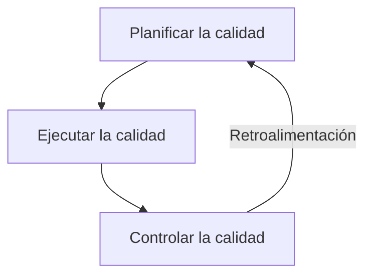

# Gestión De la Calidad Del Proyecto (PMBOK)

## Concepto General

- **Gestión de la calidad**: aplica tanto al proyecto como al producto final.
    
- Se aplica a **todos los proyectos**, independientemente del producto.
    
- Técnicas y medidas de calidad del producto son **específicas** según cada resultado.
    
- No cumplir con los requisitos de calidad puede generar:
    
    - Sobrecarga del equipo → desgaste, errores, reprocesos.
        
    - Inspecciones apresuradas → errores no detectados.

## Objetivos

- Satisfacer las **necesidades por las cuales fue emprendido el proyecto**.
    
- Convertir expectativas de los interesados en **requisitos claros**.
    
- Lograr la **satisfacción del cliente**: producto que cubra necesidades reales.
    
- Priorizar **prevención sobre inspección**.
    
- Impulsar la **mejora continua**.

## Responsabilidades Del Director Del Proyecto

- Recomendar mejoras en procesos y políticas de calidad.
    
- Establecer métricas para medir la calidad.
    
- Revisar la calidad antes de finalizar los entregables.
    
- Evaluar impacto en la calidad ante cambios de **alcance, tiempo, coste, riesgos o recursos**.
    
- Destinar tiempo para mejoras de calidad.
    
- Asegurar uso del **control integrado de cambios**.

---

## Procesos De la Gestión De la Calidad (según PMBOK)

### 1. **Planificar La calidad**

- Desarrollo del **plan de gestión de calidad**:
    
    - Define objetivos y criterios de calidad.
        
    - Identifica estándares y métricas de calidad.
        
    - Determina actividades y recursos necesarios.

### 2. **Ejecutar La calidad**

- Implementación del plan de gestión de calidad.
    
- Incluye:
    
    - **Aseguramiento de la calidad**.
        
    - Inspecciones, pruebas y revisiones.
        
    - Aplicación de técnicas de control para corregir y prevenir defectos.

### 3. **Controlar La calidad**

- Monitorización y control continuo de resultados frente a estándares definidos.
    
- Actividades clave:
    
    - Seguimiento del desempeño.
        
    - Recopilación y análisis de datos.
        
    - Identificación de desviaciones o problemas.
        
    - Implementación de acciones correctivas.

---

## Herramientas De la Gestión De Calidad

### Métricas De Calidad

- Información cuantitativa sobre rendimiento y conformidad.
    
- Se recopilan y analizan regularmente.
    
- Usadas para decisiones informadas, acciones correctivas y mejora continua.

### Informes De Calidad

- Documentan desempeño y resultados de calidad.
    
- Contienen:
    
    - Medición del desempeño.
        
    - Comparación con estándares.
        
    - Acciones correctivas y preventivas.
        
    - Análisis de tendencias.
        
    - Recomendaciones y lecciones aprendidas.

### Monitoreo Y Control De la Calidad

- Supervisión continua de resultados frente a objetivos.
    
- Garantiza que productos y servicios cumplan requisitos y expectativas.

### Inspección De Calidad

- Evaluación sistemática y objetiva de productos, servicios o resultados.
    
- Busca desviaciones o no conformidades con criterios establecidos.

---

## Diagrama De Procesos De Calidad (Mermaid)

---

## MicroTest

**Question 1**  
**Pregunta:** Los procesos de la gestión de la calidad del PMI® son:  
**Respuesta:** a. La planificación de la calidad, el aseguramiento de la calidad y el control de la calidad.  
**Por qué:** Según el PMBOK®, los tres procesos clave de gestión de calidad son **planificar**, **asegurar** y **controlar** la calidad. Estos abarcan definir estándares, ejecutar actividades para cumplirlos y monitorear los resultados.

---

**Question 2**  
**Pregunta:** ¿Cuándo se determina la calidad de un proyecto?  
**Respuesta:** c. La calidad se planifica en los procesos de planificación.  
**Por qué:** La planificación de la calidad ocurre durante la **fase de planificación** del proyecto, donde se establecen estándares, criterios, métricas y actividades necesarias para garantizar que el proyecto cumpla los requisitos.

---

**Question 3**  
**Pregunta:** El liderazgo de la gestión de la calidad en un proyecto es de la responsabilidad:  
**Respuesta:** c. Del jefe de proyecto.  
**Por qué:** El **director o jefe del proyecto** lidera la gestión de la calidad, asegurando que se cumplan los estándares y objetivos de calidad, coordinando recursos y supervisando procesos de aseguramiento y control.

---

Si quieres, puedo hacer un **resumen rápido en tabla** de las preguntas de calidad con la respuesta correcta y la justificación, para estudiar más rápido. ¿Quieres que lo haga?