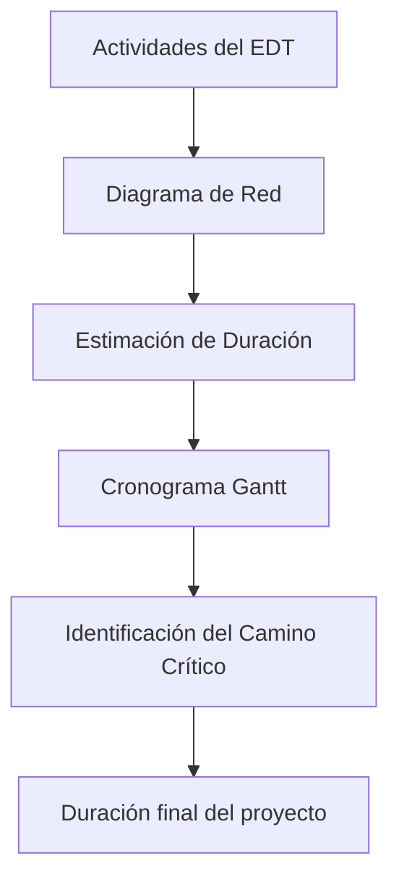

# Notas De la Clase: Diagrama De Red, Estimación De Duración, Cronograma Y Camino Crítico

## Contexto Del Proyecto

- Desarrollo de un **sistema software para la gestión de almacenes con dos cadenas de frío**:
    
    - Grandes consumidores.
        
    - Pequeños consumidores (tiendas y restaurantes).
        
- Objetivo del proyecto:
    
    - Atender **entradas de hasta 1.200 cajas/hora** y **salidas de hasta 1.000 cajas/hora y 80 pallets/hora**.
        
    - Asegurar la **cadena de frío** y una disponibilidad del **93%**.
        
    - Puesta en servicio: **febrero 2025**, régimen permanente: **junio 2025**.

---

## 1. Diagrama De Red (o Flujograma)

- Representación gráfica de un proceso mostrando las **relaciones lógicas entre actividades**.
    
- Basado en las actividades del **último nivel del EDT**.
    
- Elementos del diagrama:
    
    - **Cajas:** actividades de duración positiva.
        
    - **Rombos:** hitos o milestones (duración cero, puntos de control).
        
    - **Fechas:** representan relaciones entre actividades.
        
- Características:
    
    - Un **punto de inicio** y un **punto de finalización**.
        
    - Permite visualizar el flujo de trabajo paso a paso.

---

## 2. Estimación De Duración

- **Duración ≠ Esfuerzo**:
    
    - Se calcula considerando **esfuerzo**, **rendimiento** y **disponibilidad de recursos**.
        
- Proceso recurrente que debe documentar:
    
    - **Hipótesis** de las estimaciones.
        
    - **Riesgos** que puedan afectar tiempos.
        
- Métodos de estimación según tipo de proyecto:
    
    - **Software:** método de puntos de función, lecciones aprendidas, experiencia previa.

---

## 3. Cronograma (Diagrama De Gantt)

- Representa actividades con:
    
    - **Fechas planificadas**.
        
    - **Duraciones**.
        
    - **Hitos**.
        
    - **Recursos asignados**.
        
- Permite responder preguntas clave:
    
    - Inicio y fin de cada actividad.
        
    - Recursos necesarios y liberados por actividad.
        
    - Inicio y fin del proyecto.
        
    - Colchones (totales y libres) para cada actividad.
        
    - Identificación del **camino crítico**.
        
    - Duración final del proyecto.

---

## 4. Camino Crítico

- Secuencia de tareas con **holgura total igual a cero**.
    
- Características:
    
    - Todo proyecto tiene al menos un camino crítico.
        
    - Es la **secuencia de mayor duración** del proyecto.
        
    - Las tareas críticas **no pueden retrasarse** sin afectar la duración total del proyecto.

---

## Flujo Resumido De Planificación Temporal

---

**Notas clave:**

- La planificación debe set **detallada, realista y documentada**.
    
- La relación entre EDT, diagrama de red, cronograma y camino crítico garantiza un **control temporal efectivo** del proyecto.
    
- El **camino crítico** determina las actividades prioritarias para evitar retrasos.

## MicroTest

### Pregunta 1

**Pregunta:** ¿Qué es una ventaja de hacer un cronograma?  
**Respuesta:** A. Facilita la introducciön de cambios.
**Por qué:** El cronograma permite detallar **quién hace qué y cuándo**, lo que facilita la asignación clara de responsabilidades y evita que dos personas o recursos trabajen en la misma tarea sin coordinación. No necesariamente disminuye toda la incertidumbre ni describe todas las actividades sin ambigüedad.

---

### Pregunta 2

**Pregunta:** ¿Qué no es cierto en un flujograma o diagrama de flujo?  
**Respuesta:** d. Es un diagrama que muestra las actividades en una línea temporal.  
**Por qué:** Un flujograma representa **relaciones lógicas, precedencias y caminos de actividades**, pero **no refleja una línea temporal exacta ni la duración de las actividades**, eso es función de un cronograma o diagrama de Gantt.

---

### Pregunta 3

**Pregunta:** ¿Para qué no sirve el camino crítico?  
**Respuesta:** D. Ninguna de Ias respuestas anteriores.
**Por qué:** El camino crítico sirve para **identificar las tareas sin holgura y optimizar la secuencia de actividades**, pero **no está diseñado para reducir directamente los costes**, aunque indirectamente puede ayudar a evitar retrasos costosos.

https://www.pmi.org/standards