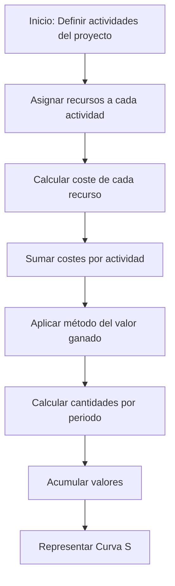

# Tema 10.4 – Estimación De Costos Y Curva S

## 1. Introducción

- Se aborda la **estimación de costos por actividad** y el cálculo de la **curva S**.
    
- Se toma como ejemplo un proyecto de **solución logística para almacenes con cadena de frío**, usando una **aplicación software de gestión inteligente**.

---

## 2. Estimación De Costos Por Actividad

- **Definición:** Aproximación de los recursos monetarios necesarios para completar cada actividad del proyecto.
    
- Es un proceso **iterativo**, que se refina a medida que avanza el proyecto.
    
- Considera todos los recursos asignados:
    
    - Recursos de trabajo (personal)
        
    - Materiales
        
    - Costes de servicios
        
    - Instalaciones
        
    - Contingencias (dependientes de la gestión de riesgos)

### 2.1 Factores a Considerar

- ¿Cuánto cuesta cada actividad?
    
- ¿Cuál es el presupuesto total del proyecto?
    
- ¿Cuál es la necesidad de financiación en función del cronograma?
    
- Las estimaciones dependen de:
    
    - Cronograma del proyecto
        
    - Registro de riesgos
        
    - Asignación de personal

---

## 3. Cálculo Del Coste Por Tarea

1. Asignar **recursos** a cada tarea según el diagrama de Gantt.
    
2. Establecer el **coste de cada recurso**.
    
3. Calcular el **coste total de cada actividad** sumando los costes de sus recursos.

---

## 4. Curva S

- Representa el **coste presupuestado del trabajo planificado (BCWS)**.
    
- Utilize el **método del valor ganado** para prever desviaciones del proyecto.
    
- Procedimiento:
    
    1. Determinar la cantidad a imputar por cada actividad (inicio o finalización).
        
    2. Sumar las cantidades de cada periodo.
        
    3. Acumular los valores para representar la curva S.

### 4.1 Representación

---

## 5. Conclusiones

- La **estimación de costos** es fundamental para planificar la financiación y la asignación de recursos.
    
- La **curva S** permite visualizar el advance del coste en el tiempo y detectar desviaciones tempranas.
    
- Ambos procesos dependen del cronograma y del detalle de la planificación del proyecto.

---

## Microtest

### Question 1

**Pregunta:** Qué no es una ventaja de hacer un presupuesto:

**Opciones:**  
a. Revisar la planificación para conseguir los objetivos presupuestarios planificados en caso de darnos cuenta de que no llegamos a cumplirlos.  
**b. Mejora la dirección y el seguimiento.**  
c. Favorece el análisis para la optimización de los recursos del proyecto y conseguir la mayor eficiencia.  
d. Permite detectar desviaciones en la planificación de costes y tiempos de forma anticipada (método de valor ganado – EVM).

**Respuesta:** b

**Por qué:**  
Revisar la planificación para corregir desviaciones no es en sí una **ventaja directa del presupuesto**, sino una acción posterior que se realiza si los resultados presupuestarios no se cumplen. Las otras opciones (b, c, d) representan beneficios directos del presupuesto: seguimiento, optimización de recursos y detección de desviaciones.

---

### Question 2

**Pregunta:** Qué es cierto con relación a la estimación de costes:

**Opciones:**  
a. La estimación de los costes de las actividades no necesita de los resultados de los procesos de planificación de otras áreas como por ejemplo el cronograma del proyecto, el registro de riesgos y las asignaciones de personal.  
**b. El coste de una actividad se calcula, de forma básica, multiplicando el número de recursos por su coste horario por el tiempo que están trabajando en la actividad.**  
c. La exactitud de la estimación del costo de un proyecto se mantiene constante según avanza el proyecto, de manera que es un proceso iterativo.  
d. Los costos se estiman para todos los recursos asignados al proyecto, es decir, recursos de trabajo, recursos materiales, coste de servicios e instalaciones, y en ningún caso se incluyen los posibles costes por contingencias.

**Respuesta:** **b**

**Por qué:**  
El cálculo básico del coste de una actividad consiste efectivamente en multiplicar **recursos × coste horario × duración de la actividad**. Las demás opciones son incorrectas:

- a) La estimación sí depende del cronograma, riesgos y asignaciones.
    
- c) La exactitud **no se mantiene constante**, mejora conforme se obtiene más información (es iterativa).
    
- d) Los costes por contingencias **sí se incluyen** como parte de la estimación total.

---

### Question 3

**Pregunta:** ¿Es necesario hacer un cronograma para la estimación de costes?

**Opciones:**  
**a. No.**  
b. Sí, siempre hay que hacer antes de estimar los costes.  
c. Sí, pero se tiene que hacer siempre después de la estimación de costes.  
d. Ninguno de las anteriores.

**Respuesta:** **b**

**Por qué:**  
El cronograma proporciona la **duración de cada actividad y la asignación de recursos en el tiempo**, información imprescindible para calcular correctamente los costes. Por eso, siempre debe realizarse **antes de la estimación de costes**.

---

Si quieres, puedo hacer un **diagrama resumido tipo Mermaid** que muestre **cómo se interrelacionan cronograma, estimación de costes y presupuesto**, para que lo tengas visualmente en tus notas.

¿Quieres que haga eso?