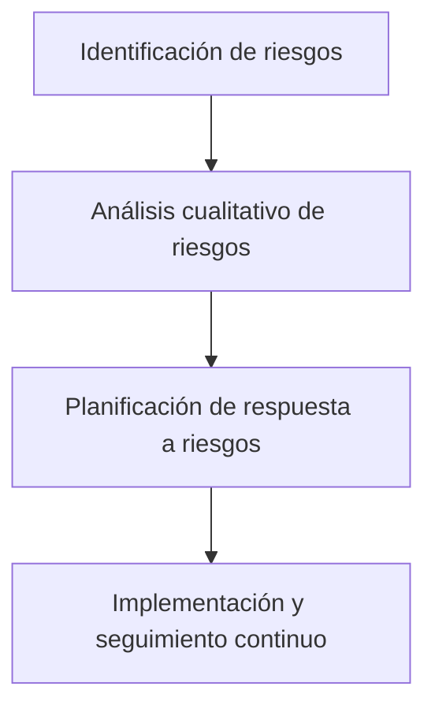

# Tema 10.5: Gestión De Riesgos En Proyectos

## 1. Contexto Del Ejemplo

- Proyecto: Aplicación software para gestión inteligente de almacenes de cadena de frío.
    
- Objetivo: Atender demandas de entrada de hasta 1.200 cajas/hora y salida de 1.000 cajas/hora y 80 pallets/hora.
    
- Garantizar la cadena de frío y disponibilidad del 93%.
    
- Plazos: Entrada en servicio en febrero 2025 y régimen permanente antes de junio 2025.

---

## 2. Identificación De Riesgos

**Definición:** Proceso de reconocer riesgos individuales y fuentes de riesgo general del proyecto, documentando sus características.

**Beneficios:**

- Documenta los riesgos individuales y fuentes generales.
    
- Permite que el equipo responda adecuadamente a los riesgos.
    
- Utilize información histórica de proyectos similares.

**Tipos de riesgos:**

1. **Internos** (controlables por el proyecto)
    
    - Sobrecostes de personal
        
    - Retrasos en contrataciones
        
    - Interferencias con otros proveedores
        
2. **Externos** (fuera del control del proyecto)
    
    - Subida de precios de materiales
        
    - Paros en la cadena de suministro

---

## 3. Análisis Cualitativo De Riesgos

**Definición:** Priorizar los riesgos del proyecto evaluando probabilidad e impacto.

**Pasos:**

- Asignar probabilidad de ocurrencia y nivel de impacto.
    
- Calcular un valor o coste de cada riesgo.
    
- Determinar la prioridad de atención según riesgo alto, medio o bajo.

**Beneficios:**

- Permite concentrar esfuerzos en riesgos de alta prioridad.
    
- Se realiza de manera iterativa a lo largo de todo el proyecto.

---

## 4. Planificación De Respuesta a Riesgos

**Definición:** Desarrollar opciones, seleccionar estrategias y acciones para mitigar la exposición al riesgo del proyecto.

**Consideraciones:**

- Aborda tanto riesgos generales como individuales.
    
- La decisión debe involucrar al equipo del proyecto para considerar todos los puntos de vista.

**Beneficios:**

- Identifica formas adecuadas de gestionar riesgos.
    
- Mejora la preparación y capacidad de respuesta ante riesgos identificados.

---

## 5. Resumen De Flujo De Gestión De Riesgos

- **A:** Detectar riesgos internos y externos.
    
- **B:** Priorizar por probabilidad e impacto.
    
- **C:** Seleccionar estrategias de mitigación y acciones.
    
- **D:** Monitorear continuamente durante todo el proyecto.

---

## MicroTest

Aquí tienes las preguntas con la **respuesta correcta** y su **justificación**:

---

### Question 1

**Pregunta:**  
¿Qué es una ventaja de hacer un plan de respuesta a los riesgos?

**Respuesta:**  
**a. Incremento de la productividad, al reducirse los retrabajos y/o reacciones frente a situaciones inesperadas.**

**Por qué:**  
El plan de respuesta a riesgos permite anticipar problemas y definir acciones correctivas antes de que ocurran, lo que reduce interrupciones y retrabajos, aumentando la eficiencia y productividad del proyecto.

---

### Question 2

**Pregunta:**  
¿Qué no es cierto en un plan de respuesta al riesgo?

**Respuesta:**  
**a. Aumenta la incertidumbre sobre el proyecto.**

**Por qué:**  
El plan de respuesta a riesgos **reduce** la incertidumbre al prever posibles problemas y definir cómo mitigarlos. Aunque puede implicar cambios en alcance, duración o coste, no aumenta la incertidumbre, sino que la gestiona.

---

### Question 3

**Pregunta:**  
El orden adecuado para el desarrollo del plan de respuesta a los riesgos es:

**Respuesta:**  
B. Identificaciån, cualificaciön, cuantificaciön, respuesta.****

**Por qué:**  
El proceso estructurado de gestión de riesgos sigue estos pasos: primero se identifican los riesgos, luego se analizan cualitativa y cuantitativamente, se priorizan según su impacto/probabilidad, y finalmente se planifica la respuesta. Esto asegura que los riesgos más críticos se gestionen primero.

