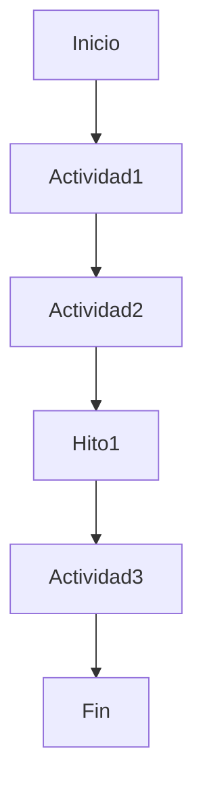
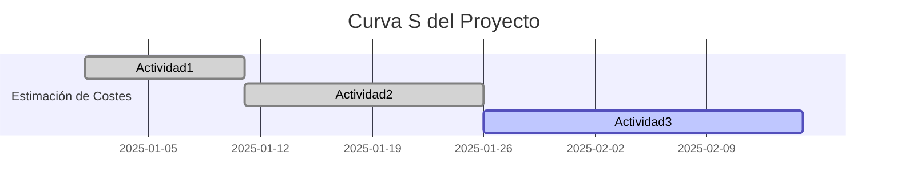
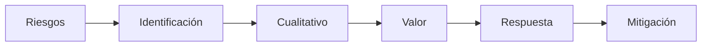

Aquí tienes las **notas del resumen** en formato claro y organizado para Obsidian, con secciones, listas y algunos diagrams Mermaid donde aplica:

---

# Resumen: Creación De Un Proyecto De Gestión

## 1. Definición Del Proyecto

- **Problema:** Empresa de distribución de productos congelados con procesos mayormente manuales.
    
- **Objetivo:** Desarrollar un sistema software para automatizar todo el proceso logístico, atendiendo:
    
    - Entrada: hasta 1,200 cajas/hora
        
    - Salida: hasta 1,000 cajas/hora y 80 palés/hora
        
    - Mantener la cadena de frío
        
    - Disponibilidad: 93% desde febrero 2025, con régimen permanente antes de junio 2025

---

## 2. Alcance Del Proyecto

- Diseño, construcción, instalación, puesta en servicio y mantenimiento de:
    
    - Sistemas de entrada e identificación de cajas
        
    - Formación de palés
        
    - Almacenaje de cajas y palés (< 24°C)
        
    - Salida y expedición de cajas y palés
        
- Control mediante software de gestión de almacenes desarrollado a medida y sistema de visualización comercial.
    
- **Nota:** Alcance del proyecto contiene al alcance del producto.

---

## 3. Estructura De Desglose De Trabajo (EDT / WBS)

- Descomposición jerárquica orientada al **producto entregable**.
    
- Objetivo: Organizar el trabajo del equipo para cumplir los objetivos y crear los entregables.
    
- Responde a preguntas como:
    
    - ¿Cómo se organiza el trabajo?
        
    - ¿Cuál es el nivel de descomposición necesario?

---

## 4. Organigrama Del Equipo Del Proyecto (OBS)

- Diagrama en forma de árbol que muestra:
    
    - Departamentos involucrados
        
    - Recursos humanos disponibles
        
    - Capacidades de cada miembro del equipo
        
- Responde a:
    
    - ¿Qué departamentos deben intervenir?
        
    - ¿Con qué personas cuento para formar el equipo?

---

## 5. Matriz De Asignación De Responsabilidades (RAM)

- Relaciona actividades con recursos (individuos o equipos)
    
- Asegura que cada componente del alcance tiene un responsible
    
- **Nota:** Inicialmente se asigna a nivel de departamento; luego se asigna a nombres y apellidos.

---

## 6. Diagrama De Red / Flujograma

- Representación gráfica del **flujo de trabajo** del proyecto.
    
- Elementos:
    
    - Cajas: actividades con duración
        
    - Rombos: hitos (duración cero, puntos de control o entregables)
        
    - Fechas: relaciones entre actividades
        
- Un único punto de inicio y un único punto de finalización

---

## 7. Estimación De Duración

- Duración ≠ Esfuerzo
    
- Calculada en función de:
    
    - Esfuerzo
        
    - Rendimiento
        
    - Disponibilidad de recursos

---

## 8. Cronograma

- Modelo de programación que incluye:
    
    - Actividades, fechas, duraciones, hitos y recursos
        
- Permite responder:
    
    - Inicio y fin de cada actividad
        
    - Necesidad y liberación de recursos
        
    - Inicio y fin del proyecto
        
    - Holguras totales y libres
        
    - Camino crítico y duración total

---

## 9. Camino Crítico

- Secuencia de tareas con **holgura total = 0**
    
- Determina la duración mínima del proyecto
    
- Retrasos en estas tareas afectan directamente al proyecto

---

## 10. Estimación De Costes Por Actividad

- Aproximación de recursos monetarios necesarios
    
- Se calcula como:  
    `Costo actividad = Número de recursos × Costo horario × Tiempo de trabajo`
    
- Depende de:
    
    - Cronograma
        
    - Registro de riesgos
        
    - Asignaciones de personal

---

## 11. Curva S

- Representa el **coste presupuestado del trabajo planificado**
    
- Método: Valor Ganado (EVM)
    
- Permite prever desviaciones en tiempo y coste
    
- Se calcula acumulando costes por periodo

---

## 12. Plan De Gestión De Riesgos

### Identificación De Riesgos

- Individuales y generales
    
- Internos: sobrecostes, retrasos en subcontrataciones
    
- Externos: subida de precios, paros en la cadena
    
- Se documentan características de cada riesgo

### Análisis Cualitativo

- Prioriza riesgos según:
    
    - Probabilidad de ocurrencia
        
    - Impacto
        
- Beneficio: concentrar esfuerzos en riesgos críticos

### Análisis De Valor De Riesgos

- Cuantificación del coste de cada riesgo si ocurriera

### Plan De Respuesta a Riesgos

- Desarrolla estrategias y acciones para mitigar riesgos
    
- Beneficio: manejo adecuado del riesgo general e individual del proyecto

---
