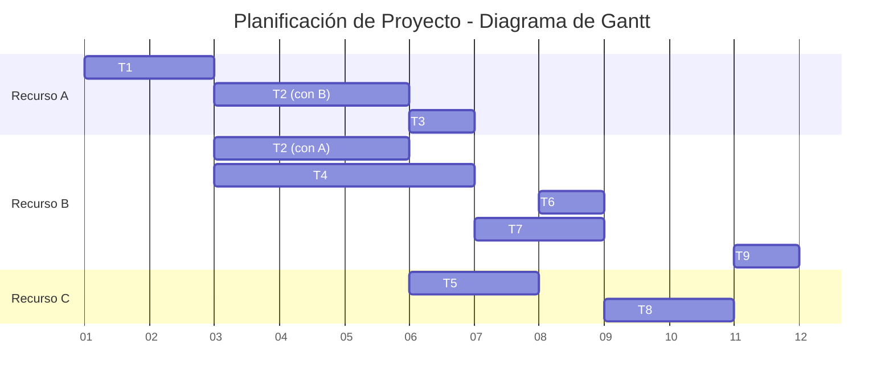

# Actividad : Planificación de Proyectos

- **Objetivos** de la actividad.
    - Ser capaz de aplicar la técnica de PERT/CPM con el fin de identificar el camino crítico, y la holgura del proyecto.
    - Set capaz de realizar un cronograma o diagrama de Gantt, considerando la dependencia de las tareas y la asignación de recursos.
- **Descripción** de la actividad y **pautas** de elaboración. El director de un proyecto ha realizado el desglose de las actividades de un proyecto. Nos ha encargado realizar la planificación de dicho proyecto. Con tal fin te ha proporcionado la siguiente tabla, la cual contiene las tareas, sus dependencias, duración y las personas asignadas a cada una de ellas.

El proyecto comienza en la semana 1. Todos los recursos trabajan con dedicación plena durante todo proyecto, excepto A que solo está disponible hasta la mitad del proyecto.

Para esta tarea te puedes ayudar de cualquier herramienta de hoja de cálculo (Excel, Google Sheets, Numbers). Si quieres, puedes practicar con una herramienta más específica para gestión de proyectos como MS Project o Monday.com.

|       |             |                    |                  |
| ----- | ----------- | ------------------ | ---------------- |
| TAREA | DEPENDENCIA | DURACIÓN (SEMANAS) | RECURSO ASIGNADO |
| T1    |             | 2                  | A                |
| T2    | 1           | 3                  | A y B            |
| T3    | 2           | 1                  | A                |
| T4    | 1           | 4                  | B                |
| T5    | 2           | 2                  | C                |
| T6    | 5           | 1                  | B                |
| T7    | 3, 4 y 5    | 2                  | B                |
| T8    | 6 y 7       | 2                  | C                |
| T9    | 8           | 1                  | B                |
|       |             |                    |                  |

- **Planteamiento de la pregunta.** En esta actividad se te plantean 9 preguntas tipo test con 4 posibles respuestas, de las cuales sólo una es correcta, esa deberá set la respuesta que debes marcar. La puntuación de cada pregunta aparece en la misma.

Tipo 1. Respuesta única

1. Si solo hubiera un recurso asignado a este proyecto, ¿cuándo acabaría el proyecto?:
    1. Semana 11
    2. Semana 12.
    3. Semana 13.
    4. Semana 18.
2. Según la asignación de recursos y la dependencia entre tareas que nos ha proporcionado el director del proyecto, ¿cuándo acaba el proyecto?:
	A. Semana 11
	B. Semana 12.
	C. Semana 13.
	D. Semana 18.
3. Considerando la tabla que nos han proporcionado el director del proyecto, ¿existe alguna colisión al asignar recursos?:
	1. No existe ninguna colisión.
	2. Existe colisión, lo que retrasaría la planificación en dos semanas según lo previsto por el director del proyecto.
	3. Existe colisión ya que las tareas 2 y 4 están asignadas a la persona B.
	4. Existe colisión, ya que la tarea 8 depende de las tareas 6 y 7.
4. En el caso de que hubiera colisión, ¿cómo la solucionarías para mantener la fecha de entrega?:
	1. No existe ninguna colisión, por lo que no es necesario.
	2. Existe colisión, pero no se puede solucionar.
	3. Existe colisión, se soluciona asignando a la tarea 2 a los recursos A y C.
	4. Existe colisión, se soluciona asignando a la tarea 4 a los recursos B y C.
5. Antes del día de comienzo del proyecto, la disponibilidad del recurso A varía y estará asignado durante toda la duración del mismo. Le asignas realizar la tarea 8, con unidades de trabajo fijo. Es decir, esta tarea pasaría a durar la mitad de tiempo. En este caso, ¿cuándo acabará el proyecto?
	1. Semana 11
	2. Semana 12.
	3. Semana 13.
	4. Semana 18.
6. ¿Qué ocurriría si la tarea T3 se retrasase dos semanas?:
	1. Nada.
	2. La entrega del proyecto se retrasaría una semana.
	3. La entrega del proyecto se retrasaría dos semanas.
	4. No se podría entregar el proyecto.
7. ¿Cuál es el camino crítico del proyecto?:
	1. T1-T4-T5-T7-T8-T9.
	2. T1-T2-T5-T7-T8-T9.
	3. T1-T2-T3-T6-T7-T8-T9.
	4. T1-T4-T7-T8-T9.
8. ¿Qué ocurriría si la tarea T3 se retrase una semana?:
	1. Nada.
	2. La entrega del proyecto se retrasaría una semana.
	3. La entrega del proyecto se retrasaría dos semanas.
	4. No se podría entregar el proyecto.
9. ¿Qué ocurriría si la tarea T3 se retrase dos semanas?:
	1. Nada.
	2. La entrega del proyecto se retrasaría una semana.
	3. La entrega del proyecto se retrasaría dos semanas.
	4. No se podría entregar el proyecto.