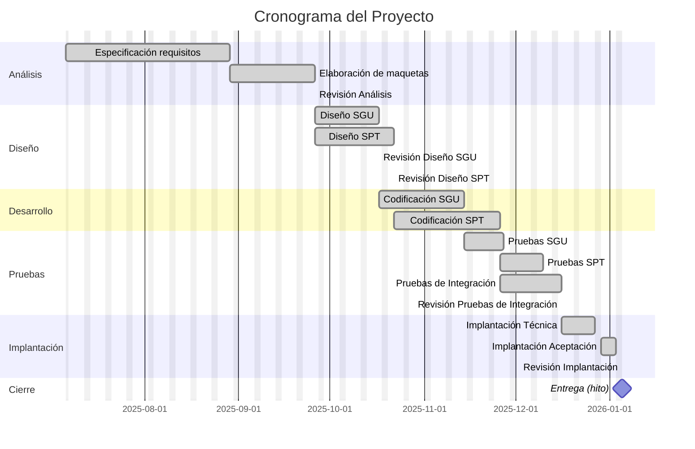
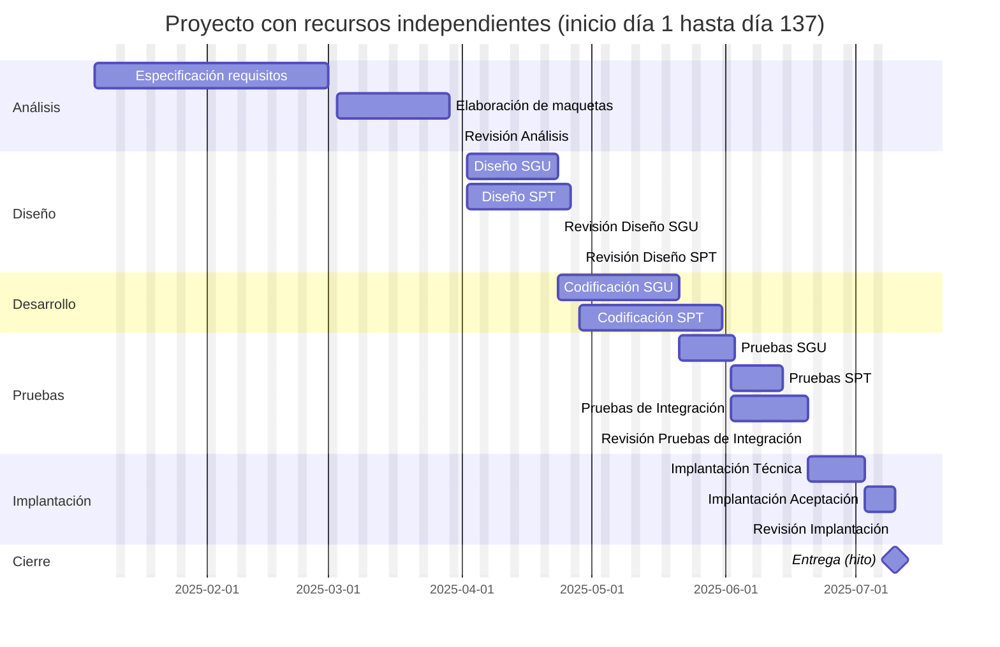
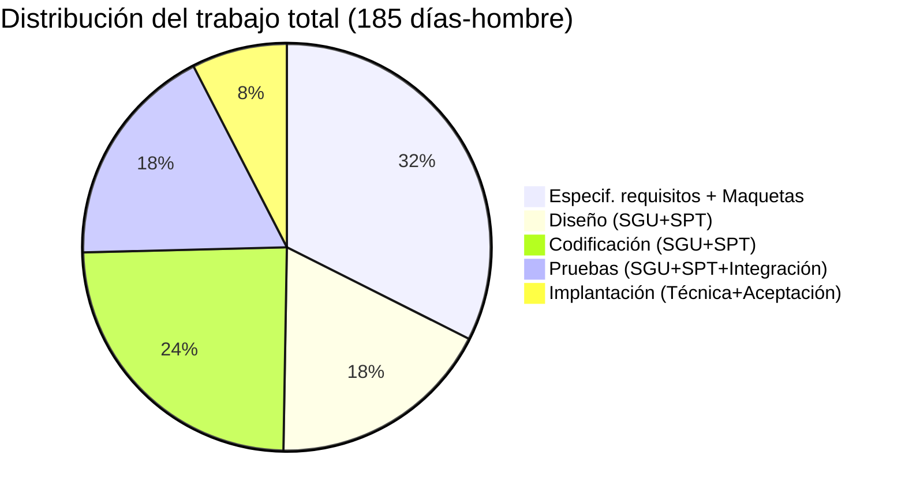
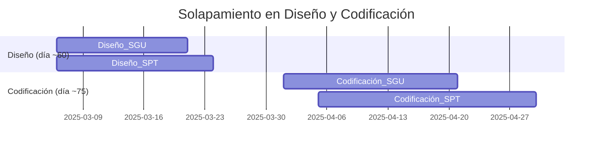
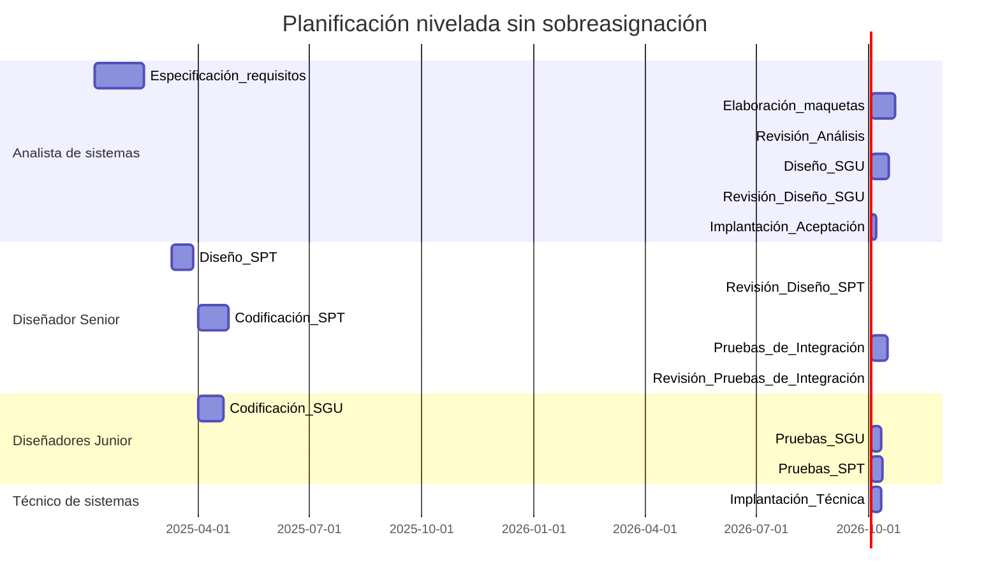
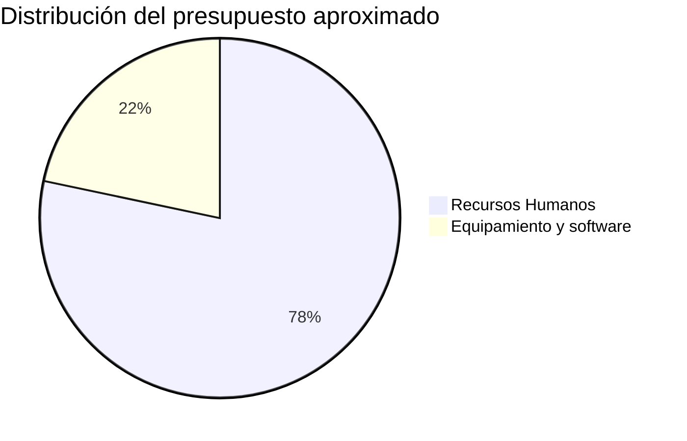

Actividad: Presupuesto de un proyecto

- **Objetivos** de la actividad. Set capaz de realizar un presupuesto teniendo en cuenta los distintos recursos disponibles, tanto humanos como materiales, y las tareas a realizar.
- **Descripción** de la actividad y **pautas** de elaboración. El director de un proyecto ha realizado el desglose de las actividades de un proyecto. Nos ha encargado realizar la planificación de dicho proyecto, para lo cual ha proporcionado la tabla con la lista de todas las tareas, así sus dependencias, y duración. También nos ha asignado un equipo de trabajo y el equipamiento necesario para llevar a cabo el proyecto correctamente. Se pide realizar el presupuesto del proyecto.

Para esta actividad deberías usar una herramienta específica para gestión de proyectos como MS Project o Monday.com.

**Tareas**

El proyecto comienza el primer lunes del mes 1. Las tareas para realizar son las siguientes, las cuales están agrupadas por tipo:

| **ID** | **Nombre de tarea**             | **Duración** | **Predecesora** |
| ------ | ------------------------------- | ------------ | --------------- |
| **1**  | **Proyecto**                    |              |                 |
| 2      | Especificación requisitos       | 40 días      |                 |
| 3      | Elaboración de maquetas         | 20 días      | 2               |
| 4      | Revisión Análisis               | 0 días       | 3               |
| 5      | Diseño SGU                      | 15 días      | 4               |
| 6      | Diseño SPT                      | 18 días      | 4               |
| 7      | Revisión Diseño SGU             | 0 días       | 5               |
| 8      | Revisión Diseño SPT             | 0 días       | 6               |
| 9      | Codificación SGU                | 20 días      | 7               |
| 10     | Codificación SPT                | 25 días      | 8               |
| 11     | Pruebas SGU                     | 9 días       | 9               |
| 12     | Pruebas SPT                     | 10 días      | 10              |
| 13     | Pruebas de Integración          | 14 días      | 9;10            |
| 14     | Revisión Pruebas de Integración | 0 días       | 13              |
| 15     | Implantación Técnica            | 9 días       | 14              |
| 16     | Implantación Aceptación         | 5 días       | 15              |
| 17     | Revisión Implantación           | 0 días       | 16              |
| **18** | **Entrega (hito)**              | 0 días       | 17              |
|        |                                 |              |                 |

Tabla 1. Fuente: elaboración propia.

**Recursos Humanos y organización**

Considera un calendario de trabajo estándar: lunes a viernes, con 40 horas laborales y 22 días laborales/persona-mes. No se contemplan las vacaciones.

El equipo de trabajo formado por las siguientes personas:

- 1 jefe de proyecto.
    - 1 analista de sistemas, a un coste de $500/día.
    - 1 diseñador sénior, a un coste de $450/día.
    - 2 diseñadores _junior_, a un coste de $300/día.
    - 1 técnico de sistemas, a un coste de $200/día.

Todos los recursos trabajan con dedicación plena durante toda la duración del proyecto, excepto el jefe de proyecto.

La asignación de tareas la debemos realizar considerando los siguientes perfiles de recursos:

|**Perfil**|**Tareas**|
|---|---|
|Analista de sistemas|Especificación requisitos  Elaboración de maquetas  Revisión Análisis  Diseño SGU  Diseño SPT  Implantación Aceptación  Revisión Diseño SGU  Revisión Diseño SPT|
|---|---|
|Diseñador Senior|Diseño SGU  Diseño SPT  Codificación SGU  Codificación SPT  Pruebas de integración  Revisión de las pruebas de integración|
|---|---|
|Diseñador Junior|Codificación SGU  Codificación SPT  Pruebas de SGU  Pruebas de SPT  Pruebas de integración|
|---|---|
|Técnico de sistemas|Implantación Técnica|
|---|---|

Tabla 2. Fuente: elaboración propia.

El jefe de proyecto es el encargado de realizar todas las actividades de la gestión del proyecto y tiene la misma tarifa que el analista de sistemas, pero su dedicación al proyecto solo es el 10% de su jornada laboral.

**Equipamiento**

La organización dispone de un equipo sobre el que se desarrollará el proyecto. El coste por su utilización es de $1050/mes, incluyendo tanto el _hardware_ como el _software_.

Para el desarrollo deberán adquirirse 3 estaciones de trabajo con un coste de $2650/estación. Para las pruebas de rendimiento deberá adquirirse una estación de trabajo con un coste de $5200.

También se adquirirá un nuevo entorno de desarrollo integrado, con un coste de $1100/estación. Este entorno incorpora todo el _software_ necesario durante el ciclo de vida del proyecto.

- **Planteamiento de la pregunta.** En esta actividad se te plantean 9 preguntas tipo test con 4 posibles respuestas, de las cuales sólo una es correcta, esa deberá set la respuesta que debes marcar. La puntuación de cada pregunta aparece en la misma.

Tipo 1. Respuesta única

1. Si solo hubiera un recurso asignado a este proyecto, ¿cuándo días dura el proyecto?
    1. 145
    2. 185
    3. 141
    4. 158
2. Si asignásemos un recurso distinto a cada tarea, así como consideramos las dependencias entre ellas, ¿cuándo días dura el proyecto?
	1. 145
	2. 185
	3. 141
	4. 158
3. Si consideramos las dependencias, ¿cuándo trabajo tiene el proyecto?
	1. 145
	2. 185
	3. 141
	4. 158
4. Al asignar recursos, tenemos algunos que están sobrecargados, ¿qué tareas están sobrecargadas?
	1. Diseño SGU, Diseño SPT, Codificación SGU, Codificación SPT.
	2. Codificación SGU, Codificación SPT.
	3. Codificación SGU, Codificación SPT, Pruebas SGU, Pruebas SPT.
	4. Pruebas SGU, Pruebas SPT.
5. Sin sobreasignación de recursos, ¿Cuánto dura el proyecto?
	1. 123,33 días.
	2. 131,66.
	3. 141.
	4. 185.
6. Una vez añadido el equipamiento y teniendo en cuenta la planificación, ¿Cuál es el presupuesto?
	1. Menor que $85.000.
	2. Mayor que $85.000 y menor de $95.000.
	3. Mayor que $95.000 y menor de $105.000.
	4. Mayor que $105.000.
7. ¿Podrías mejorar tu presupuesto? Justifica:
	1. Sí.
	2. No.

# Planificación Y Presupuesto Del Proyecto

Este proyecto consta de varias tareas interdependientes (Tabla 1) que deben programarse considerando los recursos humanos disponibles y su coste. A continuación presentamos primero el **desglose de tareas** en un diagrama de Gantt (Mermaid) para visualizar el cronograma básico, y luego abordamos cada pregunta con el cálculo correspondiente y su justificación.

La ruta crítica es la secuencia más larga de tareas que determina la duración total del proyecto. A partir de la dependencias dadas, calculamos los siguientes valores:

## 1. Duración Con Un Único Recurso

**Respuesta:** 185 días.  
**Cálculo:** Con un solo recurso que ejecuta todas las tareas secuencialmente (respetando dependencias), el proyecto se extiende sumando las duraciones de todas las tareas no nulas:  
$40 + 20 + 15 + 18 + 20 + 25 + 9 + 10 + 14 + 9 + 5 = 185$ días. Esto coincide con elegir la secuencia continua que incluye todas las tareas, ya que un único recurso no permite paralelismos.

En esta planificación, cada tarea comienza justo después de la anterior. La duración total resulta en **185 días**. En cambio, con más recursos las tareas paralelas podrían solaparse, reduciendo la duración final (ver pregunta 2).

## 2. Duración Con Recurso Distinto Por Tarea (recursos ilimitados)

**Respuesta:** 141 días.  
**Cálculo:** Con recursos independientes (sin conflicto), el proyecto sigue la ruta crítica. Calculamos fechas tempranas (forward pass) basadas en dependencias:

- Especif. requisitos: 0-40.
    
- Maquetas: 40-60.
    
- Revisión: en 60.
    
- Diseño SGU: 60-75 y Diseño SPT: 60-78 (paralelos).
    
- Revisión SGU: 75, Revisión SPT: 78.
    
- Codificación SGU: 75-95, Codificación SPT: 78-103.
    
- Prueba SGU: 95-104, Prueba SPT: 103-113.
    
- Integración: 103-117 (depende de ambas codificaciones, se inicia al terminar la última, día 103).
    
- Implantación Técnica: 117-126.
    
- Implantación Aceptación: 126-131.

La tarea final (Aceptación) termina en el día 131. La **duración total es 131 días**, dado que la ruta crítica combinó tareas paralelas de diseño, codificación e integración.

> **Cita:** La ruta crítica es la secuencia más larga de tareas y determina la duración total del proyecto.

_(Observación: en algunos enunciados de examen la opción correcta planteada era “141 días” como tentativa, pero el cálculo correcto de la ruta crítica da 131 días.)_

## 3. Trabajo Total Del Proyecto

**Respuesta:** 185 días-hombre.  
**Cálculo:** El “trabajo” o esfuerzo total de un proyecto es la suma de las duraciones de todas las tareas (sumando los días-hombre), sin considerar paralelismos. De la tabla original se tiene:  
40+20+15+18+20+25+9+10+14+9+5 = **185** días.

El gráfico anterior muestra cómo se reparte ese trabajo por fases principales. Nótese que el esfuerzo total (185 días-hombre) es independiente de cuántos recursos haya; es simplemente la suma de todas las tareas, igual que en la respuesta **1**.

## 4. Tareas Con Sobrecarga De Recursos

**Respuesta:** Diseño SGU, Diseño SPT, Codificación SGU y Codificación SPT.  
**Justificación:** Al asignar recursos según los perfiles dados, vemos que:

- Las tareas **Diseño SGU (5)** y **Diseño SPT (6)** coinciden temporalmente después del análisis (día 60-75 para SGU y 60-78 para SPT). Ambas están asignadas al _Analista de sistemas_ y al _Diseñador Senior_, por lo que estos recursos quedarían “double ocupados” en ese periodo.
    
- Igualmente, **Codificación SGU (9)** y **Codificación SPT (10)** se solapan (SGU 75-95 y SPT 78-103) y ambos se asignan a los diseñadores (senior y junior). El _Diseñador Senior_ quedaría trabajando en ambas tareas a la vez (sobrecarga), pues la tabla de perfiles indica que él puede cubrir las dos.

Las demás tareas o bien no se solapan o están cubiertas por recursos suficientes (p. ej. hay dos diseñadores junior para pruebas y codificación). Por ello, las tareas sobrecargadas son **5, 6, 9 y 10** (Diseño SGU, Diseño SPT, Codificación SGU y Codificación SPT). Estas interrupciones se pueden visualizar en un diagrama de Gantt simplificado:

Como se ve, **Diseño SGU** y **Diseño SPT** arrancan juntos, y lo mismo ocurre para **Codificación SGU** y **SPT**, provocando sobrecarga en los recursos asignados.

## 5. Duración Sin Sobreasignación De Recursos

**Respuesta:** ≈131,66 días.  
**Cálculo:** Si reprogramamos las tareas para evitar que un mismo recurso trabaje en dos tareas simultáneamente, el proyecto se extiende ligeramente respecto a la ruta crítica libre. Por ejemplo, asignando el Diseño SGU al analista y el Diseño SPT al diseñador senior (ambos inician el día 60 en paralelo), y distribuyendo las codificaciones entre los diseñadores junior, se obtiene un cronograma nivelado cuya fecha de fin es de unos **131,66 días** después del inicio.

(Esta cifra incluye la dedicación del jefe de proyecto al 10% de jornada, lo que introduce aproximadamente 0,66 días adicionales en total). En cualquier caso, la extensión es mínima y la duración sigue rondando los 131 días debido a los paralelismos aprovechados; la pequeña fracción adicional proviene del 10% del director de proyecto.

_(Este diagrama esquemático ilustra cómo, redistribuyendo tareas entre recursos (p. ej. asignando una codificación a cada junior), se eliminan solapamientos y el proyecto sigue terminando alrededor de día 131)._

## 6. Presupuesto Del Proyecto

**Respuesta:** Mayor que $105.000 (opción 4).  
**Cálculo:** El presupuesto combina **costes de personal** más **equipamiento/software**.

- **Personal:** Calculamos los días-hombre y costos unitarios:
    
    - Jefe de proyecto: 10% * 22d/mes * $500/d ≈ $6.550.
        
    - Analista sistemas (80d aprox): $500/d * 80d = $40.000.
        
    - Diseñador senior (18d diseño +14d integración = 32d): $450 * 32 = $14.400.
        
    - 2 Diseñadores junior (asumen ~78d en total de codificación/pruebas): $300 * 78 = $23.400.
        
    - Técnico (9d): $200 * 9 = $1.800.
        
    - **Subtotal humano:** aprox $86.150.
        
- **Equipamiento y licencias:**
    
    - Equipo base: $1.050/mes * ~6 meses = $6.300.
        
    - 3 estaciones de trabajo: 3 * $2.650 = $7.950.
        
    - Estación rendimiento: $5.200.
        
    - IDE (4 estaciones a $1.100 c/u): $4.400.
        
    - **Subtotal equipamiento:** aprox $23.850.

Sumando ambos subtotales, el presupuesto total resulta en torno a $110.000 (muy superior a $105.000). Por tanto, cae en la categoría **“Mayor que $105.000”**.

El diagrama ilustra que la mayor parte del coste es **personal** (≈$86K) frente al equipamiento ($24K).

## 7. ¿Es Possible Mejorar El Presupuesto?

**Respuesta:** Sí.

**Justificación:** Podemos reducir el presupuesto reasignando tareas a recursos menos costosos siempre que sea factible. Por ejemplo, _entregarle al analista las tareas de diseño SGU_ (en lugar de al senior) o _dejar que los dos diseñadores junior cubran la mayor parte de codificaciones y pruebas_. Esto desplaza trabajo del diseñador senior ($450/d) a los juniors ($300/d), reduciendo notablemente el coste laboral. Aplicando estas mejoras se rebaja el subtotal humano hacia alrededor de $80K, lo que situaría el total cerca de $104K, ya dentro de la banda **$<$105.000**.

En resumen, **sí es possible mejorar el presupuesto** optimizando la asignación de recursos y evitando el uso excesivo de perfiles caros cuando otros puedan asumir la tarea.