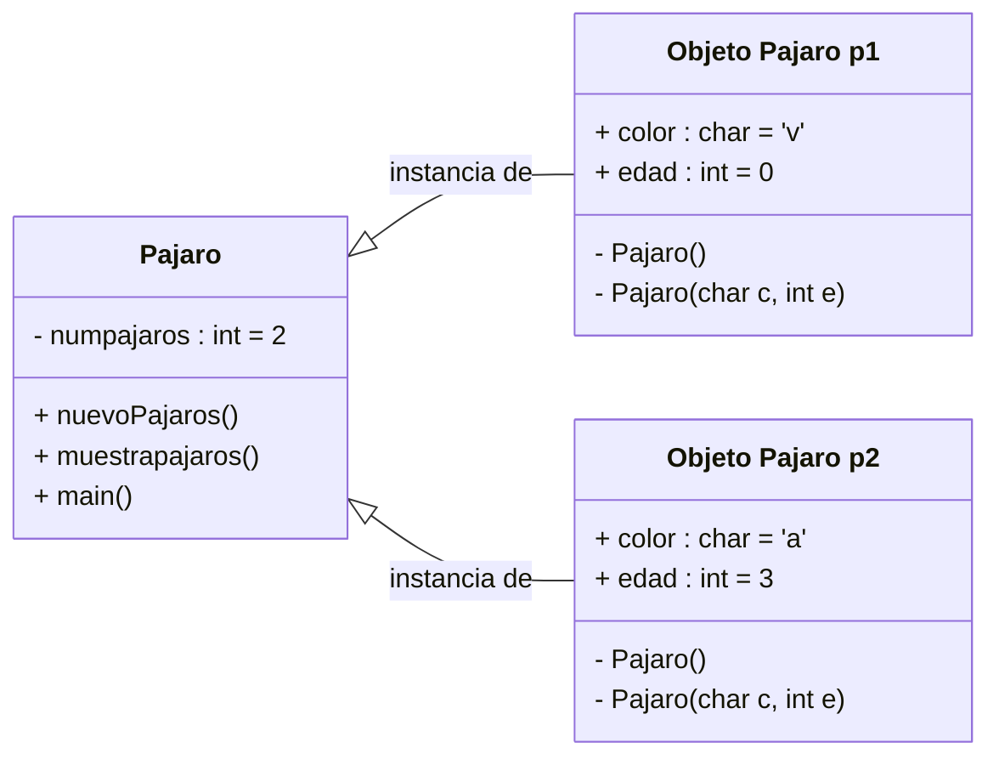
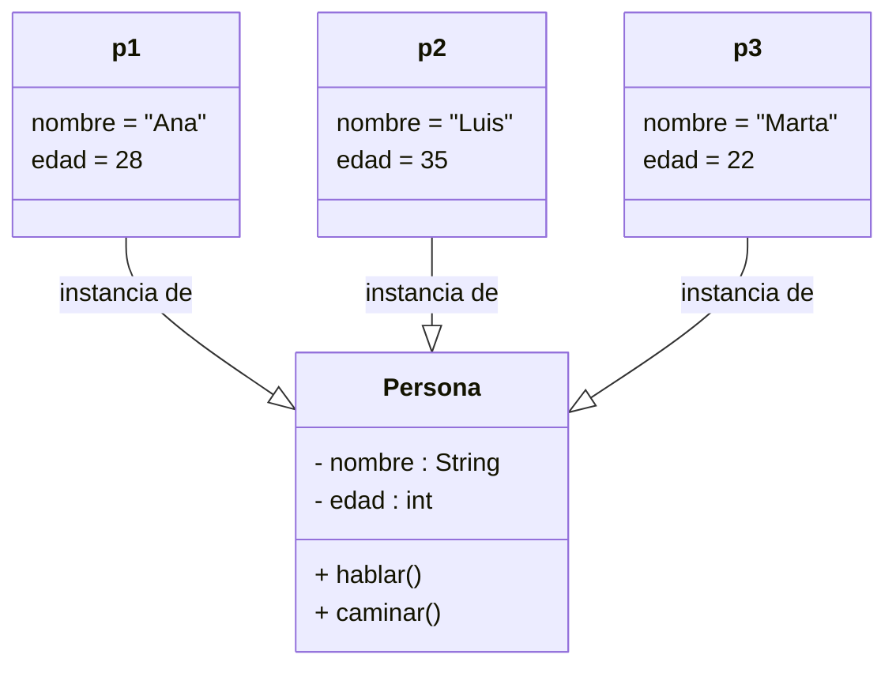

# 🧱 Objetos Y Clases

## ¿Qué Es Un Objeto?

Según Rumbaugh et al.:

> "Un objeto es una entidad discreta con identidad, estado y comportamiento que se puede invocar. Los objetos son las piezas individuales de un sistema en tiempo de ejecución."  
> — Rumbaugh, J., Jacobson, I. y Booch, G. (2007). _El Lenguaje Unificado de Modelado. Guía de Referencia UML 2.0_ (2.ª ed.). Pearson Addison-Wesley.

Sommerville complementa esta definición al afirmar que:

> "Un objeto es una entidad que tiene un estado y un conjunto de operaciones definidas que operan sobre ese estado. El estado se representa como un conjunto de atributos del objeto. Las operaciones asociadas al objeto proveen servicios a otros objetos (clientes) que solicitan estos servicios cuando se require llevar a cabo algún cálculo."  
> — Sommerville, I. (2005). _Ingeniería del Software_ (7.ª ed.). Pearson Addison-Wesley.

### En Resumen

- Un objeto **representa una entidad real o conceptual** del sistema.
    
- Se compone de:
    
    - **Estado**: Representado por sus atributos.
        
    - **Comportamiento**: Definido por las operaciones o métodos.
        
    - **Identidad**: Lo distingue de cualquier otro objeto, incluso si tienen los mismos valores de atributos.

> ⚠️ **Nota importante**: Aunque dos objetos tengan los mismos atributos y valores, **su identidad sigue siendo única**.

---

## ¿Qué Es Una Clase?

Según Rumbaugh, Jacobson y Booch:

> "Una clase es el descriptor para un conjunto de objetos con similar estructura, comportamiento y relaciones."

### En Términos Prácticos

- Una **clase es una plantilla** para crear objetos.
    
- Define:
    
    - Los **atributos** (estado).
        
    - Las **operaciones** (comportamiento).
        
- Cada **objeto es una instancia** de una clase.
    
- Los objetos de una misma clase **comparten estructura, comportamiento y relaciones**.

---

## Ejemplo En Diagrama Mermaid

El siguiente diagrama ilustra la clase `Pajaro` y cómo se crean dos objetos (`p1` y `p2`) a partir de ella:

---

## Diagrama Avanzado Mermaid.js: Clase + 3 Objetos

---

## Microtest

- Selecciona dos opciones. El objeto representa:
	- El código compuesto de propiedades y métodos que se podrán manipular de manera independiente.
	- Una entidad discreta con identidad, estado y comportamiento que se puede invocar.
- Una clase es el descriptor para:
	- Un conjunto de objetos con similar estructura, comportamiento y relaciones.
- Una clase se podría definir a dos niveles:
	- Primer y segundo nivel.

## Clases Y Objetos En Java

### Class Vs Object [00:00:05]

* Java es un lenguaje de programación orientado a objetos, donde todo está asociado con clases y objetos, incluyendo sus atributos y métodos.
* En Java, no puedes escribir un programa solo con la función principal sin declarar una clase, a diferencia de algunos otros lenguajes de programación [00:00:34].

### Components De Clase [00:01:55]

* Atributos: Datos que tiene la clase, también conocidos como campos o variables miembro [00:02:23].
* Métodos: Funciones que definen el comportamiento del objeto y sus miembros [00:03:32].
* Constructor: Se utilize para declarar un objeto en Java a partir de una clase [00:02:53]. Java crea un constructor vacío público predeterminado si no especificas uno [00:02:10].

### Creación De Objetos [00:04:33]

* Un objeto es una instancia de una clase.
* Puedes crear una variable o instancia de un tipo de clase, que se llama objeto.
* Usa la palabra clave `new` con el constructor para crear una nueva instancia u objeto [00:04:47].

### Diferencias Clave [00:07:25]

* Una clase es un plano, modelo o plantilla, mientras que un objeto es una instancia de esa clase.
* Una clase no tiene un valor en la memoria, pero un objeto sí.
* Una clase es una entidad lógica, mientras que un objeto es una entidad física.
* Las clases se declaran usando la palabra clave `class`, y los objetos se crean usando la palabra clave `new`.
* Una clase se declara una vez, pero los objetos se pueden declarar varias veces.
* Los atributos de la clase no tienen valores, pero los objetos tienen copias de los atributos con valores asociados.

### Descripción Del Código En El Video

* **Clase Vehículo**: Se crea una clase llamada "Vehículo" [00:01:15], que contiene atributos y métodos.
    * **Atributos**: La clase "Vehículo" tiene atributos como "peso" (de tipo `boolean`) y "modelo" (de tipo `String`) [00:02:37].
    * **Constructores**: Se muestran diferentes constructores para la clase "Vehículo" [00:03:01]. Esto incluye un constructor vacío [00:02:18] y un constructor que acepta un parámetro de modelo [00:03:22].
    * **Métodos**: La clase "Vehículo" tiene un método llamado "conducir" [00:03:50], que imprime "Estoy conduciendo" en la consola [00:04:26].
* **Objetos de la clase Vehículo**:
    * Se crean objetos (instancias) de la clase "Vehículo" utilizando la palabra clave `new` [00:04:47].
    * Se muestra cómo crear objetos utilizando diferentes constructores, como `new Vehículo()` y `new Vehículo("Mercedes")` [00:05:31].
    * Se demuestra cómo acceder y modificar los atributos de un objeto (si son públicos) [00:06:04] y cómo llamar a sus métodos [00:05:53].
    * Se crean múltiples objetos de la clase "Vehículo", como "miVehículo", "otroVehículo" y "unVehículo" [00:06:18].

En resumen, el código ejemplifica la creación de una clase, la definición de sus atributos y métodos, y la posterior creación de objetos basados en esa clase. ``