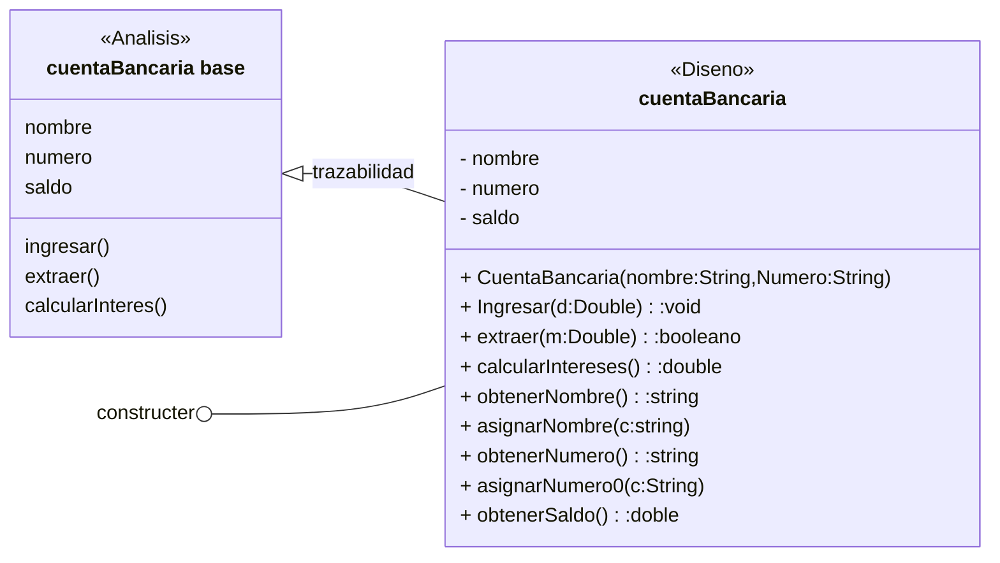
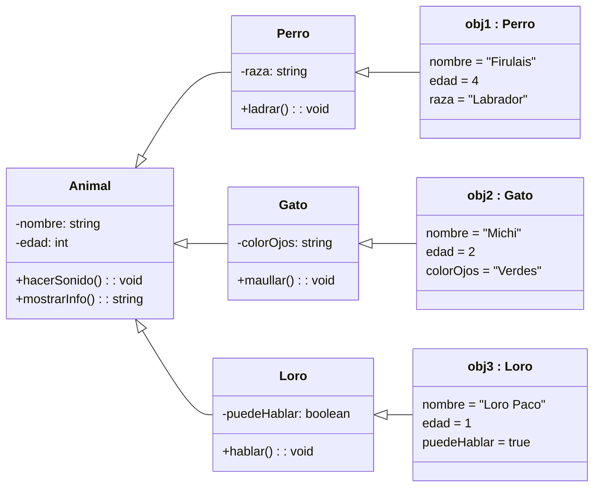
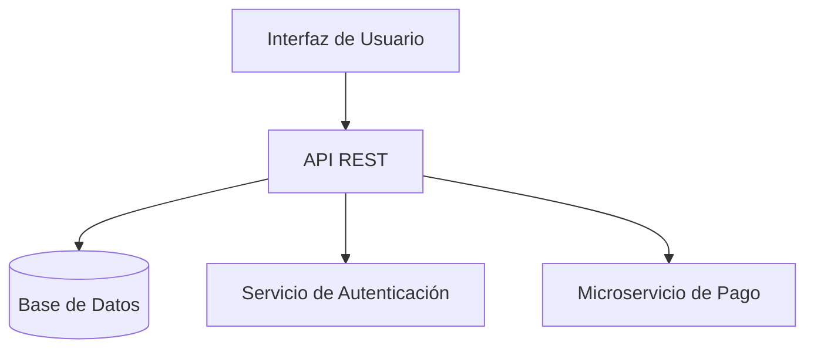
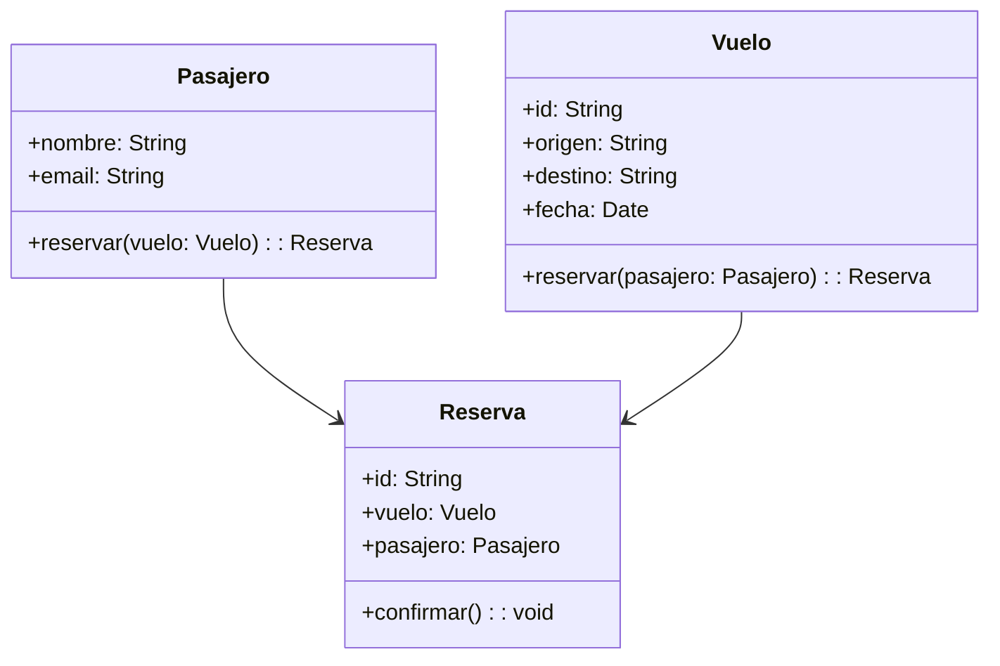

# 🔍 Análisis Orientado a Objetos (AOO)

* **Objetivo**: Desarrollar el sistema correcto.
* Se enfoca en encontrar objetos relevantes del **dominio del problema** (ej. vuelo, avión, piloto).
* **Clases de análisis** (Arlow & Neustadt):

  * Alta abstracción del dominio.
  * Nombre claro y coherente con el negocio.
  * Atributos a alto nivel, sin detallar visibilidad.
  * Operaciones representan responsabilidades de alto nivel.
  * Estereotipos y valores etiquetados solo si mejoran la comprensión.

## Tipos De Clases Según Pressman (2010)

* Entidades externas (usuarios, sensores, otros sistemas).
* Cosas del dominio de información (pantallas, informes).
* Ocurrencias/eventos (transacciones, alarmas).
* Roles (cliente, administrador).
* Unidades organizativas (departamentos).
* Lugares (aeropuerto, almacén).
* Estructuras (vehículos, dispositivos).

---

# 🛠️ Diseño Orientado a Objetos (DOO)

* **Objetivo**: Desarrollar el sistema de la manera correcta.
* Refina las clases del análisis para ajustarse a la **plataforma de desarrollo**.
* Las clases de diseño incorporan detalles como visibilidad, tipos de datos y métodos precisos.

---

# ✨ Ejemplo AOO → DOO En Mermaid.js



---

# 🧪 Diagrama Avanzado Mermaid.js – Clase Y 3 Objetos



---

# MicroTest

- El análisis orientado a objetos (AOO):
	- Define las clases que servirán siempre de base para el diseño orientado a objetos (DOO).
- En la fase de análisis, las clases deberían definir los atributos a muy alto nivel, definiendo lo mínimo tal como:
	- Nombre, atributos, operaciones, visibilidad, estereotipos y valores etiquetados.
- ¿Qué afirmación satisface todo lenguaje orientado a objetos?
	- Las clases siempre tendrán atributos y operaciones.

## Read More

## 🔍 Análisis Y Diseño Orientado a Objetos (OOAD)

### 1. Identificar El Dominio Del Problema

**Descripción:**
Es el área de interés que queremos resolver con nuestro sistema. Hay que comprender requisitos, objetivos, restricciones y expectativas de stakeholders y usuarios.

**Técnicas de ejemplo:**

* Entrevistas
* Casos de uso
* Historias de usuario
* Escenarios

**Ejemplo:**
Imaginemos un sistema de reserva de vuelos. Dominio del problema: **Reservas**, **Vuelos**, **Pasajeros**, **Pagos**.

```plaintext
Stakeholders:
- Pasajero           → Quiere reservar y pagar un vuelo.
- Agencia de viajes  → Quiere gestionar inventario de asientos.
- Aerolínea         → Quiere registrar vuelos y disponibilidad.
```

---

### 2. Definir la Arquitectura Del Sistema

**Descripción:**
Estructura de alto nivel: components, subsistemas, interfaces y relaciones.

**Técnicas de ejemplo:**

* Diagrama de paquetes UML
* Diagrama de components
* Diagrama de despliegue
* CRC cards

**Diagrama ejemplo (Mermaid):**



**Explicación:**

* **UI** consume la **API**
* **API** se comunica con la **BD**, **Auth** y **Pago**

---

### 3. Diseñar Clases Y Objetos

**Descripción:**
Identificar atributos, métodos y responsabilidades de cada clase, así como relaciones (herencia, asociación, composición).

**Técnicas de ejemplo:**

* Diagrama de clases
* Diagrama de objetos
* Diagrama de secuencia

**Diagrama ejemplo (Mermaid):**



**Ejemplo de código (Java):**

```java
public class Pasajero {
    private String nombre;
    private String email;
    public Reserva reservar(Vuelo vuelo) {
        Reserva r = new Reserva(this, vuelo);
        r.confirmar();
        return r;
    }
    // getters y setters...
}
```

---

### 4. Implementar El Código

**Descripción:**
Traducir el diseño a código usando un lenguaje OO (Java, Python, C++, etc.), siguiendo buenas prácticas.

**Ejemplo (Python):**

```python
class Vuelo:
    def __init__(self, id, origen, destino, fecha):
        self.id = id
        self.origen = origen
        self.destino = destino
        self.fecha = fecha

    def reservar(self, pasajero):
        reserv = Reserva(pasajero, self)
        reserv.confirmar()
        return reserv

class Pasajero:
    def __init__(self, nombre, email):
        self.nombre = nombre
        self.email = email

class Reserva:
    def __init__(self, pasajero, vuelo):
        self.pasajero = pasajero
        self.vuelo = vuelo
        self.confirmada = False

    def confirmar(self):
        self.confirmada = True
        print(f"Reserva confirmada para {self.pasajero.nombre}")
```

---

### 5. Probar Y Refactorizar El Sistema

**Descripción:**
Verificar que cumple requisitos funcionales y no funcionales; corregir errores y mejorar el código.

**Técnicas de ejemplo:**

* Pruebas unitarias
* Pruebas de integración
* Revisiones de código
* Refactorización

**Ejemplo de prueba (Java, JUnit):**

```java
@Test
public void testReserva() {
    Pasajero p = new Pasajero("Ana", "ana@mail.com");
    Vuelo v = new Vuelo("V123", "MAD", "BCN", LocalDate.now());
    Reserva r = p.reservar(v);
    assertTrue(r.isConfirmada());
}
```

**Refactorización:**

* Extraer métodos
* Renombrar variables para mayor claridad
* Separar responsabilidades (Single Responsibility Principle)

OOAD es un proceso **iterativo** y **flexible** que ayuda a crear sistemas robustos, mantenibles y adaptables. Aplicando estas técnicas mejorarás tu capacidad de análisis y diseño orientado a objetos y obtendrás soluciones de mayor calidad.

---

