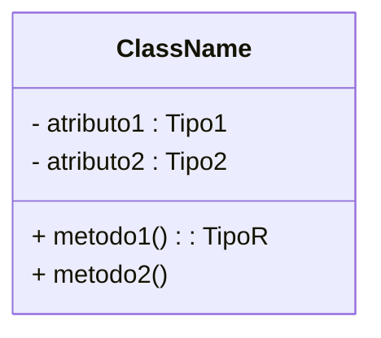
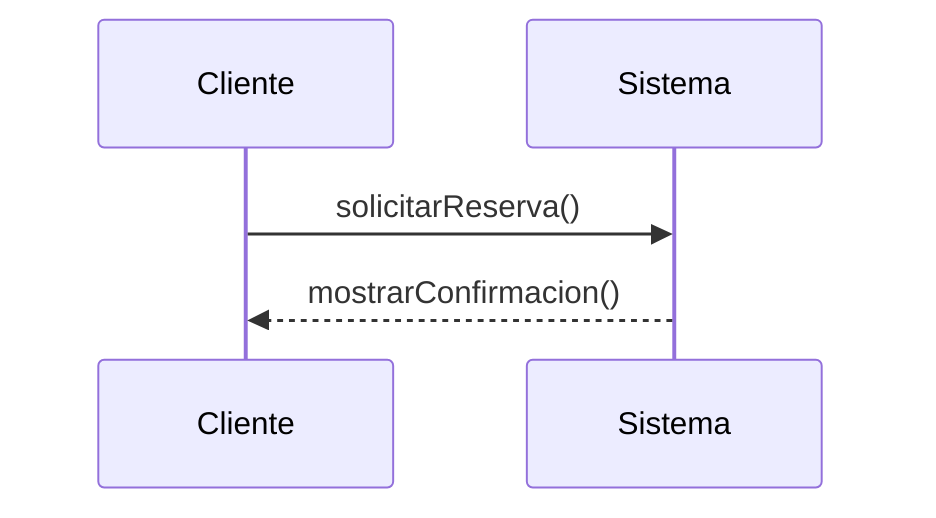

# 📘 Notas: Lenguaje Unificado De Modelado (UML)

## 1. ¿Qué Es UML?

- **UML** (Unified Modeling Language) es un **lenguaje visual de propósito general** para modelar sistemas.
    
- Aunque se asocia al modelado OO, **puede aplicarse** en múltiples disciplinas por su **extensibilidad**.
    
- **Integra mejores prácticas** de técnicas de modelado e ingeniería de software.
    
- **No es** una metodología: se puede usar con cualquier ciclo de vida (UP, ágil, cascada…).

---

## 2. Historia Y Origen

1. **Años 70–80**: surgen lenguajes de modelado OO independientes (Booch, OMT, OOSE).
    
2. **1994–1996**: Booch, Rumbaugh y Jacobson unifican notaciones en UML 0.9 y 0.91.
    
3. **1997**: UML 1.1 lanza correcciones; lo aprueba OMG.
    
4. **2000**: UML 1.4 incorpora la “semántica de acción”.

---

## 3. Usos Y Niveles De Diagrama (Fowler)

- **Sketch**: bocetos informales para entender partes complejas.
    
- **Blueprint**: detallados, sirven para ingeniería inversa o generación de código.
    
- **Código**: modelo ejecutable desde el que se genera código automáticamente.

---

## 4. Tipos De Diagrams Fundamentales (Erickson & Siau)

1. **Actividad**: flujo de trabajo ó proceso.
    
2. **Caso de uso**: interacción actor–sistema.
    
3. **Secuencia**: mensajes entre objetos en tiempo.
    
4. **Clases**: estructura estática de clases/relaciones.
    
5. **Estado**: reacciones del sistema a eventos.

---

## 5. Components De Un Modelo UML

1. **Sintaxis abstracta** (metamodelo): define elementos y reglas.
    
2. **Sintaxis concreta** (notación): símbolos gráficos/textuales.
    
3. **Semántica**: significado de cada elemento, a menudo con OCL.

---

## 6. Ejemplos De Diagrams En Mermaid.js

### 6.1. Diagrama De Clase Simple



### 6.2. Diagrama De Secuencia



### 6.3. Diagrama De Caso De Uso

```mermaid
%% Diagrama de caso de uso básico
flowchart
    actor Cliente
    actor Administrador
    system ReservaVuelos {
      usecase "Buscar vuelo" as UC1
      usecase "Hacer reserva" as UC2
      usecase "Cancelar reserva" as UC3
    }
    Cliente --> UC1
    Cliente --> UC2
    Cliente --> UC3
    Administrador --> UC3
```

---

## 7. Metamodelo Y Semántica

- El **metamodelo** de UML es él mismo un modelo que define la **estructura** de UML.
    
- La **semántica** se documenta en texto y, opcionalmente, con **OCL**.
    
- Ejemplo de restricción OCL:

    ```ocl
    context Vuelo
      inv: self.escala->isOrdered()
    ```

---

## 8. Ventajas E Inconvenientes De UML

### Ventajas

- Lenguaje **estándar** y **maduro**.
    
- Variedad de diagrams para **todas las fases** de desarrollo.
    
- Facilita la **comunicación** entre stakeholders.

### Inconvenientes

- **Semántica no totalmente formal**: puede haber ambigüedad.
    
- Cada stakeholder puede **interpretar** un diagrama de manera ligeramente distinta.
    
- Solución: definir **correspondencias formales** o usar OCL para eliminar ambigüedades.

---

> **Conclusión:** UML es una herramienta muy poderosa para el modelado de sistemas; aplicar buenas prácticas y, cuando sea necesario, formalizar restricciones (OCL) mitigará ambigüedades y mejorará la comunicación en tu proyecto.

---

## MicroTest

- ¿Cuál de las siguientes afirmaciones es correcta?
	- UML es un lenguaje de propósito general.
- De acuerdo con Fowler (2003), los diagrams UML pueden tener tres finalidades bien diferenciadas. Selecciona las tres correctas:
	- Sketch
	- Blueprint
	- Lenguaje de programación.
- Se puede decir que UML va a estar definido por tres elementos:
	- Sintaxis abstracta (metamodelo), sintaxis concreta (notación) y semántica.