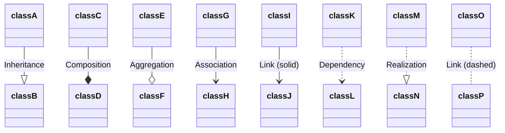
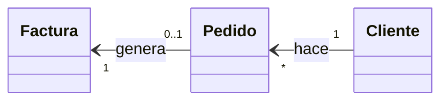
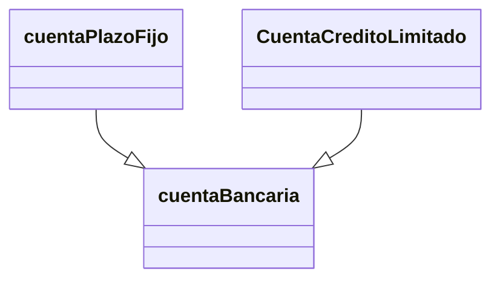
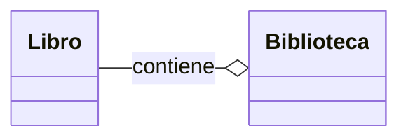
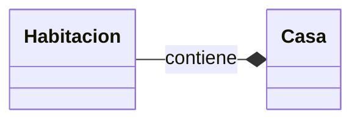
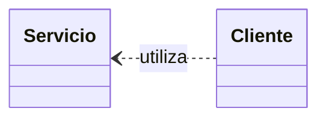
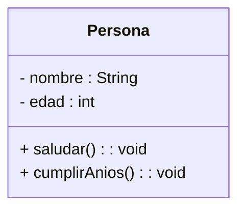
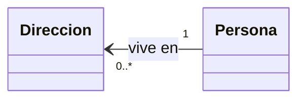
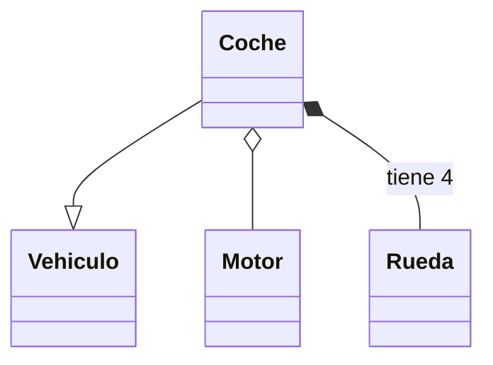
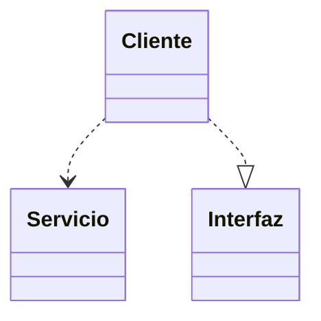

# 📘 Notas: Diagrama De Clases En UML

Las **clases** son la base de la programación orientada a objetos (POO). Representan las características comunes de los elementos en un software. Para modelar sus atributos, operaciones y relaciones, se usan los **diagrams de clases UML** (Rumbaugh, Jacobson & Booch, 2007).

---

## 1. Estructura De Una Clase

```plaintext
+-----------------------------+
|        ClassName            |
+-----------------------------+
| - atributo1 : Tipo          |
| # atributo2 : Tipo          |
| + atributo3 : Tipo          |
+-----------------------------+
| + metodo1(par: Tipo) : Tipo |
| + metodo2()                 |
+-----------------------------+
```

- **Nombre**: sustantivo en singular, claro y significativo.
    
- **Atributos**:
    
    - Sintaxis: `visibilidad nombre: Tipo`
        
    - Visibilidad:
        
        - `+` público (se recomienda exponer con getters/setters)
            
        - `#` protegido
            
        - `-` privado
            
- **Operaciones**:
    
    - Sintaxis: `visibilidad nombre(parámetros) [: TipoRetorno]`
        
    - Parámetros: `[dirección] nombre: Tipo [= valorPorDefecto]`
        
        - `in` (entrada), `out` (salida), `inout` (entrada/salida)

---

## 2. Relaciones Entre Clases



### 2.1 Asociación

- **Más común**: línea continua.
    
- **Unidireccional**: flecha en un extremo.
    
- **Roles y multiplicidad**:



**Multiplicidades**:

|Notación|Significado|Ejemplo|
|:-:|---|---|
|`1`|Exactamente 1|Una persona tiene un único país de origen.|
|`0..1`|Cero o uno|Un empleado puede tener un responsible (o no).|
|`0..*`|Cero o más|Una persona puede tener varias direcciones.|
|`1..*`|Uno o más|Un alumno está matriculado en ≥1 asignatura.|
|`n`|Exacto n|Un segmento tiene 2 puntos (origen y destino).|

---

### 2.2 Generalización (Herencia)

- **Relación “es-un”**: subclase hereda de superclase.
    
- Se dibuja con punta triangular hueca.



---

### 2.3 Agregación

- **“Todo/parte”** conceptual, partes sobreviven al todo.
    
- Rombo hueco en la clase “todo”.



---

### 2.4 Composición

- Agregación fuerte: partes mueren con el todo.
    
- Rombo relleno en la clase “todo”.



---

### 2.5 Dependencia

- Uso puntual: cambios en proveedor afectan cliente.
    
- Línea discontinua con flecha al cliente.



---

## 3. Ejemplos En Mermaid.js

### 3.1 Clase Y Atributos



### 3.2 Asociación Con Multiplicidad



### 3.3 Herencia, Agregación Y Composición



### 3.4 Dependencia Y Realización



---

> Estas notas cubren casi todos los detalles originales y añaden ejemplos prácticos en **Mermaid.js** para facilitar la comprensión y la aplicación en tus diagrams de clases.

---

## MicroTest

- Selecciona tres opciones. Los atributos son las propiedades de las clases y para cada uno se puede indicar lo siguiente:
	- Tipo
	- Visibilidad.
	- Nombre
- La visibilidad nos indica cómo pueden relacionarse las operaciones de otras clases con el atributo. Selecciona las tres opciones correctas:
	- Público (+): puede relacionarse con otras clases.
	- Protegido (#): puede relacionarse con las clases descendientes
	- Privado (-): no puede relacionarse con otras clases.
- Las principales razones que puede haber entre dos o más clases en la orientación a objetos (OO) son:
	- **Generalización (herencia), asociación, agregación, composición y dependencia.**

