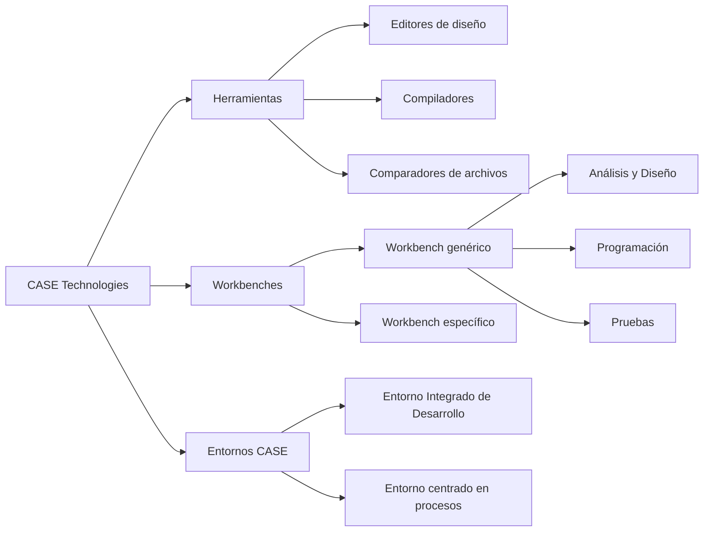
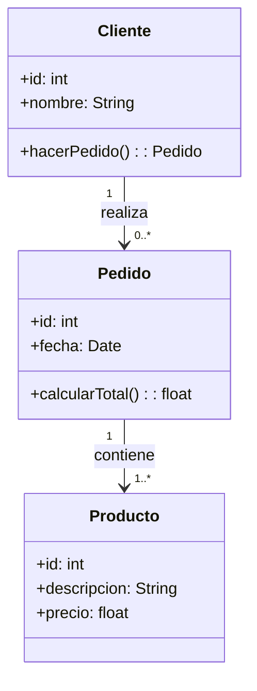

# 🛠️ Notas: Herramientas CASE

---

## 1. ¿Qué Son Las Herramientas CASE?

Las **herramientas CASE** (Computer-Aided Software Engineering) son aplicaciones que **automatizan** y **soportan** diversas actividades del proceso de desarrollo de software, incluyendo:

1. **Ingeniería de requisitos**
    
2. **Análisis y diseño**
    
3. **Codificación**
    
4. **Pruebas**
    
5. **Mantenimiento**

_(Sommerville, 2005)_

---

## 2. Clasificación De Herramientas CASE

1. **Propósito general** vs. **Muy especializadas**
    
2. **Standalone** (independientes) vs. **Workbench** (conjunto integrado de herramientas)
    
3. **Entornos CASE**: agrupan múltiples workbenches y brindan soporte a todo el ciclo de vida

---

## 3. Estructura Conceptual

- **Herramientas**: soluciones individuales (editores, compiladores, comparadores).
    
- **Workbenches**: colecciones integradas para fases concretas (AD, codificación, tests).
    
- **Entornos CASE**: suites completas que cubren todo el ciclo de vida.

---

## 4. Características Clave Para UML

- **Representación gráfica** y edición WYSIWYG
    
- **Corrección sintáctica** en tiempo real
    
- **Coherencia** entre diagrams (p.ej. clases vs. secuencia)
    
- **Integración** con otros repositorios y aplicaciones
    
- **Trabajo multiusuario** y control de versiones
    
- **Reutilización** de modelos y plantillas
    
- **Generación de código** a partir de diagrams

---

## 5. Desarrollo Dirigido Por Modelos (MDE/DSDM)

1. **Modelos** guían toda la construcción del software
    
2. CASE especifica el sistema **independientemente de la plataforma**
    
3. Selección de **plataforma objetivo**
    
4. **Transformación** automática de especificaciones al dialecto de la plataforma

---

## 6. Selección De la Herramienta UML

- **¿Qué diagrams necesitas?** Caso de uso, clases, secuencia, actividad…
    
- **¿Qué funcionalidades valoras?** Generación de código, ingeniería inversa, colaboración en la nube…
    
- **¿Standalone o en la nube?**

### Ejemplos Populares

- **StarUML**
    
- **ArgoUML**
    
- **Papyrus UML**
    
- **Visual Paradigm Online**
    
- **Modelio**
    
- **MagicDraw**
    
- **Lucidchart**
    
- **GenMyModel**
    
- **UMLet**
    
- **PlantUML**
    
- **yUML**

> **Consejo:** Prueba varias; combina modelado offline y online según el flujo de tu equipo.

---

## 7. Ejemplo De Diagrama De Clases En Mermaid.js

---

## MicroTest

- Las herramientas CASE:
	- Transforman la especificación del sistema software en una especificación específica para la plataforma de desarrollo seleccionada.
- Las herramientas CASE se pueden clasificar en distintas categorías. Selecciona tres opciones correctas:
	- Herramientas
	- Workbenches
	- Entornos
- Las herramientas CASE van a permitir una de estas funcionalidades:
	- Especificar un sistema software independientemente de la plataforma sobre la que se va a soportar.

## [Herramientas Case](https://www.techtarget.com/searcherp/definition/CASE-computer-aided-software-engineering)