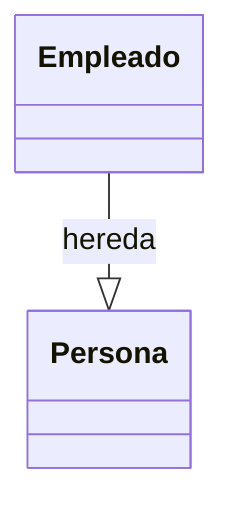
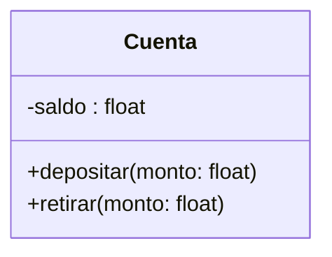
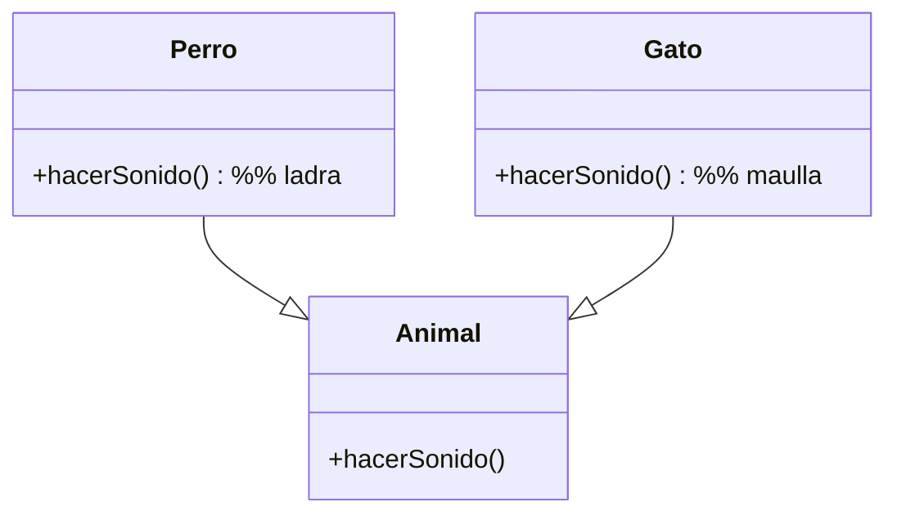
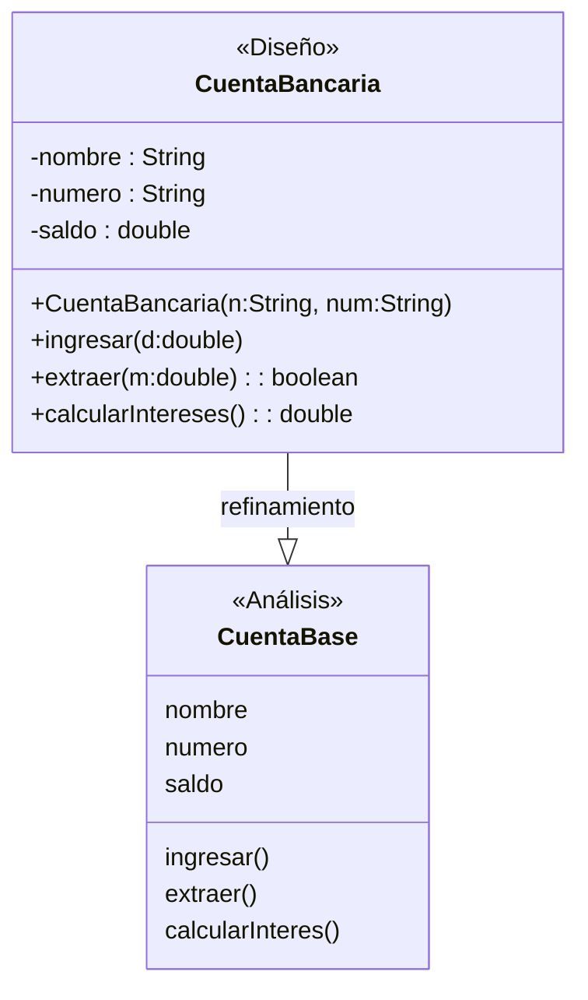
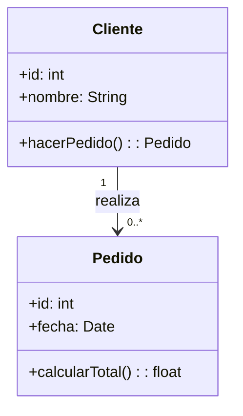
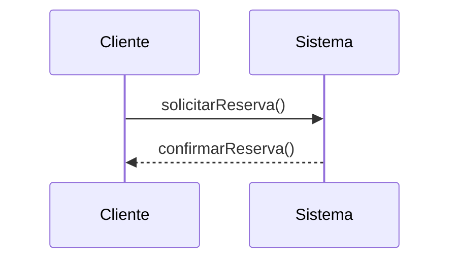
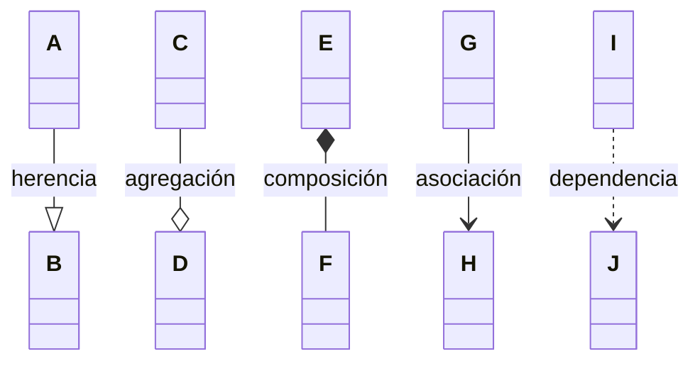

# 📘 Notas: Programación Y Modelado Orientado a Objetos

---

## 1. POO: Concepto Y Ventajas

- **Enfoque en objetos** en lugar de algoritmos (Shlaer & Mellor, 1992).
    
- Cada **objeto** es instancia de una **clase**.
    
- Agrupa código con funcionalidades similares en **unidades cohesivas**.
    
- Acceso y modificación ordenados a través de **mensajes**.

---

## 2. Características De Un Lenguaje OO (Booch Et Al., 2007)

1. **Abstracciones de datos** (objetos) con interfaz pública y estado oculto.
    
2. Los objetos tienen un **tipo asociado** (clase).
    
3. Las clases pueden **heredar** atributos y métodos de su superclase.

---

## 3. Principios Fundamentales OO

### 3.1 Abstracción

> “Denota características esenciales de un objeto, ignorando detalles no importantes.”  
> Tipos (Booch et al.):

- **Entidad**: modelo de una entidad del dominio.
    
- **Acción**: objeto que agrupa operaciones con fin común.
    
- **Máquina virtual**: operaciones de control o auxiliares.
    
- **Casual**: operaciones no relacionadas.

---

### 3.2 Clasificación

> “Asignar un tipo a un objeto; tipos distintos no son intercambiables salvo con restricciones.”

- **Fuerte vs Débil**: consistencia de tipos.
    
- **Estática vs Dinámica**: enlace de nombres en compilación (_early_) o ejecución (_late_).

---

### 3.3 Jerarquía (Herencia)

- Relación “es-un/a” entre superclase ↔ subclase.
    
- Permite **reutilizar** atributos, métodos y relaciones.



---

### 3.4 Encapsulamiento

- Separa **interfaz** de **implementación**.
    
- Atributos/operaciones internas → `-` privado; interfaz pública → `+` público.



---

### 3.5 Polimorfismo

- Mismo mensaje → distinto comportamiento según tipo de objeto.
    
- Subclases pueden **redefinir** métodos heredados.



---

## 4. Análisis Vs Diseño OO

- **Análisis OO (AOO)**: identifica objetos/conceptos del dominio (avión, vuelo, piloto).
    
    - Clases de análisis: atributos de alto nivel, operaciones, estereotipos opcionales.
        
- **Diseño OO (DOO)**: refina clases para la plataforma (Java, C++, …), añade visibilidad, tipos, constructores.



---

## 5. UML: Lenguaje Unificado De Modelado

- **Visual** de propósito general; no es una metodología.
    
- Origen: unificación de Booch, OMT y OOSE (1994–1997).
    
- **Diagrams**:
    
    - **Estructura**: Clases, components, despliegue.
        
    - **Comportamiento**: Casos de uso, secuencia, actividad, estado.

---

### 5.1 Diagrama De Clases (estructura estática)



---

### 5.2 Diagrama De Secuencia (interacción temporal)



---

### 5.3 Diagrama De Caso De Uso (actor–sistema)

```mermaid
usecaseDiagram
    actor Cliente
    usecase "Buscar vuelo" as UC1
    usecase "Reservar vuelo" as UC2
    Cliente --> UC1
    Cliente --> UC2
```

---

## 6. Relaciones En Diagrams De Clases



|Relación|Símbolo|Descripción|
|---|---|---|
|Herencia|`--|>`|
|Agregación|`--o`|“todo/parte” (las partes viven sin el todo)|
|Composición|`*--`|Parte depende del todo|
|Asociación|`-->`|Enlace semántico entre clases|
|Dependencia|`..>`|Uso puntual, relación débil|

---

# 🚀 Conclusión

La **POO** y **UML** ofrecen un marco coherente para **modelar**, **analizar**, **diseñar** e **implementar** sistemas complejos mediante **objetos** que colaboran y se organizan en **clases**, aplicando principios clave (abstracción, encapsulamiento, herencia, polimorfismo y clasificación).

Utilize **Mermaid.js** para prototipar rápidamente tus diagrams y reforzar tu comprensión.