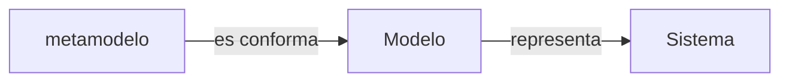
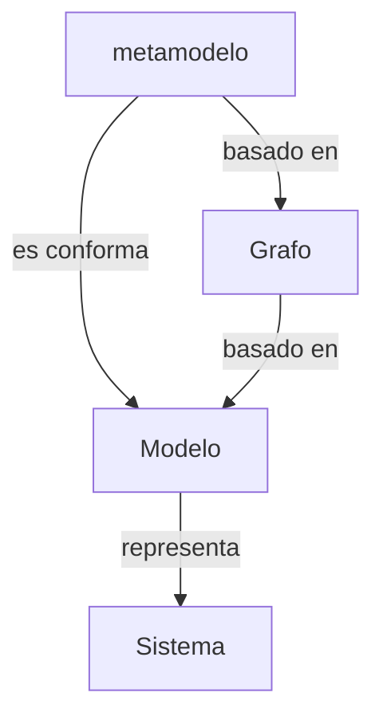

# **Ingeniería Dirigida Por Modelos**

## Introducción

![[Pasted image 20250526164807.png]]

- Usar modelos para diseñar sistemas complejos es importante en ingeniería.
    
- Los modelos ayudan a comprender y resolver problemas mediante la **abstracción**.
    
- La ingeniería dirigida por modelos ([[MDE]]) hace que los **modelos sean los principales artefactos en el desarrollo de software**.
    
- Con [[MDE]], los modelos son utilizados para **descripción, validación, verificación, simulación y generación de código**.

## Ventajas

La ventaja principal en una primera aproximación es que en un modelo se usan **conceptos más próximos al dominio conceptual del problema** y estarán menos relacionados con elementos de los lenguajes de programación.

Esto hará que los lenguajes sean más fáciles de:

- Especificar
    
- Comprender
    
- Mantener

## Origen Y Definición De MDE

El término **[[MDE]]** fue propuesto inicialmente por **Kent**, pero tiene su origen en una iniciativa del **Object Management Group (OMG)** conocida como **Arquitectura Dirigida por Modelos (Model Driven Architecture, MDA)**.

[[MDE]] **generaliza conceptos** mediante el establecimiento de unos principios, donde **MDA constituye un estándar aplicado** de la teoría que presenta.

## Principios De MDE

[[MDE]] **eleva el nivel de abstracción** en el proceso de desarrollo de software, lo cual favorece:

- La gestión de la complejidad de los sistemas
    
- La gestión del cambio inherente en los sistemas software

[[MDE]] se fundamenta, básicamente, en dos conceptos:

- **Sistema**
    
- **Modelo**

Y en dos relaciones:

- **Representación** (entre sistema y modelo)
    
- **Conformidad** (entre modelo y metamodelo)

> El **metamodelo** describe los conceptos que se pueden considerar en un modelo, las relaciones entre estos conceptos y sus restricciones.

### Diagrama Representativo

## Definición De Bézivin

> Un modelo en [[MDE]] queda definido como una **estructura basada en un grafo (dirigido y etiquetado)** que representa algunos aspectos de un sistema y es conforme a la definición de otro grafo denominado **metamodelo**.
> 
> (Bézivin, J. (2006). _Model driven engineering: an emerging technical space_. En R. Lämmel, J. Saraiva y J. Visser (Eds.), _Generative and transformational techniques in Software engineering_, Springer)

### Diagrama Extendido

![[Pasted image 20250601092155.png]]
## Definición Del OMG

El **Object Management Group (OMG)** en su documento _The MDA Foundation Model_ define un modelo como:

> Una **representación selectiva** de un sistema cuya forma y contenido están basados en un conjunto específico de **incumbencias (concerns)**.
> 
> El modelo se relaciona con el sistema a través de una correspondencia (**mapping**) implícita o explícita.

> (OMG, 2010. _The MDA Foundation Model_, ORMSC DRAFT)

### Ejemplos De Modelos Que Se Acogen a Esta Definición

- Un modelo **UML** correspondiente a una parte de la aplicación
    
- Un **modelo de proceso de negocio**
    
- Un **modelo de simulación**

Esta definición desde la perspectiva de MDA.

![[Pasted image 20250531195741.png]]

## Consideraciones Generales Sobre Modelos

- Un modelo es una **simplificación de la realidad** en el contexto de un sistema.
    
- Sirve como una **representación simplificada** bajo ciertas reglas de un **lenguaje de modelado**.
    
- La **similitud entre el modelo y la realidad siempre será parcial**.

En ingeniería de software, un modelo se define como una **especificación formal** de:

- La función
    
- La estructura
    
- El comportamiento

## Características Fundamentales

- El modelo y el sistema **no son lo mismo**, el modelo representa **partes del sistema a construir**.
    
- El modelo debe set **conforme a un único metamodelo**.
    
- La relación entre modelo y sistema incluye:
    
    - **Correspondencia**
        
    - **Simplificación o reducción**
        
    - **Practicidad**
        
- El modelo **refleja una selección relevante** de propiedades del sistema real.
    
- El modelo debe set usado **en lugar del sistema original**, con un propósito:
    
    - **Descriptivo**
        
    - **Prescriptivo**

---

## Vistas Múltiples Y Correspondencias

- Cada modelo debe ofrecer una **vista diferente** del sistema.
    
- No es práctico esperar que un **único modelo contenga todos los detalles** necesarios.
    
- Los modelos pueden expresarse en:
    
    - **El mismo lenguaje**
        
    - **Lenguajes diferentes**

Las correspondencias se clasifican como:

- **Adaptación del modelo**: si son del mismo lenguaje
    
- **Adaptación del lenguaje**: si son de lenguajes diferentes

---

## Separación En Vistas Y Dimensions

> (Tarr, R., Ossher, H., Harrison, W., y Sutton, S.M. (1999). _N degrees of separation: multidimensional separation of concerns_. En _Proceedings of the 21st International Conference on Software Engineering (ICSE'99)_, pp. 107–119)

### Beneficios

- **Reducir la complejidad**
    
- **Favorecer comprensión, reutilización y evolución**
    
- **Facilitar trazabilidad entre artefactos**

La **capacidad para separar y clasificar vistas** de un sistema será base para un **software de calidad**.

> El elemento clave: **descomposición simultánea** del sistema según sus dimensions.

---

## Automatización Con Herramientas CASE

En MDE, **todo es un modelo**. Es decir, todos los artefactos serán creados en base a un **lenguaje de modelado**.

Los modelos **dirigen el proceso de desarrollo**, pudiendo **automatizar** partes con herramientas **CASE**.

### Ventajas De la Automatización

- Generación de procesos:
    
    - **Controlados**
        
    - **Medibles**
        
    - **Auditables**
        
    - **Repetibles**

> Herramientas CASE minimizan el esfuerzo de creación y evolución, y **maximizan beneficios**:  
> simulaciones, transformaciones, comprobaciones, trazabilidad, etc.

> (Kent, S. (2002). _Model driven engineering_. En M.J. Butler, L. Petre, y K. Sere (Eds.), _IFM '02: Proceedings of the Third International Conference on Integrated Formal Methods_, pp. 286–298. Springer)

---

## Ejemplos De Modelos UML

- **Casos de uso** → función
    
- **Clases** → estructura
    
- **Components** → estructura
    
- **Estados** → comportamiento

Cada tipo de modelo se basa en una **aproximación distinta de abstracción**.

---

## Tipos De Modelos Según Su Foco

|Tipo de Modelo|Se enfoca en…|Omite…|
|---|---|---|
|**Flujo de datos**|El flujo y transformación de datos entre procesos|La estructura de los datos|
|**Modelo de datos**|Las estructuras de datos|La funcionalidad o procesos|

---

## MicroTest

- ¿Cuál es la relación que se da entre un sistema y un modelo en la ingeniería dirigida por modelos ([[MDE]])?
	- Relación de representación.
- ¿Qué proporción pretende reducir o eliminar la necesidad de programación en la ingeniería de software dirigida por modelos?
	- Los Modelos
- ¿Qué conceptos forman la base de la ingeniería dirigida por modelos?
	- Sistema y modelo
- ¿Cuál es la definición de modelo en el contexto de la ingeniería dirigida por modelos?
	- Una estructura basada en un grafo (dirigido y etiquetado) que representa algunos aspectos de un sistema y es conforme a la definición de otro grafo denominado metamodelo.

## Saber Mas

Mambrilla, M., Cabot, J. y Wimmer, M. (2017). _Model-driven software engineering in practice_ (2.ª ed.). Morgan & Claypool Publishers.

Este libro analiza cómo los enfoques basados en modelos pueden mejorar la práctica diaria de los profesionales del desarrollo de software, aumentando la eficiencia y la eficacia en el desarrollo. El objetivo de este libro es ayudar a comprender rápidamente los principios y técnicas básicos de [[MDE]].